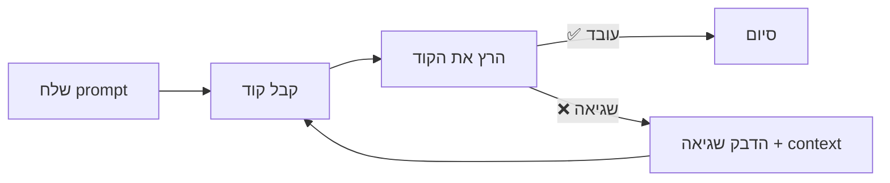

# מודול 1: Prompt Engineering לקוד

!!! info "משך"
    30 דקות הרצאה + 60 דקות hands-on + 15 דקות דיון

## מטרות למידה

בסוף המודול הזה, תוכלו:

- לכתוב prompts שמייצרים קוד ברמת production מהניסיון הראשון
- להשתמש ב-few-shot examples, personas ו-chain-of-thought בצורה יעילה
- לזהות ולהימנע מ-anti-patterns נפוצים ב-prompting
- לבצע iterative refinement — להזין שגיאות ופלט חזרה כדי לשפר תוצאות
- להתאים את סגנון ה-prompting לסוגים שונים של משימות (API, CLI, DevOps, data processing)

---

## חלק 1: כתיבת Prompts יעילים (10 דקות הרצאה)

### הכלל הבסיסי: ספציפיות

ההבדל בין prompt מעורפל לספציפי הוא ההבדל בין קוד שצריך לזרוק לקוד שאפשר לעשות לו merge.

**דוגמה — Web API:**

| Prompt מעורפל | Prompt ספציפי |
|---|---|
| "תוסיפו input validation" | "תוסיפו Zod validation לפורמט email, שדה name חובה (2-50 תווים), ו-phone אופציונלי בפורמט E.164" |

**דוגמה — CLI tool:**

| Prompt מעורפל | Prompt ספציפי |
|---|---|
| "תכתבו CLI שמוחק קבצים" | "תכתבו CLI ב-Python עם click שמקבל path ו-pattern (glob), מציג את הקבצים שימחקו, מבקש אישור עם `--yes` flag לדילוג, ותומך ב-`--dry-run`" |

**דוגמה — DevOps:**

| Prompt מעורפל | Prompt ספציפי |
|---|---|
| "תכתבו Dockerfile" | "תכתבו multi-stage Dockerfile ל-Node.js 20 app עם pnpm, שלב build נפרד, production image מבוסס alpine, non-root user, ו-healthcheck endpoint על port 3000" |

**דוגמה — Data Processing:**

| Prompt מעורפל | Prompt ספציפי |
|---|---|
| "תעבדו את הנתונים" | "תכתבו script ב-Python עם pandas שקורא CSV עם עמודות date,amount,category, מנקה שורות עם ערכים חסרים, ממיר את date לפורמט ISO 8601, ומייצר סיכום חודשי של סכומים לפי קטגוריה" |

### מה לכלול ב-prompt טוב

1. **שפה ו-framework:** "TypeScript עם Express" / "Python 3.12 עם FastAPI"
2. **דפוסים קיימים:** "אנחנו משתמשים ב-repository pattern" / "כל ה-handlers מחזירים `Result<T, AppError>`"
3. **אילוצים:** דרישות ביצועים, style guide, בלי dependencies חיצוניים
4. **פורמט פלט רצוי:** "תחזיר קובץ אחד" / "תפצל ל-modules" / "תוסיף JSDoc"
5. **מה לא לעשות:** "אל תשתמש ב-any" / "בלי ORMs, SQL ישיר בלבד"

### Before & After: ההבדל בפועל

!!! example "דוגמה: Prompt מעורפל ומה הוא מייצר"

    **Prompt:**
    ```
    Write a function to process user data
    ```

    **תוצאה אופיינית:**
    ```python
    def process_user_data(data):
        result = []
        for item in data:
            processed = {
                'name': item['name'],
                'email': item['email']
            }
            result.append(processed)
        return result
    ```

    בעיות: אין type hints, אין validation, אין error handling, אין docs, לא ברור מה "process" אומר.

!!! success "דוגמה: Prompt ספציפי ומה הוא מייצר"

    **Prompt:**
    ```
    Write a Python function that:
    - Takes a list of user dicts with keys: name (str), email (str), age (int), role (str)
    - Validates email format using a regex
    - Filters out users under 18
    - Returns a list of UserSummary dataclasses with fields: display_name (str), email (str), is_admin (bool)
    - is_admin is True when role == "admin"
    - Raise ValueError with descriptive message for invalid input
    - Add type hints and a docstring
    ```

    **תוצאה אופיינית:**
    ```python
    import re
    from dataclasses import dataclass

    EMAIL_REGEX = re.compile(r'^[a-zA-Z0-9._%+-]+@[a-zA-Z0-9.-]+\.[a-zA-Z]{2,}$')

    @dataclass
    class UserSummary:
        display_name: str
        email: str
        is_admin: bool

    def process_users(users: list[dict]) -> list[UserSummary]:
        """Filter and transform raw user dicts into UserSummary objects.

        Args:
            users: List of dicts with keys name, email, age, role.

        Returns:
            List of UserSummary for valid users aged 18+.

        Raises:
            ValueError: If a user dict is missing required keys or has invalid email.
        """
        required_keys = {'name', 'email', 'age', 'role'}
        results: list[UserSummary] = []

        for user in users:
            missing = required_keys - user.keys()
            if missing:
                raise ValueError(f"User missing keys: {missing}")

            if not EMAIL_REGEX.match(user['email']):
                raise ValueError(f"Invalid email: {user['email']}")

            if user['age'] < 18:
                continue

            results.append(UserSummary(
                display_name=user['name'],
                email=user['email'],
                is_admin=user['role'] == 'admin',
            ))

        return results
    ```

    ההבדל ברור: קוד עם types, validation, error handling, docs — מוכן ל-production.

---

## חלק 2: Few-Shot Examples (5 דקות הרצאה)

הראו ל-AI מה אתם רוצים באמצעות דוגמה. זו אחת הטכניקות הכי חזקות — במקום להסביר את הסגנון שלכם, פשוט תראו אותו.

### דוגמה: API Handlers

```
Here's how we write API handlers in this project:

// GET /users/:id
export async function getUser(req: Request, res: Response) {
  const user = await db.users.findById(req.params.id);
  if (!user) return res.status(404).json({ error: "User not found" });
  return res.json(user);
}

Now write a similar handler for DELETE /users/:id that also
checks authorization.
```

### דוגמה: Test Patterns

```
Here's how we write tests in this project:

describe("UserService", () => {
  it("should return user by id", async () => {
    // Arrange
    const mockUser = createTestUser({ id: "123" });
    await seedDatabase(mockUser);

    // Act
    const result = await userService.getById("123");

    // Assert
    expect(result).toEqual(mockUser);
  });
});

Now write tests for the createUser method. It should test:
1. Successful creation
2. Duplicate email error
3. Invalid input validation
```

### דוגמה: CLI Commands

```
Here's how we define CLI commands in this project using click:

@cli.command()
@click.argument("name")
@click.option("--format", type=click.Choice(["json", "table"]), default="table")
def show(name: str, format: str) -> None:
    """Display details for a specific resource."""
    resource = api.get_resource(name)
    if format == "json":
        click.echo(json.dumps(resource, indent=2))
    else:
        print_table([resource])

Now write a similar command called "list" that shows all resources
with optional --filter flag for filtering by status.
```

### למה זה עובד?

- ה-AI לומד את ה-**conventions** שלכם (naming, error handling, structure)
- הפלט יהיה **עקבי** עם הקוד הקיים
- חוסך לכם את ההסבר על style guide — הדוגמה אומרת הכל

---

## חלק 3: Personas (5 דקות הרצאה)

Persona היא טכניקה שבה אתם אומרים ל-AI **מי הוא** לפני שאתם נותנים לו משימה. זה משנה את הסגנון, רמת הפירוט, וסוג השיקולים שהוא מביא.

### למה Personas עובדות?

כשאתם אומרים ל-AI "אתה senior backend engineer", הוא:

- שם דגש על error handling, edge cases, performance
- כותב קוד יותר defensive
- מוסיף logging ו-monitoring
- חושב על scalability

לעומת prompt בלי persona שמייצר קוד "גנרי" בלי הדגשים האלה.

### דוגמאות מעשיות

**Senior Security Engineer:**
```
You are a senior security engineer reviewing a Node.js Express application.
Review this authentication middleware and identify:
1. Security vulnerabilities
2. Missing protections (CSRF, rate limiting, etc.)
3. Suggested fixes with code examples

[paste middleware code here]
```

**DevOps Engineer:**
```
You are an experienced DevOps engineer specializing in Kubernetes.
I need to deploy a stateful PostgreSQL instance on EKS.
Consider: persistent volumes, backup strategy, failover,
resource limits, and monitoring.
Write the Kubernetes manifests.
```

**Tech Lead doing Code Review:**
```
You are a tech lead reviewing a pull request from a junior developer.
Be constructive but thorough. Focus on:
- Correctness and edge cases
- Code organization and naming
- Performance implications
- Test coverage gaps

Here's the diff:
[paste diff here]
```

**Data Engineer:**
```
You are a senior data engineer building ETL pipelines.
Write a Python script that:
- Reads from a PostgreSQL source table (10M+ rows)
- Transforms dates to UTC, normalizes phone numbers
- Loads into a Snowflake destination
- Must handle failures gracefully with checkpointing
- Include logging with structured JSON format
```

### מתי להשתמש ב-Personas

| מצב | Persona מומלצת |
|---|---|
| כתיבת קוד production | Senior engineer באותו domain |
| Code review | Tech lead / Security expert |
| כתיבת tests | QA engineer עם ניסיון ב-edge cases |
| תכנון architecture | System architect |
| כתיבת docs | Technical writer |
| Debug | Senior debugger שמכיר את ה-stack |

!!! warning "מלכודת נפוצה"
    אל תשתמשו ב-personas סותרות ("אתה גם security expert וגם move-fast startup developer"). בחרו persona אחת שמתאימה למשימה.

---

## חלק 4: Chain-of-Thought לבעיות מורכבות (5 דקות הרצאה)

בקשו מה-AI לחשוב צעד אחר צעד לפני שהוא כותב קוד. זה מונע טעויות ומאפשר לכם לתקן את הכיוון לפני שנכתבת שורת קוד אחת.

### דוגמה: Migration

```
I need to migrate our authentication from JWT to session-based auth.

Before writing code, please:
1. List all files that would need to change
2. Outline the migration strategy
3. Identify potential breaking changes
4. Then implement the changes one file at a time
```

### דוגמה: Debug

```
This API endpoint returns 500 intermittently.
Here's the error log: [paste log]
Here's the relevant code: [paste code]

Please:
1. List all possible root causes
2. Rank them by likelihood
3. For the most likely cause, explain why
4. Suggest a fix with code
5. Suggest how to add monitoring to catch this earlier
```

### דוגמה: System Design

```
I need to add real-time notifications to our app.

Before suggesting a solution:
1. What are the different approaches? (WebSockets, SSE, polling)
2. What are the trade-offs of each for our use case (< 1000 concurrent users)?
3. What infrastructure changes does each require?
4. Recommend one approach and explain why
5. Then write the implementation
```

### Before & After: Chain-of-Thought

!!! example "בלי Chain-of-Thought"

    **Prompt:**
    ```
    Add caching to our database queries
    ```

    **תוצאה:** ה-AI מוסיף Redis caching לכל query בצורה אחידה — גם ל-queries שמשתנים כל שנייה, בלי invalidation strategy, בלי TTL מותאם.

!!! success "עם Chain-of-Thought"

    **Prompt:**
    ```
    I want to add caching to our database queries.

    Before writing code:
    1. Which queries in our app are good candidates for caching? (high read, low write)
    2. What caching strategy fits each? (cache-aside, write-through, etc.)
    3. What should the TTL be for each type?
    4. How do we handle cache invalidation on writes?
    5. Now implement caching for the top 3 candidates
    ```

    **תוצאה:** ה-AI מנתח את ה-queries, בוחר strategy מתאים לכל אחד, מגדיר TTL שונה, ומטפל ב-invalidation — קוד שאפשר באמת להשתמש בו.

---

## חלק 5: Iterative Refinement — הזנת שגיאות חזרה (5 דקות הרצאה)

אחת הטעויות הנפוצות: לקבל קוד מה-AI, לראות שיש שגיאה, ולהתחיל prompt חדש מאפס. **אל תעשו את זה.** ה-AI יודע לתקן את עצמו — אם תיתנו לו את ה-feedback.

### הזרימה הנכונה



### דוגמה: הזנת שגיאת compilation

```
The code you gave me produces this TypeScript error:

src/auth.ts:15:7 - error TS2345:
Argument of type 'string | undefined' is not assignable to
parameter of type 'string'.

Here's the relevant line:
const token = req.headers.authorization;
verifyToken(token);  // <-- error here

Please fix this while maintaining type safety (don't use 'as' or '!').
```

### דוגמה: הזנת שגיאת runtime

```
The function works but fails for this edge case:

Input: {"users": []}
Expected: {"summary": "No users found", "count": 0}
Got: TypeError: Cannot read properties of undefined (reading 'map')

Stack trace:
  at processUsers (src/users.ts:42:18)

Please fix and add handling for empty arrays.
```

### דוגמה: שיפור איטרטיבי של DevOps

```
The Dockerfile you wrote works but the image is 1.2GB.
Here's the current Dockerfile: [paste]

Please optimize it:
- Use multi-stage builds
- Minimize layers
- Remove dev dependencies from final image
- Target: under 200MB
```

### טיפים ל-refinement יעיל

1. **הדביקו את השגיאה המלאה** — כולל stack trace, לא רק "it doesn't work"
2. **ציינו מה כן עובד** — "הפונקציה עובדת למקרה הרגיל, אבל נכשלת כש..."
3. **תנו כיוון** — "אני חושב שהבעיה ב-null check בשורה 42"
4. **ציינו אילוצים לתיקון** — "תתקן בלי לשבור את ה-API הקיים"

!!! tip "כלל אצבע"
    אם אחרי 3 סיבובי refinement אתם עדיין לא מקבלים תוצאה טובה — בדרך כלל הבעיה היא ב-prompt המקורי. התחילו מחדש עם prompt יותר מפורט.

---

## חלק 6: Anti-Patterns (זמן שנשאר מההרצאה)

### Anti-patterns נפוצים ואיך לתקן אותם

| Anti-Pattern | למה זה בעייתי | מה לעשות במקום |
|---|---|---|
| **"Make it better"** | "better" לא אומר כלום ל-AI | ציינו מה בדיוק לשפר: performance? readability? error handling? |
| **אפליקציה שלמה ב-prompt אחד** | יותר מדי context, תוצאה שטחית | פרקו למשימות: קודם schema, אחר כך API, אחר כך tests |
| **בלי context** | ה-AI מנחש שפה, framework, דפוסים | תמיד ציינו: שפה, framework, conventions, project structure |
| **התעלמות משגיאות** | מתחילים מאפס במקום לתקן | הדביקו את השגיאה ובקשו fix (ראו חלק 5) |
| **Copy-paste בלי הבנה** | קוד שלא מבינים = bugs בעתיד | בקשו מה-AI להסביר מה הקוד עושה ולמה |
| **Prompt באנגלית רעה** | ה-AI לא מבין מה רוצים | כתבו בשפה שנוחה לכם, גם עברית עובדת מצוין |

### Before & After: Anti-patterns

!!! example "Anti-pattern: אפליקציה שלמה ב-prompt אחד"

    **Prompt גרוע:**
    ```
    Build a complete todo app with React, Node.js, MongoDB,
    authentication, real-time updates, and deploy to AWS.
    ```

    **תוצאה:** קוד שטחי, חצי עובד, מערבב concerns, קשה לדבג.

!!! success "גישה נכונה: פירוק למשימות"

    **Prompt 1:** "Design the MongoDB schema for a todo app with users, lists, and items. Include indexes."

    **Prompt 2:** "Based on this schema, write the Express.js REST API for CRUD operations on todos. Use this error handling pattern: [example]"

    **Prompt 3:** "Write integration tests for the API using supertest. Cover: create, read, update, delete, and authorization."

    **כל prompt מייצר קוד ממוקד, איכותי, וקל לבדיקה.**

---

## תרגיל מעשי (60 דקות)

!!! warning "לפני שמתחילים"
    פתחו את אחד הכלים הבאים — תשתמשו בו לאורך כל התרגיל:

    - **Claude** — [claude.ai](https://claude.ai) (מומלץ)
    - **ChatGPT** — [chatgpt.com](https://chatgpt.com)
    - **Kiro** — [kiro.dev](https://kiro.dev) (IDE-based)

    ודאו שיש לכם חשבון פעיל ושאתם מחוברים.

### חלק א: אתגר שיפור Prompts (25 דקות)

המטרה: לראות בפועל איך prompts ספציפיים יותר מייצרים קוד טוב יותר.

**בחרו אחד מהתרחישים הבאים** (לפי התחום שמעניין אתכם):

| תרחיש | תיאור |
|---|---|
| 🌐 Web API | מערכת הרשמת משתמשים |
| 🖥️ CLI Tool | כלי לניהול קבצי configuration |
| 📊 Data Processing | script לניתוח לוגים |
| 🔧 DevOps | GitHub Actions CI pipeline |

---

**סיבוב 1: Prompt מעורפל (5 דקות)**

שלחו את ה-prompt המעורפל לכלי AI:

- Web API: `"Build a user registration system"`
- CLI Tool: `"Write a config file manager"`
- Data Processing: `"Analyze log files"`
- DevOps: `"Create a CI pipeline"`

✍️ **רשמו:** מה קיבלתם? באיזו שפה? יש error handling? יש tests? יש docs?

---

**סיבוב 2: הוספת פרטים (5 דקות)**

שלחו שוב, הפעם עם פרטים. דוגמה עבור Web API:

```
Build a user registration system in TypeScript with Express.js.
- POST /register endpoint
- Fields: email (valid format), password (min 8 chars, 1 uppercase, 1 number), name (required, 2-50 chars)
- Hash passwords with bcrypt
- Store in PostgreSQL using Prisma ORM
- Return JWT token on success
- Return appropriate error messages for validation failures
```

✍️ **רשמו:** מה השתפר? מה עדיין חסר?

---

**סיבוב 3: הוספת context של פרויקט (5 דקות)**

הוסיפו context על דפוסים קיימים. דוגמה:

```
Additional context for the registration endpoint:
- Follow this project's error handling pattern:
  throw new AppError(statusCode, message, errorCode)
- Use our validation middleware pattern:
  router.post("/register", validate(registerSchema), registerHandler)
- File structure: src/routes/, src/handlers/, src/schemas/, src/services/
- All database calls go through service layer, not directly in handlers
- Use our logger: import { logger } from "@/lib/logger"
```

✍️ **רשמו:** האם הקוד עכשיו מתאים לפרויקט אמיתי?

---

**סיבוב 4: אילוצים ו-edge cases (5 דקות)**

הוסיפו אילוצים:

```
Additional requirements:
- Rate limit: max 5 registration attempts per IP per hour
- Check for disposable email domains (block them)
- Send welcome email via our EmailService (don't implement it, just call it)
- Log security events (registration attempt, success, failure) in structured JSON
- Write unit tests for the handler with mocked dependencies
- Handle race condition: two users registering with same email simultaneously
```

✍️ **רשמו:** כמה הפלט הסופי שונה מסיבוב 1? האם זה קוד שהייתם עושים לו merge?

---

**סיכום סיבוב (5 דקות)**

השוו את 4 הפלטים. מלאו את הטבלה:

| קריטריון | סיבוב 1 | סיבוב 2 | סיבוב 3 | סיבוב 4 |
|---|---|---|---|---|
| Type safety | | | | |
| Error handling | | | | |
| Validation | | | | |
| Tests | | | | |
| מתאים לפרויקט אמיתי | | | | |
| מוכן ל-production | | | | |

---

### חלק ב: Persona Challenge (15 דקות)

**המשימה:** קחו את הקוד שקיבלתם בסיבוב 4, ותבקשו review עם personas שונות.

**שלב 1 (5 דקות):** שלחו את הקוד עם prompt:

```
You are a senior security engineer. Review this registration code
for security vulnerabilities. Be specific — point to exact lines
and explain the risk and fix for each issue.
```

✍️ **רשמו:** אילו בעיות הוא מצא?

**שלב 2 (5 דקות):** שלחו שוב עם persona אחרת:

```
You are a senior performance engineer. Review this registration code
for performance issues. Consider: database queries, hashing cost,
unnecessary allocations, and behavior under high load (1000 req/sec).
```

✍️ **רשמו:** האם הוא מצא דברים שונים מה-security review?

**שלב 3 (5 דקות):** בקשו מה-AI לתקן את הבעיות:

```
Based on the security and performance reviews above, refactor the code
to address the top 3 most critical issues. Explain what you changed and why.
```

---

### חלק ג: Iterative Refinement (20 דקות)

**המשימה:** תרגול iterative refinement — הזנת שגיאות חזרה לשיפור קוד.

**שלב 1 (5 דקות):** בקשו מה-AI לכתוב פונקציה:

```
Write a TypeScript function called parseConfig that:
- Reads a YAML config file from disk
- Validates it against a Zod schema
- Returns the typed config object
- Handles: file not found, invalid YAML, validation errors
```

**שלב 2 (5 דקות):** קחו את הקוד, **מצאו בעיה** (או המציאו אחת סבירה), והזינו חזרה:

```
When I run this with a config file that has an extra unknown field,
it silently ignores it instead of warning. Also, the error message
for missing fields just says "Required" without saying which field.

Here's the input I tested with:
[paste YAML]

Here's the output I got:
[paste output]

Please fix both issues.
```

**שלב 3 (5 דקות):** בקשו שיפור נוסף:

```
The function works now, but I want to add:
1. Support for environment variable interpolation in the YAML (e.g., ${DB_HOST})
2. A --validate-only CLI flag that checks the config without starting the app
3. Colored error output showing exactly where in the YAML the error is

Keep backward compatibility with existing callers.
```

**שלב 4 (5 דקות):** ניסוי אחרון — בקשו מה-AI להוסיף tests:

```
Write tests for parseConfig using vitest. Cover:
1. Valid config file → returns typed object
2. Missing file → throws ConfigNotFoundError
3. Invalid YAML syntax → throws YamlParseError
4. Missing required field → error message includes field name
5. Unknown fields → warning logged
6. Environment variable interpolation → ${VAR} replaced with env value
```

---

## דיון (15 דקות)

### שאלות לדיון

1. **באיזה סיבוב ראיתם את השיפור הכי גדול?** מהמעורפל לספציפי, או מהספציפי ל-context-aware?

2. **האם ה-personas הוסיפו ערך אמיתי?** מה ה-security reviewer מצא שלא הייתם חושבים עליו?

3. **כמה סיבובי refinement לקח עד שקיבלתם קוד שהייתם עושים לו merge?**

4. **מתי עדיף להתחיל prompt חדש מאפס לעומת להמשיך לשפר?**

5. **איך זה משנה את ה-workflow היומי שלכם?** מה תעשו אחרת מחר?

---

## נקודות מפתח

- **Prompting הוא מיומנות** — ההבדל בין prompt מעורפל למדויק הוא ההבדל בין קוד שזורקים לקוד שעושים לו merge
- **תמיד ספקו context:** שפה, framework, דפוסים קיימים, מבנה פרויקט
- **השתמשו ב-few-shot examples** כשאתם רוצים שה-AI יתאים לסגנון הקוד שלכם
- **Personas משנות את הזווית:** security engineer רואה דברים שונים מ-performance engineer
- **Chain-of-thought מונע טעויות:** בקשו מה-AI לחשוב לפני שהוא כותב
- **Iterative refinement > התחלה מחדש:** הזינו שגיאות חזרה, אל תתחילו prompt חדש
- **פרקו משימות מורכבות:** prompt אחד = משימה אחת ממוקדת
- **3 סיבובים ללא שיפור = prompt מקורי גרוע:** התחילו מחדש עם prompt יותר מפורט
