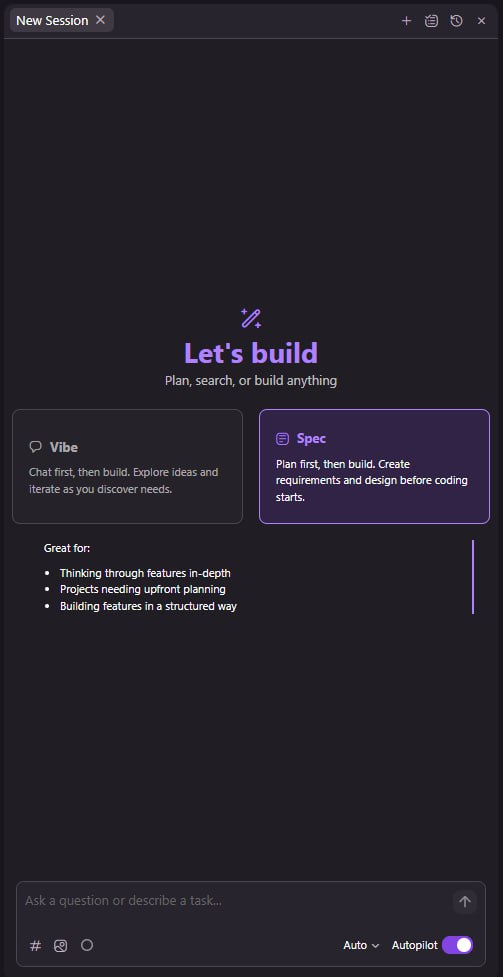

# מודול 2: עבודה עם כלי פיתוח מבוססי AI

!!! info "משך"
    30 דקות הרצאה + 60 דקות hands-on + 15 דקות דיון

## מטרות למידה

בסוף המודול הזה, תוכלו:

- לנווט בביטחון בכלי פיתוח AI (Kiro, Cursor, Claude Code, Windsurf וכו׳)
- להבין את העקרונות המשותפים לכל הכלים — בלי קשר לכלי הספציפי
- לנהל context, הרשאות, כללים וסשנים בצורה יעילה
- להרחיב את יכולות הכלי עם MCP servers

!!! tip "למה עקרונות ולא כלי ספציפי?"
    הכלים משתנים כל כמה חודשים. העקרונות נשארים. מי שמבין את הבסיס יכול לעבור בין כלים בקלות.

## הממשק — מה יש בפנים

### הפאנל של ה-Agent

כל כלי AI לפיתוח מכיל פאנל שבו מתנהלת האינטראקציה עם המודל. בין אם זה sidebar ב-IDE או terminal ב-CLI — העקרונות זהים:

- **שדה קלט** — כאן כותבים את ההנחיה (prompt)
- **היסטוריית שיחה** — ההודעות ההלוך-חזור בין המשתמש למודל
- **פעולות בזמן אמת** — הכלי מראה מה הוא עושה (קורא קובץ, כותב, מריץ פקודה)
- **אזור אישורים** — חלק מהפעולות דורשות אישור לפני ביצוע

**ב-Kiro** זה ה-AI Panel שנפתח בצד. **ב-Cursor** זה ה-Composer/Chat. **ב-Claude Code** זה ה-terminal עצמו.

### מבט על הפאנל — Kiro כדוגמה

{ width="380" }

<div class="annotated-panel" markdown>

| # | אזור | תפקיד |
|---|---|---|

1. **ניהול סשנים** (למעלה) — פתיחת סשן חדש, היסטוריית סשנים, טיימר
2. **בחירת מצב עבודה** — **Vibe** (chat חופשי → build) או **Spec** (תכנון → דרישות → קוד). רוב הכלים מציעים וריאציה של זה
3. **שדה קלט** (למטה) — כאן כותבים את ה-prompt. כולל:
      - `#` — הוספת context (קבצים, סמלים, תיקיות)
      - צירוף תמונות — screenshots, דיאגרמות, UI mockups
      - `○` — בחירת כללים (rules) רלוונטיים לשיחה
4. **בורר מודל** — `Auto` בוחר אוטומטית, אפשר לשנות ל-Claude Sonnet/Opus וכו׳
5. **Autopilot toggle** — כשפעיל, המודל מבצע פעולות בלי לבקש אישור (כמו YOLO mode). כשכבוי — מבקש אישור לכל כתיבה/הרצה

</div>

!!! note "נראה שונה בכלי אחר?"
    הממשק משתנה, אבל **כל הרכיבים האלה קיימים בכל כלי**. ב-Cursor יש Composer עם בורר מודל ו-context. ב-Claude Code הכל דרך ה-terminal עם flags ו-slash commands. העקרון זהה.

### בחירת מודל

רוב הכלים מאפשרים לבחור איזה מודל לעבוד איתו:

- **Claude Sonnet** — מהיר, חסכוני, מספיק לרוב המשימות
- **Claude Opus** — חכם יותר, איטי יותר, למשימות מורכבות
- **GPT-4o, Gemini** — חלק מהכלים תומכים גם במודלים של ספקים אחרים

!!! warning "טיפ חשוב"
    אל תבחרו תמיד את המודל הכי חזק. Sonnet מספיק ל-80% מהמשימות, ואתם חוסכים עלויות וזמן.

## ניהול Context

### למה Context חשוב?

המודל יודע **רק** מה שנמצא ב-context window שלו. אם הוא לא רואה את הקובץ — הוא לא יודע מה יש בו. כל מה שלא ב-context כאילו לא קיים.

### צירוף קבצים

כל הכלים מאפשרים לצרף קבצים ל-context בצורה כזו או אחרת:

- **Kiro / Cursor** — גררו קובץ לפאנל, או השתמשו ב-`@` כדי לציין קובץ
- **Claude Code** — הכלי קורא קבצים אוטומטית לפי הצורך, או ציינו נתיב ב-prompt
- **כולם** — אפשר לצרף תמונות (screenshots, דיאגרמות), URLs, ואפילו שגיאות מה-terminal

### מעקב אחרי ה-Context

ה-context window מוגבל. כשהוא מתמלא, קורים דברים רעים:

- המודל "שוכח" דברים מתחילת השיחה
- האיכות של התשובות יורדת
- חלק מהכלים עושים compression אוטומטי (מסכמים הודעות ישנות)

**איך לעקוב:**

- **Kiro** — מראה אינדיקטור של ניצול ה-context
- **Claude Code** — מציג את מספר ה-tokens בשורת הסטטוס
- **Cursor** — מראה כמה context נשאר

> כשאתם מרגישים שהמודל "הולך לאיבוד" — זה בדרך כלל בגלל שה-context התמלא. פתחו סשן חדש.

## ניהול סשנים ו-Snapshots

### סשנים

סשן = שיחה אחת עם המודל. כללי אצבע:

- **משימה אחת = סשן אחד** — אל תערבבו נושאים
- **סשן ארוך מדי = תוצאות גרועות** — אחרי 30-50 הודעות, שקלו להתחיל מחדש
- **סשן חדש לא אומר לאבד context** — אפשר לתת למודל סיכום של מה שקרה בסשן הקודם

### Snapshots

חלק מהכלים (Cursor, Kiro) שומרים snapshots — נקודות שחזור של הקבצים:

- לפני כל שינוי משמעותי, הכלי שומר את המצב הקודם
- אם המודל שבר משהו, אפשר לחזור ל-snapshot
- זה כמו `git stash` אוטומטי — רשת ביטחון חשובה

!!! tip "טיפ"
    גם אם יש snapshots, עדיין עשו `git commit` לפני שאתם נותנים למודל לעשות שינויים גדולים. Snapshots הם רשת ביטחון נוספת, לא תחליף ל-version control.

## כללים (Rules)

### מה זה?

קבצי כללים הם הוראות קבועות שנטענים אוטומטית בכל סשן. הם אומרים למודל:

- איזה סגנון קוד לשמור (tabs/spaces, naming conventions)
- אילו frameworks וכלים לעדיף
- מה לא לעשות (למשל: "אל תשתמש ב-any ב-TypeScript")
- מבנה הפרויקט ודפוסים קיימים

### השמות משתנים, העיקרון אחד

- **Kiro** — קבצי `.kiro/rules/`
- **Claude Code** — `CLAUDE.md` בשורש הפרויקט
- **Cursor** — `.cursor/rules/` או `.cursorrules`
- **Windsurf** — `.windsurfrules`

### דוגמה לקובץ כללים

```markdown
# Project Rules

## Stack
- TypeScript with strict mode
- React 19 + Next.js 15
- Tailwind CSS for styling
- Prisma for database

## Conventions
- Use named exports, not default exports
- Error handling: use Result type pattern, not try/catch
- Tests: vitest, co-located with source files (*.test.ts)
- Always use Hebrew for user-facing strings

## Do NOT
- Use `any` type
- Add console.log (use the logger utility)
- Install new dependencies without asking
```

## MCP — Model Context Protocol

### מה זה?

MCP הוא פרוטוקול שמאפשר לכלי AI להתחבר ל**שירותים חיצוניים**. במקום שהמודל יידע רק לקרוא ולכתוב קבצים, MCP מאפשר לו:

- לחפש ב-Jira/Linear
- לגשת ל-database
- לקרוא דוקומנטציה מ-Confluence
- להריץ queries ב-Grafana
- כל דבר שיש לו MCP server

### איך זה עובד?

```
AI Tool ←→ MCP Client ←→ MCP Server ←→ External Service
```

ה-MCP server חושף **כלים** (tools) — בדיוק כמו הכלים שראינו בתרגיל של ה-agent loop (מודול 4). המודל קורא לכלי, ה-MCP server מבצע, ומחזיר תוצאה.

### הגדרת MCP

ההגדרה נעשית בקובץ JSON, בדרך כלל בתיקיית ההגדרות של הכלי:

```json
{
  "mcpServers": {
    "github": {
      "command": "npx",
      "args": ["-y", "@modelcontextprotocol/server-github"],
      "env": {
        "GITHUB_TOKEN": "ghp_..."
      }
    },
    "postgres": {
      "command": "npx",
      "args": ["-y", "@modelcontextprotocol/server-postgres"],
      "env": {
        "DATABASE_URL": "postgresql://..."
      }
    }
  }
}
```

- **Kiro** — `.kiro/mcp.json`
- **Claude Code** — `.claude/mcp.json` או `~/.claude/mcp.json` (גלובלי)
- **Cursor** — `.cursor/mcp.json`

## הרשאות

### למה זה חשוב?

ה-AI agent יכול לקרוא קבצים, לכתוב קבצים, ולהריץ פקודות. בלי הרשאות — הוא יכול לעשות כל דבר. זה מפחיד.

### רמות הרשאה

רוב הכלים מציעים מספר רמות:

- **אישור לכל פעולה** — הכי בטוח, הכי איטי
- **אישור אוטומטי לקריאה, ידני לכתיבה** — איזון טוב
- **YOLO mode** — הכל אוטומטי, מתאים רק לסביבות sandbox

### מה לאשר ומה לא?

- **תמיד לאשר:** מחיקת קבצים, `git push`, פקודות עם `sudo`, התקנת packages
- **בדרך כלל בטוח:** קריאת קבצים, הרצת tests, `git status/diff`
- **תלוי בהקשר:** כתיבת קבצים חדשים, הרצת scripts

## מענה על שאלות של המודל

לפעמים המודל שואל שאלות לפני שהוא פועל. **אל תתעלמו מזה!**

- אם המודל שואל — כנראה שחסר לו מידע חשוב
- תשובה מפורטת חוסכת iterations ותוצאות שגויות
- אם לא בטוחים, עדיף לענות "אני לא בטוח, תבחר את הגישה שנראית לך הכי נכונה" מאשר להתעלם

## Skills

### מה זה?

Skills הם "מתכונים" מוכנים מראש — workflows שהמודל יודע לבצע. במקום להסביר בכל פעם "תכתוב לי test", אפשר להגדיר skill של "כתיבת test" שכולל:

- באיזה framework להשתמש
- מבנה הקובץ
- naming conventions
- דוגמאות

### דוגמה ב-Kiro

```markdown
# Skill: Create API Endpoint

## Steps
1. Create route handler in `src/routes/`
2. Add Zod validation schema
3. Add integration test in `__tests__/`
4. Update OpenAPI spec in `docs/api.yaml`

## Template
- Handler: src/routes/{name}.ts
- Test: __tests__/routes/{name}.test.ts
```

Skills חוסכים זמן וגורמים לתוצאות עקביות — במיוחד כשצוות שלם עובד עם אותם כלים.

## תרגיל מעשי

### הכרת הכלי — Guided Tour (30 דקות)

פתחו את Kiro (או כלי AI אחר) על פרויקט קיים ובצעו:

1. **פאנל ושיחה** — פתחו את הפאנל, שלחו prompt פשוט, עקבו אחרי הפעולות
2. **צירוף context** — צרפו קובץ, צרפו תמונה, צרפו שגיאה מה-terminal
3. **בחירת מודל** — החליפו מודל ובדקו את ההבדל בתשובות
4. **מעקב context** — שלחו 10+ הודעות ועקבו אחרי ניצול ה-context window

### הגדרות (15 דקות)

5. **קובץ כללים** — צרו קובץ rules לפרויקט עם לפחות 5 כללים
6. **הרשאות** — בדקו את הגדרות ההרשאות, שנו רמה ובדקו את ההבדל

### MCP (15 דקות)

7. **הגדרת MCP** — הגדירו MCP server אחד (למשל: GitHub, filesystem, או sqlite)
8. **שימוש** — בקשו מהמודל לבצע פעולה דרך ה-MCP server

## שאלות לדיון

1. מתי פותחים סשן חדש לעומת ממשיכים באותו סשן?
2. מה ההבדל בין rules טובים לגרועים? איך זה משפיע על התוצאות?
3. אילו MCP servers הייתם רוצים לבנות לצוות שלכם?
4. איפה הגבול הנכון בהרשאות — בין מהירות לבטיחות?

## נקודות מפתח

- כל כלי AI לפיתוח בנוי על אותם עקרונות — למדו אחד, תבינו את כולם
- **Context הוא המשאב הכי חשוב** — נהלו אותו בתבונה
- קבצי כללים הם ה-force multiplier הכי גדול — השקיעו בהם
- MCP מרחיב את יכולות ה-agent מעבר לקריאה וכתיבה של קבצים
- הרשאות הן לא מטרד — הן רשת ביטחון. השתמשו בהן
