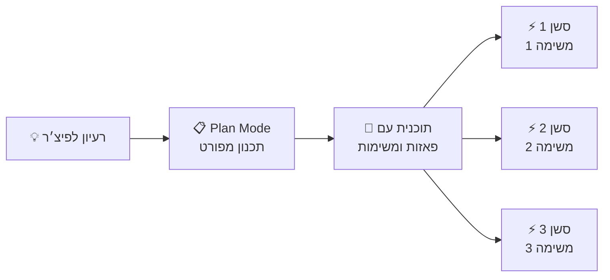
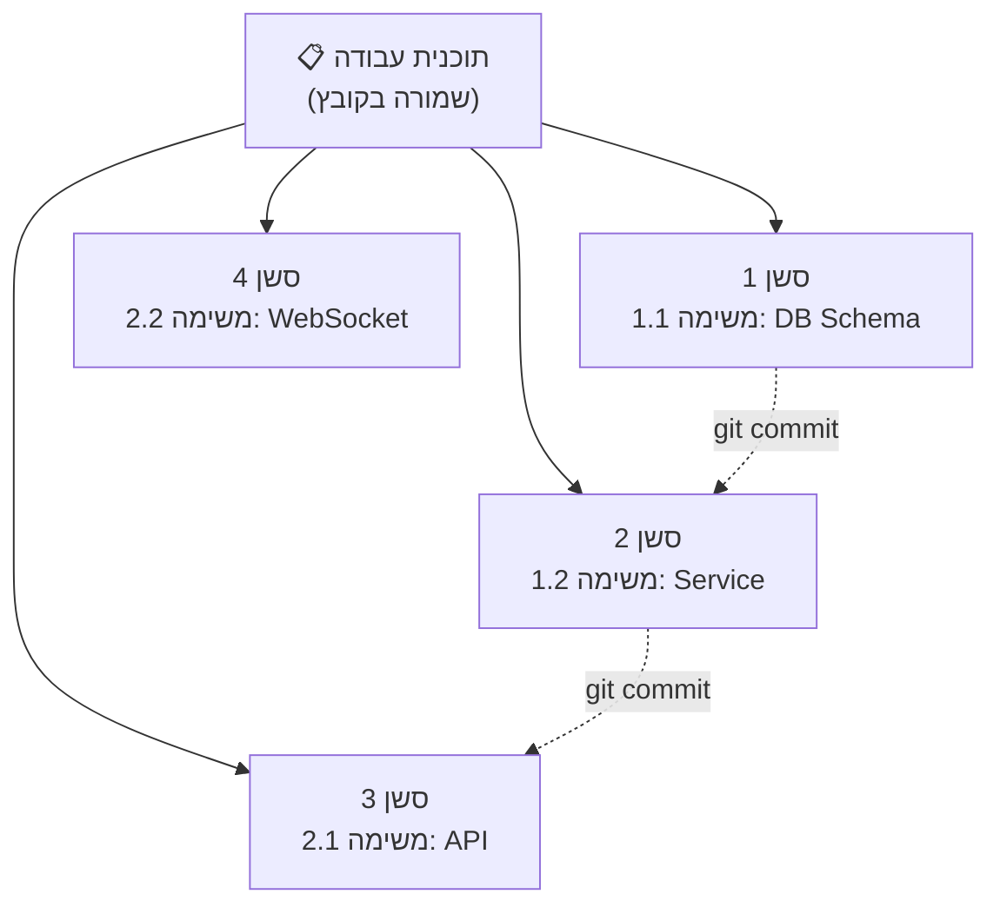
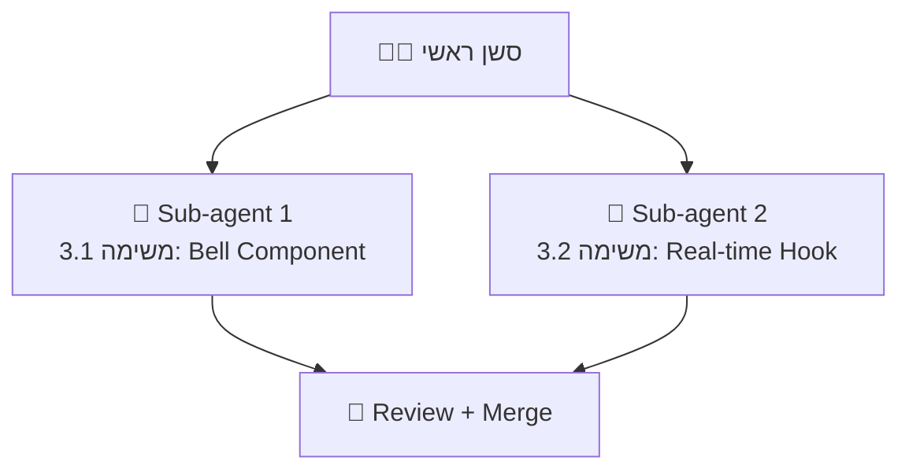

# מודול 3C: Plan Mode — תכנון פיצ׳רים מורכבים

!!! info "משך"
    20 דקות הרצאה + 60 דקות hands-on + 15 דקות דיון

## מטרות למידה

בסוף המודול הזה, תוכלו:

- להבין מתי ולמה להשתמש ב-Plan Mode לפני שמתחילים לכתוב קוד
- ליצור תוכנית עבודה מפורטת שמכסה את כל ההיבטים של פיצ׳ר מורכב
- לפרק פיצ׳ר לפאזות/משימות עצמאיות שאפשר להריץ בסשנים נפרדים
- להשתמש ב-sub-agents כדי להריץ משימות במקביל

!!! tip "למה סשן נפרד?"
    במודול 3 למדנו את העקרונות של עבודה עם כלי AI. כאן נתמקד בדפוס קריטי: **לפני שכותבים שורת קוד אחת — מתכננים**. זה ההבדל בין מפתח שמקווה לטוב לבין מפתח שיודע לאן הוא הולך.

## הבעיה: למה קוד בלי תוכנית נכשל

### התרחיש הקלאסי

```
"הוסף מערכת notifications לאפליקציה"
```

בלי תכנון, מה קורה:

1. ה-agent מתחיל לכתוב קוד מיד
2. באמצע הדרך מגלה שצריך database schema חדש
3. כותב migration, אבל שוכח את ה-API layer
4. מוסיף API endpoint, אבל לא חשב על real-time (WebSockets)
5. ה-context window מתמלא
6. התוצאה: קוד חלקי, לא עקבי, עם חורים

### מה השתבש?

- **אין תמונה כוללת** — ה-agent פתר בעיות נקודתיות בלי לראות את המערכת
- **ה-context נגמר** — פיצ׳ר מורכב דורש יותר context ממה שסשן אחד מכיל
- **אין סדר עדיפויות** — לא ברור מה לעשות קודם ומה תלוי במה

## הפתרון: Plan Mode

### מה זה Plan Mode?

Plan Mode הוא מצב עבודה שבו **לא כותבים קוד** — רק מתכננים. במקום לבקש מה-agent לבנות את הפיצ׳ר, מבקשים ממנו **לתכנן** אותו.



### איך נכנסים ל-Plan Mode?

**ב-Claude Code / Kiro CLI:**

```
> /plan הוסף מערכת notifications לאפליקציה
```

או בצורה מפורשת ב-prompt:

```
> אני רוצה להוסיף מערכת notifications לאפליקציה.
  אל תכתוב קוד. תכנן את הפיצ׳ר — מה צריך לבנות,
  באיזה סדר, ומה התלויות בין החלקים.
```

**ב-Kiro IDE — Spec Mode:**

Kiro IDE מציע מצב **Spec** שעובד על אותו עיקרון: לפני שכותבים קוד, מגדירים דרישות, מפרטים, ורק אז עוברים למימוש.

### מה התוכנית צריכה לכלול?

תוכנית טובה מכסה את **כל ההיבטים** של הפיצ׳ר:

- **ארכיטקטורה** — אילו רכיבים צריך לבנות/לשנות
- **Database** — שינויי schema, migrations
- **API** — endpoints חדשים, שינויים בקיימים
- **Frontend** — components, state management, UI flows
- **תשתית** — WebSockets, queues, cron jobs
- **בדיקות** — מה לבדוק ואיך
- **תלויות** — מה תלוי במה, מה אפשר לעשות במקביל

## מבנה התוכנית: פאזות ומשימות

### העיקרון

תוכנית טובה מפרקת את הפיצ׳ר ל**פאזות** (phases). כל פאזה מכילה **משימות** (tasks) עצמאיות שאפשר לבצע בסשן נפרד.

### דוגמה: מערכת Notifications

נניח שביקשנו מה-agent לתכנן מערכת notifications. תוכנית טובה תיראה כך:

---

**פאזה 1 — תשתית (Foundation)**

- **משימה 1.1: Database Schema**
    - יצירת טבלת `notifications` עם עמודות: id, user_id, type, title, body, read, created_at
    - יצירת טבלת `notification_preferences` להגדרות per-user
    - כתיבת migration
    - *קבצים:* `prisma/schema.prisma`, `prisma/migrations/`

- **משימה 1.2: Notification Service**
    - יצירת service class עם methods: create, markAsRead, getUnread, deleteOld
    - הוספת types/interfaces
    - *קבצים:* `src/services/notification.service.ts`, `src/types/notification.ts`

---

**פאזה 2 — API Layer**

- **משימה 2.1: REST Endpoints**
    - `GET /notifications` — רשימת notifications עם pagination
    - `PATCH /notifications/:id/read` — סימון כנקרא
    - `DELETE /notifications/:id` — מחיקה
    - Validation עם Zod
    - *קבצים:* `src/routes/notifications.ts`, `src/validators/notification.ts`

- **משימה 2.2: WebSocket Integration**
    - הגדרת WebSocket channel לreal-time notifications
    - שליחת notification חדש ל-connected clients
    - *קבצים:* `src/ws/notifications.ts`, `src/ws/index.ts`

---

**פאזה 3 — Frontend**

- **משימה 3.1: Notification Bell Component**
    - אייקון bell עם badge של unread count
    - Dropdown עם רשימת notifications
    - *קבצים:* `src/components/NotificationBell.tsx`, `src/components/NotificationList.tsx`

- **משימה 3.2: Real-time Updates**
    - חיבור WebSocket לקבלת notifications בזמן אמת
    - עדכון UI אוטומטי כש-notification חדש מגיע
    - *קבצים:* `src/hooks/useNotifications.ts`

---

**פאזה 4 — בדיקות ו-Polish**

- **משימה 4.1: Unit Tests**
    - בדיקות ל-notification service
    - בדיקות ל-API endpoints
    - *קבצים:* `src/services/__tests__/notification.test.ts`, `src/routes/__tests__/notifications.test.ts`

- **משימה 4.2: Integration Test**
    - תרחיש end-to-end: יצירת notification → קבלה ב-WebSocket → סימון כנקרא
    - *קבצים:* `tests/notifications.e2e.test.ts`

---

### מה עושה את התוכנית הזו טובה?

- **כל משימה עצמאית** — אפשר לבצע אותה בסשן נפרד עם context נקי
- **תלויות ברורות** — פאזה 1 חייבת להסתיים לפני פאזה 2, אבל משימות בתוך פאזה יכולות לרוץ במקביל
- **קבצים מפורטים** — ה-agent יודע בדיוק על אילו קבצים לעבוד
- **היקף מוגדר** — כל משימה קטנה מספיק לסשן אחד

## ביצוע: סשן אחד למשימה

### למה סשנים נפרדים?

כל משימה רצה ב**סשן חדש עם context נקי**:



**למה זה עובד:**

- **Context נקי** — ה-agent מתמקד רק במשימה הנוכחית, לא טוען 1000 שורות היסטוריה
- **מיקוד** — משימה קטנה = תוצאה טובה יותר
- **גמישות** — אם משימה נכשלה, מתחילים אותה מחדש בלי לאבד את השאר
- **Git history נקי** — commit אחד לכל משימה

### איך מתחילים סשן עבודה?

בכל סשן חדש, נותנים ל-agent את ה-context הדרוש:

```
> אני עובד על מערכת notifications לפי התוכנית ב-PLAN.md.
  עכשיו תבצע את משימה 2.1: REST Endpoints.
  קרא את PLAN.md ואת הקבצים הרלוונטיים שנוצרו בפאזות הקודמות.
```

ה-agent:

1. קורא את קובץ התוכנית
2. קורא את הקבצים שכבר קיימים (מפאזות קודמות)
3. מבצע את המשימה
4. עושה commit

### שמירת התוכנית

!!! tip "שמרו את התוכנית בקובץ"
    שמרו את התוכנית כקובץ בפרויקט (למשל `PLAN.md` או `.claude/plan.md`). ככה כל סשן חדש יכול לקרוא אותה ולהבין את ההקשר.

דוגמה לקובץ תוכנית:

```markdown
# Plan: Notification System

## Status
- [x] Phase 1: Foundation
  - [x] Task 1.1: Database Schema
  - [x] Task 1.2: Notification Service
- [ ] Phase 2: API Layer
  - [ ] Task 2.1: REST Endpoints ← CURRENT
  - [ ] Task 2.2: WebSocket Integration
- [ ] Phase 3: Frontend
- [ ] Phase 4: Testing

## Architecture Decision Records
- Using Prisma for ORM (consistent with rest of project)
- WebSocket via socket.io (already a dependency)
- Zod for API validation

## Task Details
(... הפירוט של כל משימה ...)
```

## עבודה במקביל עם Sub-agents

### מה הם Sub-agents?

כשיש משימות **עצמאיות** באותה פאזה, אפשר להריץ אותן **במקביל** באמצעות sub-agents. Sub-agent הוא סשן עבודה נפרד שרץ ברקע.



### איך זה עובד ב-Claude Code?

Claude Code תומך ב-sub-agents באמצעות כלי ה-Task. כש-agent מקבל תוכנית עם משימות עצמאיות, הוא יכול:

1. לזהות אילו משימות אפשר להריץ במקביל
2. להפעיל sub-agent לכל משימה
3. לחכות שכולם יסיימו
4. לעשות review ו-merge של התוצאות

```
> תבצע את פאזה 3 מהתוכנית. משימות 3.1 ו-3.2 עצמאיות —
  תריץ אותן במקביל עם sub-agents.
```

### מתי להשתמש ב-Sub-agents?

**כן — כשהמשימות עצמאיות:**

- שני components שלא תלויים אחד בשני
- tests ל-modules שונים
- frontend ו-backend שמסכימים על interface

**לא — כשיש תלויות:**

- API שתלוי ב-database schema
- Frontend שתלוי ב-API שעוד לא קיים
- Test שתלוי בקוד שעוד לא נכתב

!!! warning "זהירות עם sub-agents"
    sub-agents עובדים על אותו codebase. אם שני sub-agents עורכים את אותו קובץ — יהיו conflicts. וודאו שכל sub-agent עובד על קבצים שונים.

## Prompt Engineering לתכנון

### prompt לתכנון מפורט

```
אני רוצה לבנות [תיאור הפיצ׳ר].

אל תכתוב קוד. תכנן את הפיצ׳ר בצורה מפורטת:

1. ניתוח — מה בדיוק צריך לקרות? מה ה-user flows?
2. ארכיטקטורה — אילו רכיבים צריך לבנות/לשנות?
3. תלויות — מה תלוי במה?
4. פאזות — פרק לפאזות לפי סדר. בתוך כל פאזה, פרט משימות עצמאיות.
5. לכל משימה ציין: מה לעשות, אילו קבצים מושפעים, ומה הקריטריון להצלחה.
6. ציין אילו משימות אפשר להריץ במקביל.

קרא קודם את הקוד הקיים כדי להבין את המבנה, ה-conventions,
וה-stack הטכנולוגי.
```

### prompt לביצוע משימה בודדת

```
אני עובד על [שם הפיצ׳ר] לפי התוכנית ב-PLAN.md.
תבצע את משימה [X.Y]: [שם המשימה].

קרא את PLAN.md כדי להבין את ההקשר הכולל.
קרא את הקבצים שנוצרו בפאזות הקודמות.
בצע רק את המשימה הזו — לא יותר.
בסוף, עדכן את PLAN.md וסמן את המשימה כ-done.
```

## תרגיל מעשי

### תרגיל 1: תכנון פיצ׳ר (20 דקות)

בחרו פיצ׳ר מורכב (או השתמשו בדוגמה):

**אופציה A:** מערכת comments עם threads, reactions, ו-mentions

**אופציה B:** מערכת authentication עם OAuth, 2FA, ו-session management

**אופציה C:** dashboard עם גרפים, filters, ו-export ל-CSV

פתחו סשן חדש והריצו Plan Mode:

```bash
kiro
> /plan [תיאור הפיצ׳ר שבחרתם]
```

או:

```bash
kiro
> אני רוצה לבנות [תיאור הפיצ׳ר]. אל תכתוב קוד.
  תכנן את הפיצ׳ר בצורה מפורטת עם פאזות ומשימות.
  קח בחשבון database, API, frontend, ובדיקות.
```

**בדקו שהתוכנית כוללת:**

- [ ] פאזות ברורות עם סדר הגיוני
- [ ] משימות עצמאיות בתוך כל פאזה
- [ ] קבצים ספציפיים לכל משימה
- [ ] תלויות מפורשות בין פאזות
- [ ] ציון אילו משימות אפשר להריץ במקביל

### תרגיל 2: ביצוע לפי תוכנית (30 דקות)

קחו את התוכנית מתרגיל 1 ובצעו את **שתי המשימות הראשונות**:

1. שמרו את התוכנית כקובץ `PLAN.md` בפרויקט
2. פתחו **סשן חדש** לכל משימה
3. בכל סשן:
    - תנו ל-agent את ה-context (הפנו ל-`PLAN.md`)
    - בקשו ממנו לבצע משימה ספציפית
    - וודאו שהוא עושה commit בסוף
    - עדכנו את `PLAN.md` (סמנו `[x]` על המשימה)

**שימו לב להבדל:** כל סשן מתחיל נקי, ה-agent קורא את התוכנית ואת הקוד הקיים, ומתמקד רק במשימה הנוכחית.

### תרגיל 3: עבודה במקביל (10 דקות)

אם הגעתם לפאזה שמכילה משימות עצמאיות:

1. פתחו שני terminals
2. בכל terminal הפעילו Kiro CLI
3. בכל אחד בצעו משימה אחרת מאותה פאזה
4. וודאו שאין conflicts — כל agent עובד על קבצים שונים
5. עשו merge של התוצאות

## טעויות נפוצות

### "התוכנית כללית מדי"

```
# ❌ לא מספיק מפורט
- פאזה 1: בנה את ה-backend
- פאזה 2: בנה את ה-frontend

# ✅ מפורט ומעשי
- פאזה 1: Database + Service Layer
  - משימה 1.1: יצירת טבלת notifications (schema + migration)
  - משימה 1.2: NotificationService class (create, read, delete)
```

### "קפיצה ישר לקוד"

אם ה-agent מתחיל לכתוב קוד ב-Plan Mode, עצרו אותו:

```
> עצור. אנחנו במצב תכנון. אל תכתוב קוד — רק תתכנן.
  תחזור לתוכנית ותמשיך לפרט את הפאזות.
```

### "סשן אחד ענק"

```
# ❌ הכל בסשן אחד
> "תבנה מערכת notifications מלאה"

# ✅ סשן לכל משימה
> "תבצע משימה 1.1 מהתוכנית: יצירת database schema"
```

### "שכחנו לעדכן את התוכנית"

תמיד עדכנו את `PLAN.md` אחרי כל משימה. ככה הסשן הבא יודע מה כבר בוצע ומה נשאר.

## שאלות לדיון

1. מתי תכנון הוא overhead ומתי הוא הכרחי? מה הרף של "פיצ׳ר מורכב"?
2. איך מתמודדים עם שינויים בתוכנית באמצע הביצוע? (למשל: גילינו שהארכיטקטורה לא מתאימה)
3. מה היחס הנכון בין זמן תכנון לזמן ביצוע?
4. איך דפוס התכנון הזה משתלב עם Agile / sprints?

## נקודות מפתח

- **תכנון לפני ביצוע** — ב-Plan Mode ה-agent מנתח, מפרק, ומתכנן בלי לכתוב קוד
- **פאזות ומשימות** — פיצ׳ר מורכב מתפרק לפאזות עם תלויות ברורות, וכל פאזה למשימות עצמאיות
- **סשן אחד = משימה אחת** — context נקי, מיקוד, ו-git history נקי
- **שמרו את התוכנית בקובץ** — `PLAN.md` הוא ה-source of truth לכל הסשנים
- **Sub-agents לעבודה במקביל** — משימות עצמאיות יכולות לרוץ במקביל, בתנאי שהן לא עורכות את אותם קבצים
- **עדכנו את התוכנית** — אחרי כל משימה, סמנו מה בוצע ומה נשאר
