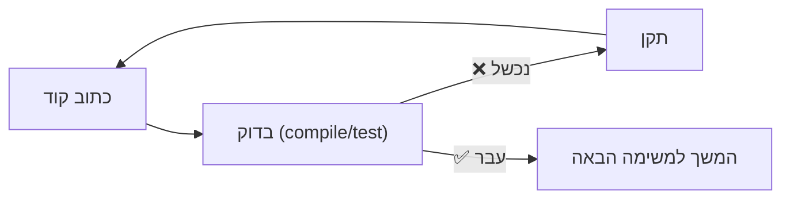
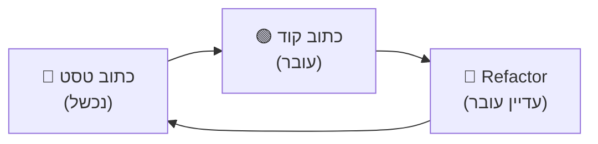

# מודול 5: Steering — איך לנווט את ה-Agent להצלחה

!!! info "משך"
    30 דקות הרצאה + 60 דקות hands-on + 15 דקות דיון

## מטרות למידה

בסוף המודול הזה, תוכלו:

- להבין את ההבדל בין prompt טוב לבין **steering אפקטיבי** — ניווט מתמשך של ה-agent
- להשתמש בקומפילציה, טסטים ו-verification כדי לוודא שה-agent באמת מצליח
- להגדיר **יעדים ברורים ומדידים** שה-agent יכול לאמת בעצמו
- לנצל את היכולות של ה-agent (הרצת פקודות, קריאת פלט) כדי ליצור **feedback loops** אוטומטיים

!!! tip "למה סשן נפרד?"
    במודולים הקודמים למדנו איך לכתוב prompts טובים ואיך לתכנן פיצ'רים. אבל prompt טוב ותוכנית טובה לא מספיקים — צריך **לנווט** את ה-agent בזמן העבודה. זה ההבדל בין "לבקש" לבין "להוביל".

## הבעיה: Agent שעובד בלי feedback

### התרחיש הקלאסי

```
> "תוסיף validation לכל הטפסים באפליקציה"
```

מה קורה בלי steering:

1. ה-agent כותב validation לטופס הראשון ✅
2. שוכח edge case חשוב ❌
3. עובר לטופס הבא בלי לבדוק שהראשון עובד ❌
4. כותב קוד שלא מתקמפל (import חסר) ❌
5. ממשיך 15 דקות בלי שאף אחד אומר לו שיש בעיה ❌
6. בסוף — 200 שורות קוד שצריך לזרוק

### מה השתבש?

- **אין feedback loop** — ה-agent כותב קוד אבל לא מוודא שהוא עובד
- **אין יעד מדיד** — "validation לכל הטפסים" זה לא ברור מספיק
- **אין verification** — אף אחד לא בדק שהקוד מתקמפל, עובר tests, או באמת עושה מה שצריך

## העיקרון: Feedback Loops הם הכל

> Steering = ליצור מצב שבו ה-agent **יודע אם הוא מצליח או נכשל** — ומתקן את עצמו בזמן אמת.

ההבדל בין מפתח מנוסה למתחיל בעבודה עם agents הוא לא ב-prompt — הוא ב**מנגנוני ה-feedback** שהוא יוצר.



## ארבעת הכלים לSteering

### 1. קומפילציה — ה-Safety Net הבסיסי

הכלי הכי פשוט והכי חשוב: **וודאו שהקוד מתקמפל אחרי כל שינוי**.

**בלי steering:**
```
> "תוסיף TypeScript types לכל הפונקציות ב-src/utils/"
```

ה-agent כותב types ל-10 קבצים. בקובץ השלישי יש שגיאת import. הוא ממשיך לכתוב עוד 7 קבצים שמבוססים על ה-type השגוי. בסוף — הכל שבור.

**עם steering:**
```
> "תוסיף TypeScript types לכל הפונקציות ב-src/utils/.
  אחרי כל קובץ שאתה משנה, הרץ `npx tsc --noEmit` כדי לוודא
  שאין שגיאות קומפילציה. אם יש שגיאה — תתקן לפני שממשיכים."
```

עכשיו ה-agent מקבל feedback מיידי. שגיאה בקובץ 3? הוא מתקן אותה **עכשיו** ולא אחרי 7 קבצים נוספים.

!!! example "דוגמאות לפקודות קומפילציה"
    - **TypeScript:** `npx tsc --noEmit`
    - **Go:** `go build ./...`
    - **Rust:** `cargo check`
    - **Python:** `python -m py_compile file.py` או `mypy src/`
    - **Java:** `mvn compile`
    - **Frontend:** `npm run build`

### 2. טסטים — ה-Source of Truth

טסטים הם ה-feedback הכי חזק שיש. הם אומרים ל-agent בדיוק **מה צריך לעבוד ואיך**.

#### טסטים כמפרט (Test as Spec)

במקום לתאר מה אתם רוצים במילים — **כתבו טסט שמגדיר את ההתנהגות הרצויה**:

**בלי steering:**
```
> "תכתוב פונקציה שמפרסרת כתובות email"
```

ה-agent יכתוב פונקציה, אבל האם היא מטפלת ב-edge cases? ב-unicode? ב-subaddressing (`user+tag@domain.com`)? אתם לא יודעים עד שתבדקו ידנית.

**עם steering — כתבו טסט קודם:**
```
> "אני רוצה פונקציה parseEmail שמפרסרת כתובות email.
  הנה הטסטים שהיא צריכה לעבור:

  test('basic email', () => {
    expect(parseEmail('user@domain.com')).toEqual({
      local: 'user', domain: 'domain.com'
    });
  });

  test('subaddressing', () => {
    expect(parseEmail('user+tag@domain.com')).toEqual({
      local: 'user', tag: 'tag', domain: 'domain.com'
    });
  });

  test('invalid email', () => {
    expect(parseEmail('not-an-email')).toBeNull();
  });

  תממש את parseEmail כך שכל הטסטים יעברו.
  הרץ את הטסטים אחרי הכתיבה."
```

עכשיו ל-agent יש **מפרט ברור** ו**דרך לאמת שהוא עומד בו**.

#### דפוס Red-Green-Refactor עם Agent



1. **אתם** כותבים טסט שנכשל (או מתארים אותו)
2. **ה-agent** כותב קוד שגורם לטסט לעבור
3. **ה-agent** עושה refactor — ומוודא שהטסטים עדיין עוברים

```
> "הנה טסט שנכשל:

  test('user cannot delete other users posts', async () => {
    const post = await createPost({ author: userA });
    const response = await deletePost(post.id, { as: userB });
    expect(response.status).toBe(403);
    expect(await getPost(post.id)).not.toBeNull();
  });

  תתקן את הקוד כך שהטסט יעבור.
  הרץ את כל הטסטים אחרי התיקון לוודא שלא שברת שום דבר."
```

#### הרצת טסטים אחרי כל שינוי

```
> "אחרי כל שינוי שאתה עושה, הרץ `npm test`.
  אם טסט נכשל — תקן לפני שאתה ממשיך.
  אם כל הטסטים עוברים — המשך למשימה הבאה."
```

!!! warning "חשוב"
    **אל תסמכו על ה-agent שירוץ טסטים מעצמו.** חלק מה-agents לא מריצים טסטים אלא אם מבקשים מהם מפורשות. תמיד ציינו: "הרץ את הטסטים".

### 3. Computer Use — ה-Agent רואה מה שאתם רואים

כש-agents יכולים לראות את המסך, **הם יכולים לאמת UI ותוצאות ויזואליות** — לא רק קוד.

#### Verification ויזואלי

```
> "תוסיף dark mode toggle ל-navbar.
  אחרי שתסיים, פתח את הדפדפן ותוודא שהכפתור:
  1. נראה נכון (אייקון שמש/ירח)
  2. משנה את ה-theme כשלוחצים
  3. שומר את הבחירה אחרי refresh"
```

ה-agent יכול:

- לפתוח את הדפדפן ולצלם screenshot
- לאמת שה-UI נראה כמו שצריך
- ללחוץ על כפתורים ולוודא שהם עובדים
- להשוות לפני/אחרי

#### Terminal כ-Computer Use

גם בלי computer use מלא, **ה-terminal עצמו הוא כלי verification עוצמתי**:

```
> "תכתוב API endpoint שמחזיר רשימת משתמשים.
  אחרי שתסיים:
  1. הרץ את השרת
  2. שלח request עם curl ותראה לי את ה-response
  3. וודא שה-response תואם את ה-schema שהגדרנו"
```

```
> "תכתוב migration שמוסיף עמודה חדשה.
  אחרי שתסיים:
  1. הרץ את ה-migration
  2. הרץ `psql -c '\d users'` ותראה לי שהעמודה נוספה
  3. הרץ rollback ווודא שהעמודה הוסרה"
```

### 4. יעדים ברורים — ה-Agent יודע מתי הוא סיים

יעד לא ברור = agent שממשיך לעבוד בלי סוף, או שעוצר מוקדם מדי.

#### הגדרת "Definition of Done"

**בלי steering:**
```
> "תשפר את הביצועים של הדף"
```

מה זה "שיפור"? 10%? 50%? ה-agent לא יודע מתי לעצור.

**עם steering:**
```
> "הדף הראשי נטען ב-4.2 שניות (ראה: `npx lighthouse http://localhost:3000`).
  המטרה: להוריד את זמן הטעינה מתחת ל-2 שניות.

  אחרי כל שיפור:
  1. הרץ lighthouse שוב
  2. רשום מה שינית ומה ההשפעה על זמן הטעינה
  3. אם הגענו מתחת ל-2 שניות — סיימנו
  4. אם לא — המשך לשיפור הבא"
```

עכשיו ל-agent יש **יעד מספרי** ו**דרך למדוד אותו**.

#### דפוס: Exit Criteria מפורשים

תמיד הגדירו מתי ה-agent צריך לעצור:

```
> "סיימת כשכל התנאים הבאים מתקיימים:
  1. `npm run build` עובר בלי שגיאות
  2. `npm test` — כל הטסטים עוברים
  3. `npm run lint` — אין warnings חדשים
  4. הפיצ'ר עובד כמו שמתואר למעלה"
```

#### דפוס: Checklist מדיד

```
> "תבנה טופס הרשמה עם הדרישות הבאות:

  שדות:
  - [ ] שם (חובה, 2-50 תווים)
  - [ ] אימייל (חובה, פורמט תקין)
  - [ ] סיסמה (חובה, 8+ תווים, אות גדולה, מספר)
  - [ ] אישור סיסמה (חובה, זהה לסיסמה)

  התנהגות:
  - [ ] שגיאות מוצגות inline מתחת לכל שדה
  - [ ] כפתור Submit מנוטרל עד שכל השדות תקינים
  - [ ] אחרי הגשה מוצלחת — redirect ל-/dashboard

  בדיקות:
  - [ ] `npm test` עובר
  - [ ] `npm run build` עובר

  עבור על כל פריט ב-checklist ווודא שהוא מתקיים."
```

## דפוסי Steering מתקדמים

### דפוס "Compile After Every File"

כשה-agent עורך מספר קבצים:

```
> "לכל קובץ שאתה משנה:
  1. ערוך את הקובץ
  2. הרץ `npx tsc --noEmit`
  3. אם יש שגיאה — תקן אותה עכשיו
  4. רק אז עבור לקובץ הבא"
```

זה מונע את הבעיה של "20 קבצים שבורים שכולם תלויים אחד בשני".

### דפוס "Test-Driven Agent"

```
> "נעבוד ב-TDD:
  1. קודם תכתוב טסט למה שאני מבקש
  2. הרץ אותו — הוא צריך להיכשל
  3. כתוב את הקוד שגורם לו לעבור
  4. הרץ שוב — הוא צריך לעבור
  5. תשאל אותי לפני שאתה ממשיך למשימה הבאה"
```

### דפוס "Smoke Test"

אחרי שינוי גדול, בקשו מה-agent לעשות smoke test:

```
> "סיימת את הפיצ'ר. עכשיו תעשה smoke test:
  1. הרץ את השרת
  2. שלח request ל-endpoint החדש עם curl
  3. שלח request עם input לא תקין — וודא שמקבלים שגיאה
  4. בדוק שה-logs לא מראים שגיאות unexpected
  5. תדווח לי מה עבד ומה לא"
```

### דפוס "Before/After"

```
> "לפני שאתה מתחיל:
  1. הרץ `npm test` ותראה לי את התוצאה
  2. הרץ `npm run build` ותראה לי את התוצאה

  עכשיו תעשה את השינוי.

  אחרי שתסיים:
  1. הרץ שוב `npm test` — צריך להיות אותו מספר טסטים שעוברים (ועוד)
  2. הרץ שוב `npm run build` — צריך לעבור בלי שגיאות

  אם משהו שהיה עובד לפני — נשבר עכשיו — תתקן."
```

## כשה-Agent נתקע בלולאה

### הבעיה

לפעמים ה-agent נכנס ללולאה אינסופית: מריץ test, נכשל, מנסה לתקן, נכשל שוב, מנסה גישה אחרת, נכשל שוב... וזה יכול להמשיך 10-15 דקות (ולעלות הרבה כסף).

### אסטרטגיות לטיפול

**1. הגבלת iterations:**

```
> תנסה לתקן את הטסט. אם אחרי 3 ניסיונות זה עדיין לא עובד —
  תעצור ותשאל אותי.
```

**2. התערבות ידנית:**

אם ה-agent כבר בלולאה, לחצו `Ctrl+C` (או Escape ב-Claude Code) כדי לעצור אותו. אז תנו לו כיוון חדש:

```
> הגישה הזו לא עובדת. הבעיה היא ש-X.
  תנסה גישה אחרת: [הכוונה ספציפית]
```

**3. Reset context:**

אם ה-agent "התבלבל" מנסיונות כושלים מרובים, התחילו סשן חדש עם הוראות ממוקדות:

```
> (סשן חדש)
  יש באג בקובץ X: הטסט Y נכשל בגלל Z.
  תתקן את זה. הנה הטסט: [הדבקת הטסט]
```

**4. צמצום scope:**

לפעמים המשימה גדולה מדי. פרקו אותה:

```
> עזוב את כל המשימה. תתמקד רק בפונקציה validateEmail.
  תכתוב אותה כך שהטסט הזה יעבור: [טסט בודד]
```

!!! tip "עלות של Steering"
    Steering יעיל = יותר iterations = יותר API calls = יותר עלות. זה בסדר — עדיף 10 iterations קצרים שמצליחים מאשר iteration אחד ארוך שנכשל. אבל שימו לב: אם ה-agent בלולאה, העלות גדלה מהר. הגבלת iterations חוסכת גם זמן וגם כסף.

    **כלל אצבע:** steering הוא קריטי לשינויים מורכבים ורב-קבצים. לשינויים פשוטים (שנייה בקובץ אחד) — לא צריך steering מיוחד.

## הטבלה: בלי Steering לעומת עם Steering

### בלי Steering

- ה-agent כותב 200 שורות בלי לבדוק
- שגיאות מצטברות ונהיות קשות לתיקון
- לא ברור מתי ה-agent "סיים"
- תוצאות לא צפויות

### עם Steering

- ה-agent מוודא אחרי כל שלב קטן
- שגיאות מתגלות ומתוקנות מיד
- יש קריטריונים ברורים ל"סיים"
- תוצאות עקביות ואמינות

## תרגיל מעשי

### תרגיל 1: Compile-Driven Development (25 דקות)

צרו פרויקט TypeScript פשוט:

```bash
mkdir ~/missions/steering-practice && cd $_
kiro
```

```
> "צור פרויקט TypeScript עם tsconfig.json.
  צור קובץ src/math.ts עם פונקציות: add, subtract, multiply, divide.
  צור קובץ src/stats.ts שמייבא מ-math.ts ומממש: average, median, standardDeviation.

  חשוב: אחרי כל קובץ שאתה כותב, הרץ `npx tsc --noEmit`.
  אם יש שגיאה — תקן מיד."
```

**שימו לב:**

- האם ה-agent באמת מריץ `tsc` אחרי כל קובץ?
- האם הוא מתקן שגיאות מיד או ממשיך?
- מה קורה כשיש שגיאת import?

### תרגיל 2: Test-Driven Steering (20 דקות)

```bash
mkdir ~/missions/tdd-steering && cd $_
kiro
```

```
> "צור פרויקט Node.js עם vitest.
  אני רוצה מודול validation עם הפונקציות הבאות:
  - validateEmail(email) → boolean
  - validatePassword(password) → { valid: boolean, errors: string[] }
  - validateAge(age) → boolean

  קודם תכתוב טסטים מקיפים (כולל edge cases).
  הרץ אותם — הם צריכים להיכשל.
  אז תממש את הפונקציות.
  הרץ שוב — הכל צריך לעבור.

  דרישות:
  - email: פורמט RFC 5322 בסיסי
  - password: מינימום 8 תווים, אות גדולה, אות קטנה, מספר
  - age: מספר שלם בין 0 ל-150"
```

**שימו לב:**

- האם ה-agent כתב טסטים **לפני** הקוד?
- האם הטסטים באמת נכשלו בהתחלה?
- כמה iterations לקח עד שכל הטסטים עברו?

### תרגיל 3: Clear Targets (15 דקות)

```bash
mkdir ~/missions/clear-targets && cd $_
kiro
```

```
> "צור Express API עם endpoint אחד: POST /shorten שמקבל URL ומחזיר URL מקוצר.

  Exit criteria — סיימת כשכל אלה מתקיימים:
  1. `npm run build` עובר
  2. `npm test` — כל הטסטים עוברים
  3. curl POST עם URL תקין → מחזיר 201 עם short URL
  4. curl POST בלי URL → מחזיר 400 עם הודעת שגיאה
  5. curl GET ל-short URL → מחזיר 301 redirect ל-URL המקורי

  אחרי כל שלב, תוודא עם curl שזה עובד."
```

**שימו לב:**

- האם ה-agent בדק כל exit criterion?
- האם הוא השתמש ב-curl לverification?
- האם הוא ידע מתי לעצור?

## הדפוסים בפעולה — סיכום

### מתי להשתמש בכל כלי

**קומפילציה** — תמיד, אחרי כל שינוי. זה בסיס.

- `tsc --noEmit`, `go build`, `cargo check`
- עולה אפס מאמץ, חוסך דקות של debug

**טסטים** — כשיש התנהגות ספציפית שצריך לוודא.

- כתבו טסט = כתבו מפרט ברור
- ה-agent יודע בדיוק מה מצופה ממנו
- אחרי כל שינוי — "הרץ `npm test`"

**Verification (Computer Use / Terminal)** — כשצריך לוודא שהכל עובד end-to-end.

- `curl` ל-API endpoints
- בדיקת logs
- צפייה בתוצאה בדפדפן
- בדיקת database אחרי migration

**יעדים ברורים** — תמיד. כל prompt צריך exit criteria.

- מספרים מדידים ("מתחת ל-2 שניות", "0 שגיאות lint")
- Checklists עם פריטים ספציפיים
- "סיימת כש-X, Y, Z מתקיימים"

## שאלות לדיון

1. האם יש מצב שבו steering מוגזם? מתי עדיף לתת ל-agent "לרוץ חופשי"?
2. מה עושים כשה-agent "נתקע" בלולאה — מריץ test, נכשל, מתקן, נכשל שוב?
3. איך דפוסי steering משתנים בין שפות? (TypeScript עם compiler חזק vs. Python דינמי)
4. איך תשלבו steering ב-CLAUDE.md / rules כדי שזה יקרה אוטומטית?

## נקודות מפתח

- **Steering ≠ Prompting** — prompting הוא מה שאתם *מבקשים*, steering הוא איך אתם *מנווטים* את ה-agent להצלחה
- **קומפילציה אחרי כל שינוי** — מונע הצטברות של שגיאות
- **טסטים כמפרט** — כתבו טסט = תנו ל-agent הגדרה ברורה של "הצלחה"
- **Verification בפועל** — אל תסמכו על "נראה לי תקין", הריצו ובדקו
- **Exit criteria מפורשים** — ה-agent צריך לדעת מתי סיים ואיך למדוד הצלחה
- **Feedback loops קצרים** — ככל שה-feedback מהיר יותר, השגיאות קטנות יותר
