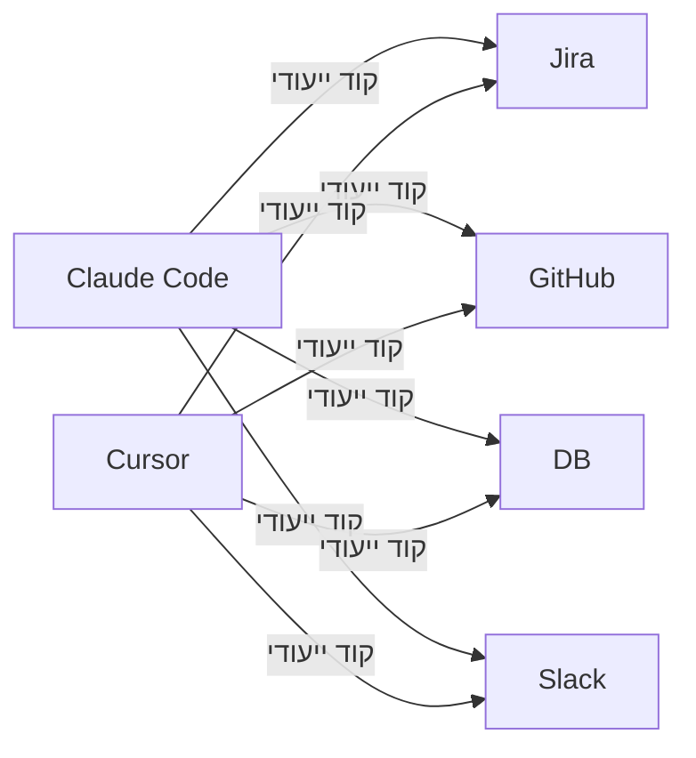
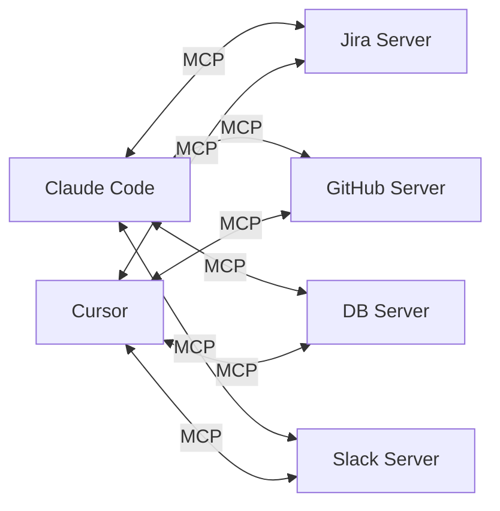
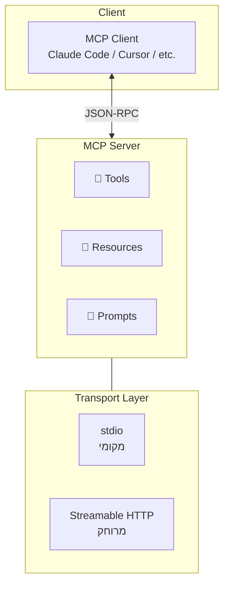
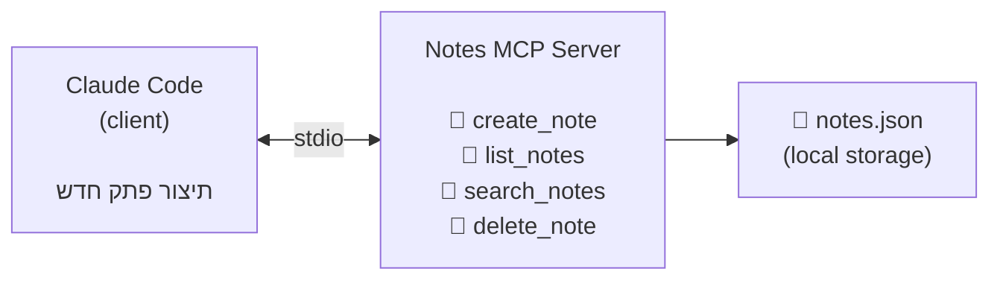
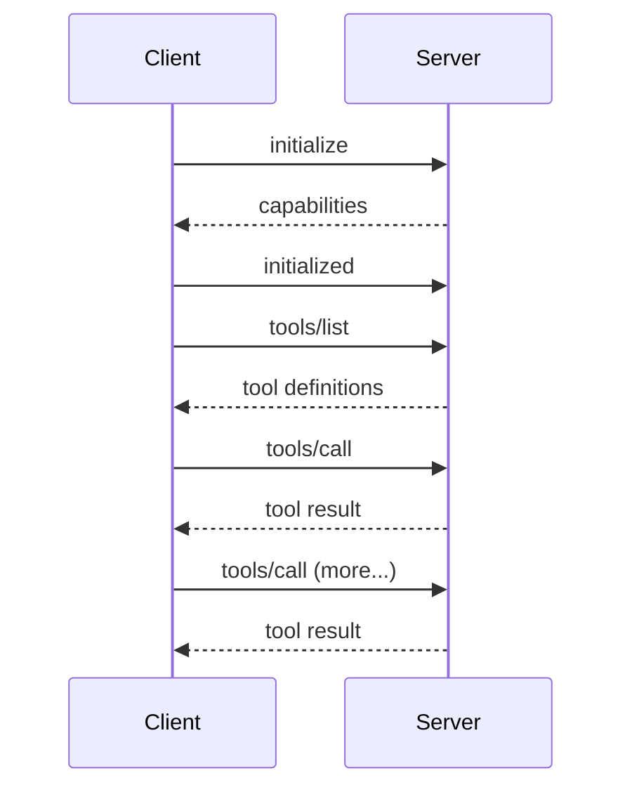

# מודול 6: שרתי MCP — הרחבת יכולות ה-Agent

!!! info "משך"
    30 דקות הרצאה + 90 דקות hands-on + 15 דקות דיון

## מטרות למידה

בסוף המודול הזה, תוכלו:

- להבין מה זה Model Context Protocol (MCP) ולמה הוא נוצר
- להגדיר שרת MCP קיים (מהמדף) ולהשתמש בו מתוך Claude Code
- לבנות שרת MCP משלכם מאפס עם TypeScript ו-MCP SDK
- להבין את הארכיטקטורה: client/server, transports, tools, resources
- לחבר שרת MCP מותאם אישית ל-Claude Code ולהשתמש בו בפועל

!!! tip "למה סשן נפרד?"
    במודול 4 בנינו agent loop מאפס והבנו איך כלים עובדים. כאן נלמד את **הסטנדרט הפתוח** שמאפשר לכל אחד להרחיב את היכולות של כל agent — בלי לשנות את הקוד שלו.

## מה זה MCP?

### הבעיה

כל agent צריך כלים. במודול 4 הגדרנו כלים ישירות בקוד: `read_file`, `write_file`, `run_command`. אבל מה אם רוצים להוסיף כלי שמתחבר ל-Jira? או ל-database? או ל-API פנימי?

בלי סטנדרט, כל שילוב דורש קוד ייעודי:

**❌ ללא MCP — כל שילוב דורש אינטגרציה ייעודית (N×M)**



### הפתרון — Model Context Protocol

MCP הוא **פרוטוקול פתוח** שיצרה Anthropic. הוא מגדיר ממשק אחיד בין AI agents (clients) לבין שירותים חיצוניים (servers):

**✅ עם MCP — פרוטוקול אחיד (N + M)**



> כמו USB — פעם כל מכשיר דרש חיבור ייחודי. USB סטנדרטיזציה את הממשק. MCP עושה את אותו הדבר עבור AI agents.

### הארכיטקטורה



### שלושת הרכיבים של שרת MCP

| רכיב | תיאור | דוגמה |
|------|--------|-------|
| **Tools** | פעולות שה-agent יכול להפעיל | `create_issue`, `query_db`, `send_message` |
| **Resources** | מקורות מידע שה-agent יכול לקרוא | קבצי config, סכמת DB, דוקומנטציה |
| **Prompts** | תבניות prompt מוכנות | "סכם את ה-issue הזה", "כתוב migration" |

### שני סוגי Transport

**stdio (Standard I/O)** — לשרתים מקומיים:

- ה-client מפעיל את השרת כ-process בן
- התקשורת עוברת דרך stdin/stdout
- מתאים לכלים שרצים על המחשב המקומי

**Streamable HTTP** — לשרתים מרוחקים:

- השרת רץ כ-web service
- התקשורת עוברת ב-HTTP
- מתאים לשירותים ארגוניים, APIs חיצוניים

!!! note "stdio הוא ברירת המחדל"
    רוב שרתי ה-MCP שתיתקלו בהם משתמשים ב-stdio. זה פשוט, מהיר, ולא דורש server setup.

## תרגיל 1: הגדרת שרת MCP קיים (20 דקות)

### מה נעשה?

נגדיר את שרת ה-**filesystem** של MCP — שרת מוכן מהמדף שנותן ל-agent גישה מבוקרת לקבצים ותיקיות.

### שלב 1 — הבנת מבנה ההגדרות

Claude Code מחפש הגדרות MCP בקובץ:

```
~/.claude/claude_desktop_config.json
```

או ברמת הפרויקט:

```
.claude/settings.json
```

!!! tip "הגדרה ברמת פרויקט"
    אם רוצים ששרת MCP יהיה זמין רק בפרויקט מסוים, שימו את ההגדרה ב-`.claude/settings.json` בתוך תיקיית הפרויקט. זה שימושי כשכל פרויקט צריך כלים אחרים.

### שלב 2 — הוספת שרת filesystem

הריצו ב-Claude Code:

```
/mcp add filesystem -- npx -y @modelcontextprotocol/server-filesystem /home/$USER/allowed-folder
```

או לחלופין, ערכו ידנית את קובץ ההגדרות:

```json
{
  "mcpServers": {
    "filesystem": {
      "command": "npx",
      "args": [
        "-y",
        "@modelcontextprotocol/server-filesystem",
        "/home/user/allowed-folder"
      ]
    }
  }
}
```

!!! warning "הגבלת נתיבים"
    שרת ה-filesystem מקבל רשימת תיקיות שמותר לגשת אליהן. **לעולם אל תתנו גישה ל-`/`** — הגבילו לתיקיות ספציפיות.

### שלב 3 — בדיקה

הפעילו מחדש את Claude Code ובדקו שהשרת עובד:

```
> "אילו כלי MCP זמינים לך?"
```

Claude Code אמור לזהות את הכלים של שרת ה-filesystem:

- `read_file` — קריאת קובץ
- `write_file` — כתיבת קובץ
- `list_directory` — הצגת תוכן תיקייה
- `create_directory` — יצירת תיקייה
- `move_file` — העברת/שינוי שם קובץ
- `search_files` — חיפוש קבצים
- `get_file_info` — מידע על קובץ

### שלב 4 — שימוש בפועל

נסו את הפקודות הבאות:

```
> "תראה לי את כל הקבצים בתיקייה /home/user/allowed-folder"
> "תיצור קובץ notes.md עם רשימת TODO לפרויקט"
> "תחפש את כל קבצי ה-JSON בתיקייה"
```

### דוגמה נוספת: שרת GitHub

```json
{
  "mcpServers": {
    "filesystem": {
      "command": "npx",
      "args": ["-y", "@modelcontextprotocol/server-filesystem", "/home/user/projects"]
    },
    "github": {
      "command": "npx",
      "args": ["-y", "@modelcontextprotocol/server-github"],
      "env": {
        "GITHUB_PERSONAL_ACCESS_TOKEN": "<your-token>"
      }
    }
  }
}
```

עם שרת GitHub תוכלו:

```
> "תראה לי את ה-open issues ב-repo שלי"
> "תיצור PR חדש מה-branch הנוכחי"
> "תגיב על issue #42 שזה טופל"
```

## תרגיל 2: בניית שרת MCP מאפס (50 דקות)

### מה נבנה?

שרת MCP שמנהל **פתקים** (notes). השרת יאפשר ל-agent ליצור, לקרוא, לחפש ולמחוק פתקים. זה מדמה תרחיש אמיתי של עטיפת מערכת פנימית ב-MCP.

### הארכיטקטורה



### שלב 1 — אתחול הפרויקט (5 דקות)

```bash
mkdir ~/mcp-notes-server && cd ~/mcp-notes-server
npm init -y
npm install @modelcontextprotocol/sdk zod
npm install -D typescript @types/node
npx tsc --init
```

עדכנו את `tsconfig.json`:

```json
{
  "compilerOptions": {
    "target": "ES2022",
    "module": "Node16",
    "moduleResolution": "Node16",
    "outDir": "./dist",
    "rootDir": "./src",
    "strict": true,
    "esModuleInterop": true,
    "declaration": true
  },
  "include": ["src/**/*"]
}
```

עדכנו את `package.json` — הוסיפו:

```json
{
  "type": "module",
  "scripts": {
    "build": "tsc",
    "start": "node dist/index.js"
  }
}
```

### שלב 2 — מבנה השרת (15 דקות)

צרו את הקובץ `src/index.ts`:

```typescript
import { McpServer } from "@modelcontextprotocol/sdk/server/mcp.js";
import { StdioServerTransport } from "@modelcontextprotocol/sdk/server/stdio.js";
import { z } from "zod";
import * as fs from "fs";
import * as path from "path";

// === Storage ===

interface Note {
  id: string;
  title: string;
  content: string;
  tags: string[];
  createdAt: string;
  updatedAt: string;
}

const NOTES_FILE = path.join(process.cwd(), "notes.json");

function loadNotes(): Note[] {
  if (!fs.existsSync(NOTES_FILE)) return [];
  const data = fs.readFileSync(NOTES_FILE, "utf-8");
  return JSON.parse(data);
}

function saveNotes(notes: Note[]): void {
  fs.writeFileSync(NOTES_FILE, JSON.stringify(notes, null, 2));
}

function generateId(): string {
  return Date.now().toString(36) + Math.random().toString(36).slice(2, 7);
}

// === MCP Server ===

const server = new McpServer({
  name: "notes-server",
  version: "1.0.0",
});

// --- Tool: create_note ---
server.tool(
  "create_note",
  "Create a new note with a title, content, and optional tags",
  {
    title: z.string().describe("The title of the note"),
    content: z.string().describe("The content/body of the note"),
    tags: z.array(z.string()).optional().describe("Optional tags for categorization"),
  },
  async ({ title, content, tags }) => {
    const notes = loadNotes();
    const now = new Date().toISOString();
    const note: Note = {
      id: generateId(),
      title,
      content,
      tags: tags ?? [],
      createdAt: now,
      updatedAt: now,
    };
    notes.push(note);
    saveNotes(notes);
    return {
      content: [
        {
          type: "text" as const,
          text: `Note created successfully!\nID: ${note.id}\nTitle: ${note.title}`,
        },
      ],
    };
  }
);

// --- Tool: list_notes ---
server.tool(
  "list_notes",
  "List all notes, optionally filtered by tag",
  {
    tag: z.string().optional().describe("Filter notes by this tag"),
  },
  async ({ tag }) => {
    let notes = loadNotes();
    if (tag) {
      notes = notes.filter((n) => n.tags.includes(tag));
    }
    if (notes.length === 0) {
      return {
        content: [{ type: "text" as const, text: "No notes found." }],
      };
    }
    const summary = notes
      .map(
        (n) =>
          `- [${n.id}] ${n.title} (tags: ${n.tags.join(", ") || "none"}) — ${n.createdAt}`
      )
      .join("\n");
    return {
      content: [{ type: "text" as const, text: summary }],
    };
  }
);

// --- Tool: search_notes ---
server.tool(
  "search_notes",
  "Search notes by keyword in title or content",
  {
    query: z.string().describe("The search query"),
  },
  async ({ query }) => {
    const notes = loadNotes();
    const lowerQuery = query.toLowerCase();
    const results = notes.filter(
      (n) =>
        n.title.toLowerCase().includes(lowerQuery) ||
        n.content.toLowerCase().includes(lowerQuery)
    );
    if (results.length === 0) {
      return {
        content: [
          { type: "text" as const, text: `No notes found matching "${query}".` },
        ],
      };
    }
    const summary = results
      .map((n) => `- [${n.id}] ${n.title}\n  ${n.content.slice(0, 100)}...`)
      .join("\n\n");
    return {
      content: [
        {
          type: "text" as const,
          text: `Found ${results.length} note(s):\n\n${summary}`,
        },
      ],
    };
  }
);

// --- Tool: delete_note ---
server.tool(
  "delete_note",
  "Delete a note by its ID",
  {
    id: z.string().describe("The ID of the note to delete"),
  },
  async ({ id }) => {
    const notes = loadNotes();
    const index = notes.findIndex((n) => n.id === id);
    if (index === -1) {
      return {
        content: [
          { type: "text" as const, text: `Note with ID "${id}" not found.` },
        ],
      };
    }
    const deleted = notes.splice(index, 1)[0];
    saveNotes(notes);
    return {
      content: [
        {
          type: "text" as const,
          text: `Deleted note: "${deleted.title}" (${deleted.id})`,
        },
      ],
    };
  }
);

// === Start Server ===

async function main() {
  const transport = new StdioServerTransport();
  await server.connect(transport);
  console.error("Notes MCP Server running on stdio");
}

main().catch(console.error);
```

!!! note "console.error ולא console.log"
    שימו לב שהלוגים נכתבים ל-`console.error` ולא ל-`console.log`. ב-MCP עם stdio transport, ה-`stdout` שייך לפרוטוקול (JSON-RPC). כל הודעת דיבוג חייבת ללכת ל-`stderr`.

### שלב 3 — בניית הפרויקט (2 דקות)

```bash
npx tsc
```

בדקו שאין שגיאות קומפילציה. אם יש — תקנו אותן.

### שלב 4 — בדיקה ידנית (3 דקות)

לפני שמחברים ל-Claude Code, בדקו שהשרת מתחיל:

```bash
echo '{"jsonrpc":"2.0","id":1,"method":"initialize","params":{"capabilities":{},"clientInfo":{"name":"test","version":"1.0"},"protocolVersion":"2024-11-05"}}' | node dist/index.js
```

אם הכל תקין, תראו תשובת JSON עם פרטי השרת.

!!! tip "דיבוג"
    אם השרת לא מגיב, בדקו:

    1. שהקומפילציה הצליחה (`ls dist/index.js`)
    2. שה-`package.json` מכיל `"type": "module"`
    3. שאין שגיאות ב-imports

## תרגיל 3: חיבור השרת ל-Claude Code (20 דקות)

### שלב 1 — הגדרת השרת

הריצו ב-Claude Code:

```
/mcp add notes-server -- node /home/user/mcp-notes-server/dist/index.js
```

או ערכו את קובץ ההגדרות ידנית:

```json
{
  "mcpServers": {
    "notes-server": {
      "command": "node",
      "args": ["/home/user/mcp-notes-server/dist/index.js"]
    }
  }
}
```

!!! warning "נתיב מלא"
    השתמשו בנתיב **מלא** (absolute path) לקובץ JS. נתיבים יחסיים עלולים לא לעבוד כי ה-working directory של השרת לא תמיד מה שמצפים.

### שלב 2 — הפעלה מחדש ובדיקה

הפעילו מחדש את Claude Code ובדקו:

```
> "אילו כלי MCP חדשים יש לך?"
```

Claude Code צריך לזהות ארבעה כלים: `create_note`, `list_notes`, `search_notes`, `delete_note`.

### שלב 3 — תרחיש שימוש מלא

נסו את התרחיש הבא:

```
> "תיצור שלושה פתקים:
   1. 'הגדרת CI' עם תוכן על GitHub Actions, תייג עם 'devops'
   2. 'באג ב-login' עם תיאור הבאג, תייג עם 'bug', 'urgent'
   3. 'רעיון לפיצ'ר' עם תיאור קצר, תייג עם 'feature'"
```

```
> "תראה לי את כל הפתקים"
```

```
> "תחפש פתקים שקשורים ל-login"
```

```
> "תמחק את הפתק על הפיצ'ר"
```

### שלב 4 — שימוש מתקדם

נסו לשלב את שרת ה-notes עם יכולות אחרות של Claude Code:

```
> "תקרא את הקובץ TODO.md בפרויקט, ותיצור פתק MCP עבור כל משימה פתוחה"
```

```
> "תסתכל על כל הפתקים שלי ותכתוב סיכום ב-markdown"
```

## מושגים מפתח

### JSON-RPC 2.0

MCP משתמש ב-JSON-RPC כפרוטוקול התקשורת. כל הודעה היא JSON object עם:

```json
// Request (Client → Server)
{
  "jsonrpc": "2.0",
  "id": 1,
  "method": "tools/call",
  "params": {
    "name": "create_note",
    "arguments": { "title": "Hello", "content": "World" }
  }
}

// Response (Server → Client)
{
  "jsonrpc": "2.0",
  "id": 1,
  "result": {
    "content": [{ "type": "text", "text": "Note created!" }]
  }
}
```

### Lifecycle — מחזור חיי החיבור



### Tools לעומת Resources

- **Tools** — פעולות אקטיביות. ה-agent מפעיל אותן (כמו function call). דוגמה: `create_note`, `delete_note`.
- **Resources** — נתונים פסיביים. ה-agent קורא אותם (כמו GET endpoint). דוגמה: `notes://all`, `notes://tag/urgent`.

### Validation עם Zod

ה-MCP SDK משתמש ב-Zod לאימות פרמטרים. Zod הופך את הסכמה ל-JSON Schema אוטומטית:

```typescript
// Zod schema
{
  title: z.string().describe("The title"),
  tags: z.array(z.string()).optional()
}

// נהפך אוטומטית ל-JSON Schema:
{
  "type": "object",
  "properties": {
    "title": { "type": "string", "description": "The title" },
    "tags": { "type": "array", "items": { "type": "string" } }
  },
  "required": ["title"]
}
```

## רעיונות להרחבה

אם סיימתם מוקדם, נסו אחד מהרעיונות הבאים:

### 1. הוספת Resources

```typescript
server.resource(
  "all-notes",
  "notes://all",
  async (uri) => {
    const notes = loadNotes();
    return {
      contents: [
        {
          uri: uri.href,
          mimeType: "application/json",
          text: JSON.stringify(notes, null, 2),
        },
      ],
    };
  }
);
```

### 2. שרת MCP ל-API פנימי

עטפו API קיים (למשל REST API של מערכת פנימית) בשרת MCP:

```typescript
server.tool(
  "get_deployments",
  "List recent deployments from the internal API",
  {
    environment: z.enum(["staging", "production"]).describe("Target environment"),
    limit: z.number().optional().default(10).describe("Max results"),
  },
  async ({ environment, limit }) => {
    const response = await fetch(
      `https://internal-api.example.com/deployments?env=${environment}&limit=${limit}`,
      { headers: { Authorization: `Bearer ${process.env.API_TOKEN}` } }
    );
    const data = await response.json();
    return {
      content: [{ type: "text" as const, text: JSON.stringify(data, null, 2) }],
    };
  }
);
```

### 3. הוספת כלי update_note

הוסיפו כלי שמעדכן פתק קיים (לפי ID) — כולל עדכון של `updatedAt`.

## שאלות לדיון

1. אילו מערכות בארגון שלכם היו נהנות משרת MCP? מה הכלים שהייתם חושפים?
2. מה ההבדל בין לבנות MCP server לבין לכתוב tool ישירות ב-agent? מתי מתאים כל אחד?
3. אילו סיכוני אבטחה יש בלחשוף מערכות פנימיות דרך MCP? איך מצמצמים?
4. איך MCP משנה את הדרך שבה אנחנו חושבים על אינטגרציות בין מערכות?

## נקודות מפתח

- **MCP הוא סטנדרט פתוח** — ממשק אחיד שמחבר כל AI agent לכל שירות חיצוני
- **הארכיטקטורה פשוטה**: client (agent) ↔ server (שירות), תקשורת ב-JSON-RPC
- **שני סוגי transport**: stdio (מקומי, פשוט) ו-Streamable HTTP (מרוחק, ארגוני)
- **שרת MCP מורכב מ-Tools, Resources, ו-Prompts** — הכלים הם הרכיב המרכזי
- **קל לבנות שרת** — עם MCP SDK ו-TypeScript, שרת בסיסי עובד תוך דקות
- **ההשפעה האמיתית**: כל כלי שתבנו פעם אחת כשרת MCP — **עובד בכל agent שתומך ב-MCP**
- חשבו על MCP כ-**USB של עולם ה-AI agents** — פרוטוקול אחד שמחבר הכל
