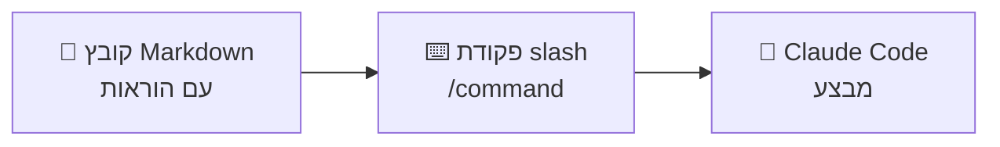

# מודול 7: Skills — אוטומציה של תהליכי עבודה

!!! info "משך"
    30 דקות הרצאה + 60 דקות hands-on + 15 דקות דיון

## מטרות למידה

בסוף המודול הזה, תוכלו:

- להבין מה הם Skills ב-Claude Code ואיך הם שונים מ-CLAUDE.md
- ליצור custom slash commands שמאטמטים תהליכי עבודה חוזרים
- להתקין ולהשתמש ב-skills מוכנים מהקהילה
- לבנות skills מתקדמים עם multi-step workflows ו-placeholders

!!! tip "למה Skills?"
    כולנו עושים פעולות חוזרות: יצירת PR, כתיבת migration, scaffold של component. במקום להסביר לـ-Claude Code מה לעשות כל פעם מחדש — אפשר לכתוב את ההוראות פעם אחת כ-skill ולהפעיל אותו בפקודה אחת.

## מה הם Skills?

Skills הם **פקודות slash מותאמות אישית** שמוסיפים ל-Claude Code. כל skill הוא קובץ Markdown שמכיל הוראות — כשמפעילים את הפקודה, ההוראות נטענות כ-prompt ו-Claude Code פועל לפיהן.

### הרעיון הבסיסי



לדוגמה:

- הקובץ `pr-review.md` → הפקודה `/pr-review`
- הקובץ `commit.md` → הפקודה `/commit`
- הקובץ `deploy-check.md` → הפקודה `/deploy-check`

### איפה שמים Skills?

יש שתי רמות:

**ברמת הפרויקט** — skills ספציפיים לפרויקט (נשמרים ב-Git):
```
.claude/skills/
├── pr-review.md
├── commit.md
└── component.md
```

**ברמה גלובלית** — skills שזמינים בכל פרויקט:
```
~/.claude/skills/
├── commit.md
├── explain.md
└── test.md
```

!!! note "סדר עדיפות"
    אם יש skill עם אותו שם גם בפרויקט וגם גלובלית — הגרסה של הפרויקט מנצחת. זה מאפשר override לפי פרויקט.

### מה ההבדל בין Skill ל-CLAUDE.md?

| | CLAUDE.md | Skill |
|---|---|---|
| **מתי נטען** | תמיד, בכל שיחה | רק כשמפעילים את הפקודה |
| **מטרה** | הנחיות כלליות לפרויקט | משימה ספציפית ומוגדרת |
| **דוגמה** | "השתמש ב-TypeScript, כתוב tests" | "/pr-review — בדוק את ה-PR הנוכחי" |
| **אנלוגיה** | מדריך עובד חדש | צ'קליסט למשימה ספציפית |

## אנטומיה של Skill

### מבנה הקובץ

קובץ skill הוא Markdown פשוט עם מבנה מוגדר:

```markdown
Description that appears in autocomplete when typing /command

---

The rest of the file is the prompt/instructions that Claude follows
when the skill is invoked. You can write anything here — it's just
a prompt that gets injected into the conversation.
```

- **שורה ראשונה** — תיאור קצר שמופיע ב-autocomplete כשמתחילים להקליד `/`
- **שאר הקובץ** — ההוראות שClaude Code מקבל כשמפעילים את הפקודה
- **שם הקובץ** — הופך לשם הפקודה (בלי `.md`)

### Placeholders

אפשר להשתמש ב-`$ARGUMENTS` כדי לקבל input מהמשתמש:

```markdown
Create a new React component with the given name

---

Create a new React component called $ARGUMENTS.

The component should:
1. Be a functional component with TypeScript
2. Have a corresponding test file
3. Have a Storybook story
4. Use CSS Modules for styling
```

שימוש:
```
/component UserProfile
```

Claude Code יחליף את `$ARGUMENTS` ב-`UserProfile` ויפעל לפי ההוראות.

### דוגמה מלאה — Skill ראשון

ניצור skill פשוט שעושה commit חכם. צרו את הקובץ `.claude/skills/commit.md`:

```markdown
Create a well-structured git commit for the current changes

---

Look at the current git diff (both staged and unstaged changes).

Follow these steps:
1. Run `git diff` and `git diff --cached` to see all changes
2. Analyze what changed and why
3. Stage the relevant files (use `git add` with specific files, not `-A`)
4. Write a commit message following Conventional Commits format:
   - feat: for new features
   - fix: for bug fixes
   - refactor: for refactoring
   - docs: for documentation
   - test: for tests
   - chore: for maintenance
5. The commit message should have:
   - A short subject line (max 72 chars)
   - A blank line
   - A body explaining WHAT changed and WHY
6. Show me the commit message before committing and ask for approval
7. Create the commit

Important:
- Never use `git add -A` or `git add .`
- Never commit .env files or secrets
- If there are unrelated changes, suggest splitting into multiple commits
```

עכשיו אפשר פשוט להקליד `/commit` ו-Claude Code ידע בדיוק מה לעשות.

## תרגיל מעשי 1: התקנה ושימוש ב-Skills מוכנים (15 דקות)

### שלב 1 — יצירת תיקיית skills

```bash
mkdir -p .claude/skills
```

### שלב 2 — התקנת skill מוכן

צרו את הקובץ `.claude/skills/pr-review.md`:

```markdown
Review the current branch's changes as a thorough code reviewer

---

You are an experienced code reviewer. Review the current branch's changes.

Steps:
1. Run `git diff main...HEAD` to see all changes in this branch
2. Run `git log main..HEAD --oneline` to see the commit history
3. For each changed file, analyze:
   - Code quality and readability
   - Potential bugs or edge cases
   - Performance implications
   - Security concerns
   - Test coverage

Provide your review in this format:

## Summary
Brief overview of what this PR does.

## Issues Found
List any problems, ordered by severity:
- 🔴 Critical: ...
- 🟡 Warning: ...
- 🔵 Suggestion: ...

## Good Things
What's done well in this PR.

## Questions
Things you'd ask the author about.
```

### שלב 3 — שימוש ב-skill

פתחו Claude Code ונסו:

```
/pr-review
```

או:

```
/commit
```

!!! tip "Autocomplete"
    כשמתחילים להקליד `/` ב-Claude Code, תראו רשימה של כל ה-skills הזמינים עם התיאור מהשורה הראשונה. זה עוזר לגלות skills שעמיתים לצוות הוסיפו.

## תרגיל מעשי 2: בניית Skill מותאם אישית (30 דקות)

### דוגמה 1: `/deploy-check` — בדיקת מוכנות ל-deploy

צרו `.claude/skills/deploy-check.md`:

```markdown
Verify the project is ready for deployment

---

Perform a comprehensive deployment readiness check.

Run the following checks and report results:

### 1. Tests
- Run the test suite (`npm test` or the project's test command)
- Report: pass/fail count, any flaky tests

### 2. Code Quality
- Search for TODO, FIXME, HACK, XXX comments: `grep -rn "TODO\|FIXME\|HACK\|XXX" src/`
- Report how many were found and in which files

### 3. Environment Variables
- Read `.env.example` (or `.env.template`)
- Check that all required env vars are documented
- Verify no secrets are hardcoded in source files (search for patterns like API_KEY=, password=, secret= in code files)

### 4. Dependencies
- Check for outdated dependencies: `npm outdated` (or equivalent)
- Check for security vulnerabilities: `npm audit` (or equivalent)

### 5. Build
- Run the build command and verify it succeeds
- Check that the build output looks reasonable (not empty, no errors)

### 6. Git Status
- Verify working directory is clean
- Verify we're on the right branch
- Check if branch is up to date with remote

Present results as a checklist:
- ✅ or ❌ for each check
- Details for any failures
- Overall verdict: READY TO DEPLOY or NOT READY (with reasons)
```

### דוגמה 2: `/component` — scaffold של React component

צרו `.claude/skills/component.md`:

```markdown
Scaffold a new React component with tests and stories

---

Create a new React component called $ARGUMENTS.

Create the following file structure:
```
src/components/$ARGUMENTS/
├── $ARGUMENTS.tsx          # The component
├── $ARGUMENTS.test.tsx     # Tests
├── $ARGUMENTS.stories.tsx  # Storybook story
├── $ARGUMENTS.module.css   # CSS Module styles
└── index.ts               # Re-export
```

### Component file ($ARGUMENTS.tsx):
- Functional component with TypeScript
- Props interface exported separately
- Use CSS Modules for styling
- Include JSDoc comment with description
- Follow existing component patterns in the project

### Test file ($ARGUMENTS.test.tsx):
- Use React Testing Library
- Include tests for:
  - Component renders without crashing
  - Props are applied correctly
  - User interactions work
  - Accessibility (role, aria attributes)

### Storybook story ($ARGUMENTS.stories.tsx):
- Default story with minimal props
- Story with all props populated
- Interactive story if applicable

### CSS Module ($ARGUMENTS.module.css):
- Base container class
- Responsive breakpoints if needed

### Index file (index.ts):
- Re-export component and props interface

Before creating files:
1. Check the existing component structure in the project for conventions
2. Look at existing tests and stories for patterns
3. Adapt to the project's style (styled-components vs CSS Modules, etc.)
```

שימוש:

```
/component UserAvatar
```

### דוגמה 3: `/db-migration` — יצירת migration

צרו `.claude/skills/db-migration.md`:

```markdown
Create a new database migration file

---

Create a new database migration for: $ARGUMENTS

Steps:
1. Check the existing migrations directory to understand:
   - Naming convention (timestamp-based, sequential, etc.)
   - File format (SQL, TypeScript, JavaScript)
   - Which migration tool is used (knex, prisma, typeorm, drizzle, etc.)

2. Generate the correct filename:
   - If timestamp-based: use current timestamp (YYYYMMDDHHMMSS_description.ts)
   - If sequential: use next number in sequence
   - Use snake_case for the description part

3. Create the migration file with:
   - `up` function: applies the migration
   - `down` function: reverts the migration
   - Proper types and imports matching existing migrations
   - Comments explaining what this migration does

4. If using Prisma:
   - Update the schema.prisma file instead
   - Run `npx prisma generate` after changes
   - Suggest running `npx prisma migrate dev --name description`

5. Show me the migration file and ask for confirmation before saving.

Important:
- Always match the existing migration style exactly
- Include proper error handling in up/down functions
- For destructive operations (dropping tables/columns), add a warning comment
- Never auto-run the migration — just create the file
```

שימוש:

```
/db-migration add email_verified column to users table
```

### עכשיו אתם — בנו skill משלכם! (15 דקות)

חשבו על תהליך עבודה חוזר שאתם עושים ובנו skill עבורו. כמה רעיונות:

- `/api-endpoint` — scaffold של endpoint חדש (route, controller, validation, test)
- `/bug-investigate` — חקירת באג (קריאת logs, חיפוש בקוד, הצעת fix)
- `/release-notes` — יצירת release notes מ-git log
- `/code-review-prep` — הכנת הקוד שלכם ל-review (lint, format, self-review)
- `/env-setup` — הגדרת סביבת פיתוח חדשה עם כל הכלים

## דפוסים מתקדמים

### Skills שקוראים לכלים

Skill יכול להנחות את Claude Code להשתמש בכלים חיצוניים:

```markdown
Analyze test coverage and suggest improvements

---

1. Run the test suite with coverage: `npm test -- --coverage`
2. Read the coverage report
3. Identify files with less than 80% coverage
4. For each under-covered file:
   a. Read the file
   b. Identify untested code paths
   c. Write the missing tests
5. Re-run coverage to verify improvement
```

### Skills עם multi-step workflows

Skill יכול להגדיר תהליך מורכב עם נקודות החלטה:

```markdown
Set up a complete CI/CD pipeline for this project

---

Analyze the project and set up an appropriate CI/CD pipeline.

### Phase 1: Analysis
- Detect the project type (Node.js, Python, Go, etc.)
- Identify the package manager
- Find existing test and build commands
- Check if there's already a CI config

### Phase 2: Create Pipeline
Based on the analysis, create a GitHub Actions workflow that:

**On Pull Request:**
- Install dependencies
- Run linting
- Run tests
- Build the project
- Comment on PR with results

**On Push to main:**
- All of the above
- Deploy (ask the user where: Vercel, AWS, GCP, etc.)

### Phase 3: Verify
- Validate the workflow YAML syntax
- Dry-run the commands locally to verify they work
- Create a summary of what was set up

Ask the user for confirmation before creating any files.
```

### Skills שאוכפים conventions של הצוות

אחד השימושים החזקים ביותר — skill שמוודא שקוד חדש עומד בסטנדרטים:

```markdown
Check that code follows our team conventions

---

Review the current changes against our team conventions:

### Naming
- Components: PascalCase
- Files: kebab-case for utilities, PascalCase for components
- Variables: camelCase, no abbreviations
- Constants: UPPER_SNAKE_CASE

### Code Structure
- No file longer than 300 lines
- No function longer than 50 lines
- Maximum 3 levels of nesting
- All exported functions must have JSDoc comments

### Git
- Branch name follows pattern: type/TICKET-123-description
- All commits use Conventional Commits format
- PR has less than 400 changed lines (suggest splitting if larger)

### Testing
- Every new function has at least one test
- Test file name matches source file name
- No skipped tests (.skip) in committed code

Check the current `git diff` against these rules and report violations.
```

!!! warning "Skills לא מחליפים CI"
    Skills רצים מקומית ותלויים בשיתוף פעולה של המפתח. הם מצוינים כ-"first line of defense" אבל אל תסמכו עליהם כתחליף לבדיקות אוטומטיות ב-CI/CD.

## שיתוף Skills בצוות

### דרך Git

כי skills שבתיקיית `.claude/skills/` הם חלק מהפרויקט, הם נשמרים ב-Git אוטומטית:

```bash
git add .claude/skills/
git commit -m "feat: add team coding skills for Claude Code"
git push
```

כל מי שעושה `git pull` מקבל את ה-skills.

### Best Practices

1. **תיעוד** — כתבו תיאור ברור בשורה הראשונה של כל skill
2. **בדיקה** — נסו את ה-skill כמה פעמים לפני שמשתפים
3. **גרסאות** — עדכנו skills כשקונבנציות הצוות משתנות
4. **ספציפיות** — skill טוב עושה דבר אחד ועושה אותו טוב
5. **הגנתיות** — תמיד בקשו אישור לפני פעולות הרסניות (מחיקה, push, deploy)

## שאלות לדיון

1. אילו תהליכי עבודה חוזרים בצוות שלכם מתאימים להפוך ל-skills?
2. איך skills משתלבים עם CLAUDE.md? מתי תשתמשו בכל אחד?
3. מה הסיכון ב-skill שמריץ פקודות אוטומטית? איך מצמצמים?
4. איך skills יכולים לעזור ב-onboarding של מפתחים חדשים לצוות?

## נקודות מפתח

- Skills הם **custom slash commands** — קבצי Markdown עם הוראות שClaude Code מבצע
- שם הקובץ הוא שם הפקודה: `pr-review.md` → `/pr-review`
- שני מיקומים: `.claude/skills/` (פרויקט) ו-`~/.claude/skills/` (גלובלי)
- `$ARGUMENTS` מאפשר לקבל input מהמשתמש
- skills של פרויקט נשמרים ב-Git ומשותפים לכל הצוות
- skill טוב עושה **דבר אחד** ועושה אותו טוב — כמו פונקציה
- השורה הראשונה היא התיאור שמופיע ב-autocomplete — כתבו אותה בקפידה
- skills לא מחליפים CI/CD — הם "קו הגנה ראשון" שרץ מקומית
