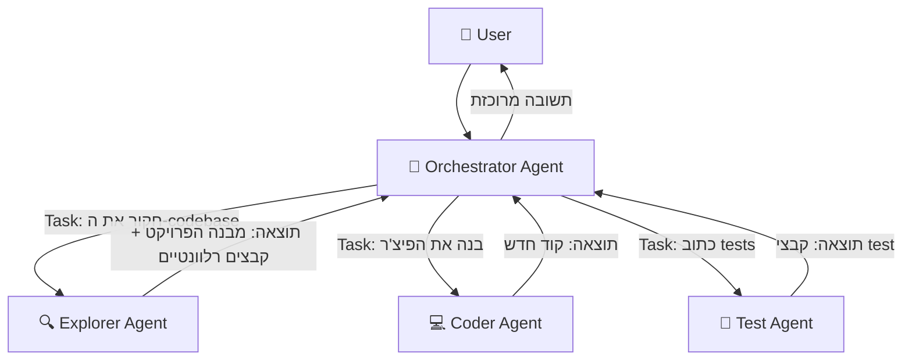
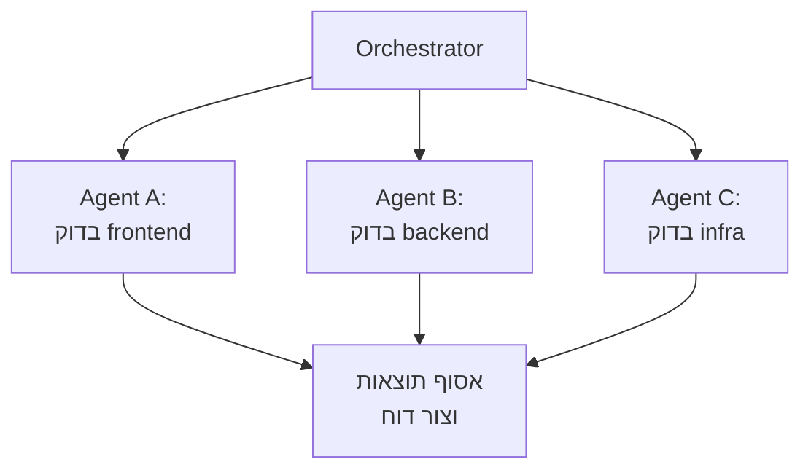
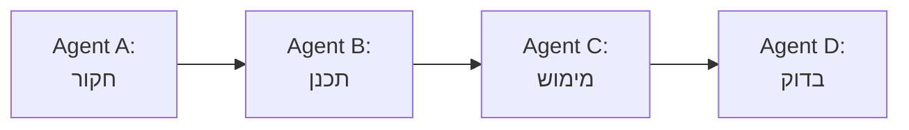
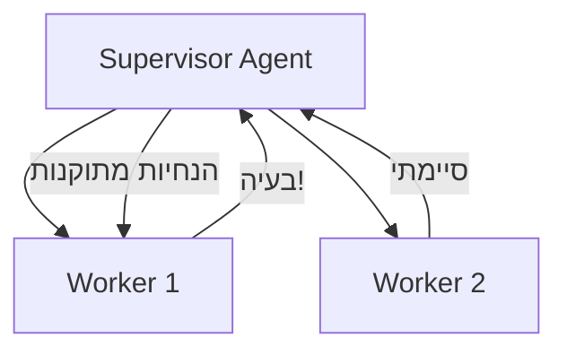

# מודול 8: Sub-Agents — תזמור של agents מרובים

!!! info "משך"
    30 דקות הרצאה + 60 דקות hands-on + 15 דקות דיון

## מטרות למידה

בסוף המודול הזה, תוכלו:

- להבין מה הם sub-agents ולמה צריך אותם
- להגדיר sub-agents עם הרשאות, משאבים ומגבלות
- לתזמר מספר agents שעובדים יחד על משימה מורכבת
- לזהות מתי כדאי לפצל משימה ל-sub-agents ומתי לא

!!! tip "למה sub-agents?"
    במודול 4 בנינו agent בודד עם loop אחד. אבל מה קורה כשהמשימה מורכבת מדי? Agent אחד שמנסה לעשות הכל — חוקר, כותב קוד, בודק, מתקן — מתחיל לאבד פוקוס ולצרוך context מיותר. הפתרון: **לפצל את העבודה ל-agents מתמחים**.

## הרעיון: Agent שמפעיל agents

### Agent בודד לעומת multi-agent

**Agent בודד:**
```
User → Agent → [קריאת קבצים, כתיבה, הרצה, תיקון, ...] → Response
```

הבעיה: ככל שהמשימה מתארכת, ה-context window מתמלא. ה-agent "שוכח" החלטות מוקדמות, מאבד פוקוס, ועושה טעויות.

**Multi-agent עם sub-agents:**
```
User → Main Agent (orchestrator)
         ├→ Sub-Agent A: "חקור את ה-codebase"
         ├→ Sub-Agent B: "כתוב את הפיצ'ר"
         └→ Sub-Agent C: "כתוב tests"
       ← Main Agent: מרכיב תשובה סופית
```

כל sub-agent מקבל **context נקי**, מתמקד במשימה אחת, ומחזיר תוצאה ממוקדת.

### האנלוגיה

חשבו על tech lead שמנהל צוות:

- **Tech lead (orchestrator)** — מבין את התמונה הגדולה, מחלק משימות, מרכיב את התוצאה הסופית
- **מפתח A (sub-agent)** — מתמחה בחקירת קוד קיים
- **מפתח B (sub-agent)** — מתמחה בכתיבת קוד חדש
- **מפתח C (sub-agent)** — מתמחה בכתיבת tests

ה-tech lead לא כותב את כל הקוד בעצמו — הוא **מתזמר** את העבודה.

## Sub-Agents ב-Kiro CLI

### איך Kiro CLI משתמש ב-sub-agents

כש-Kiro CLI מקבל משימה מורכבת, הוא יכול להפעיל sub-agents דרך ה-**Task tool**. כל sub-agent:

- מקבל **prompt ספציפי** — מה בדיוק לעשות
- רץ עם **context נקי** — לא רואה את כל היסטוריית השיחה
- מקבל **סט כלים מוגבל** — לפי סוג ה-agent
- מחזיר **תוצאה אחת** — ל-agent הראשי



### סוגי sub-agents

ב-Kiro CLI יש כמה סוגי agents מובנים, כל אחד עם כלים שונים:

**Explore Agent** — חקירת codebase:

- כלים: קריאת קבצים, חיפוש (Glob, Grep), ניווט
- **אין לו**: כתיבה, הרצת פקודות
- שימוש: "תמצא איפה מוגדר ה-authentication middleware"

**Coder Agent** — כתיבת קוד:

- כלים: קריאה, כתיבה, חיפוש, הרצת פקודות
- שימוש: "תוסיף validation לכל ה-API endpoints"

**Plan Agent** — תכנון:

- כלים: קריאה, חיפוש
- **אין לו**: כתיבה, הרצת פקודות
- שימוש: "תתכנן את הארכיטקטורה למערכת notifications"

> כל סוג agent מקבל רק את הכלים שהוא צריך — **עקרון ה-least privilege**. Explorer לא יכול לשנות קבצים, Planner לא יכול להריץ פקודות.

## הגדרת Sub-Agent

### המבנה הבסיסי

כשהאורקסטרטור מפעיל sub-agent, הוא מגדיר:

```
1. סוג ה-agent (subagent_type) — קובע את הכלים הזמינים
2. ה-prompt — מה לעשות
3. מגבלות (אופציונלי) — max turns, timeout
```

### דוגמה: הפעלת Explorer sub-agent

```
Task: "חפש בכל ה-codebase שלנו את כל המקומות שמשתמשים
ב-database connection ישירות (לא דרך ORM).
תחזיר רשימה של קבצים עם שורות ספציפיות."

סוג: Explore
```

ה-Explorer ינווט בקבצים, יחפש patterns, ויחזיר תוצאה ממוקדת — בלי לגעת בשום דבר.

### דוגמה: הפעלת Coder sub-agent

```
Task: "קרא את הקובץ src/auth/middleware.ts
ותוסיף rate limiting של 100 requests per minute per IP.
השתמש ב-express-rate-limit."

סוג: Coder
```

ה-Coder יקרא, ישנה, ויוודא שהקוד עובד.

## הרשאות ומשאבים

### עקרון ה-Least Privilege

!!! warning "כלל זהב"
    כל sub-agent צריך לקבל **רק את ההרשאות שהוא צריך** למשימה. Agent שצריך רק לחפש — לא צריך הרשאת כתיבה. Agent שכותב tests — לא צריך גישה ל-production environment.

### מה אפשר לשלוט בו

**כלים זמינים** — לפי סוג ה-agent:

- **Read-only**: קריאת קבצים, חיפוש — בטוח לחלוטין
- **Read-write**: גם כתיבת קבצים — צריך להיזהר
- **Full access**: גם הרצת פקודות — הכי מסוכן

**Context** — מה ה-agent רואה:

- ה-prompt הספציפי שהוא קיבל
- חלק מהאורקסטרטורים חולקים context מהשיחה הראשית
- ככלל: **פחות context = יותר פוקוס**

**מגבלות** — גבולות על ה-agent:

- **Max turns** — מספר מקסימלי של iteraות (מונע loops אינסופיים)
- **Timeout** — מגבלת זמן
- **Working directory** — באיזו תיקייה הוא עובד

### טבלת הרשאות לפי סוג

**Explore Agent:**

- קריאת קבצים — כן
- חיפוש (Glob/Grep) — כן
- כתיבת קבצים — לא
- הרצת פקודות — לא

**Plan Agent:**

- קריאת קבצים — כן
- חיפוש (Glob/Grep) — כן
- כתיבת קבצים — לא
- הרצת פקודות — לא

**Coder Agent:**

- קריאת קבצים — כן
- חיפוש (Glob/Grep) — כן
- כתיבת קבצים — כן
- הרצת פקודות — כן

**General-purpose Agent:**

- קריאת קבצים — כן
- חיפוש (Glob/Grep) — כן
- כתיבת קבצים — כן
- הרצת פקודות — כן
- הפעלת sub-agents — כן

## דפוסי תזמור

### דפוס 1: Fan-Out / Fan-In

**הרעיון:** שלח כמה agents במקביל, אסוף את התוצאות, ושלב.



**מתי:** כשצריך לבצע אותה פעולה על חלקים שונים של ה-codebase.

**דוגמה — code review מקבילי:**
```
Orchestrator: "צריך לעשות code review ל-PR הזה"
  → Agent A: "בדוק את שינויי ה-frontend ב-src/components/"
  → Agent B: "בדוק את שינויי ה-backend ב-src/api/"
  → Agent C: "בדוק את שינויי ה-infrastructure ב-deploy/"
← Orchestrator: מרכיב review אחד מ-3 התוצאות
```

### דפוס 2: Pipeline (שרשרת)

**הרעיון:** כל agent מקבל את התוצאה של הקודם ומוסיף עליה.



**מתי:** כשיש תלות בין השלבים — אי אפשר לכתוב קוד לפני שחקרנו.

**דוגמה — הוספת פיצ'ר:**
```
Agent A (Explore): "תמצא איך authentication עובד ב-codebase"
  → תוצאה: "Auth middleware ב-src/auth/, משתמש ב-JWT..."
Agent B (Plan): "על בסיס מה שמצאנו, תכנן הוספת 2FA"
  → תוצאה: "תוכנית: 1. הוסף TOTP library 2. עדכן user model..."
Agent C (Coder): "תממש את התוכנית הזו"
  → תוצאה: קבצים שנכתבו
Agent D (Coder): "תכתוב tests לקוד החדש"
  → תוצאה: קבצי test
```

### דפוס 3: Supervisor

**הרעיון:** agent אחד מפקח על אחרים ומתערב כשצריך.



**מתי:** כשהמשימה דורשת התאמות תוך כדי עבודה.

**דוגמה — migration:**
```
Supervisor: "העבר את הפרויקט מ-JavaScript ל-TypeScript"
  → Worker 1: "המר את src/utils/ ל-TypeScript"
    ← "נתקלתי בבעיית types ב-3 קבצים"
  → Supervisor: מנתח את הבעיה, שולח הנחיות מתוקנות
  → Worker 1 (שוב): "המר עם ה-type definitions האלה"
  → Worker 2: "המר את src/components/ ל-TypeScript"
```

## תרגיל מעשי 1: חקירה מקבילית (20 דקות)

### התרחיש

ניקח פרויקט ונבקש מ-Kiro CLI לבצע **חקירה מקבילית** של חלקים שונים.

### שלב 1 — שכפול פרויקט לדוגמה

```bash
git clone https://github.com/expressjs/express.git ~/missions/subagent-lab
cd ~/missions/subagent-lab
kiro
```

### שלב 2 — בקשה שמעודדת שימוש ב-sub-agents

```
"אני רוצה להבין את הפרויקט הזה לעומק.
בדוק במקביל:
1. מה המבנה הכללי של התיקיות והקבצים החשובים
2. מהם ה-dependencies העיקריים ומה כל אחד עושה
3. איך מערכת ה-routing עובדת — עקוב אחרי הקוד מ-entry point

תן לי סיכום מאורגן של כל הממצאים."
```

### שלב 3 — צפו ב-sub-agents בפעולה

שימו לב:

- האם Kiro CLI הפעיל sub-agents?
- מה סוג ה-agents שהוא בחר?
- האם הם רצו במקביל או בסדרה?
- איך הוא שילב את התוצאות?

!!! tip "מתי Kiro CLI מפעיל sub-agents?"
    Kiro CLI מפעיל sub-agents כשהוא מזהה שהמשימה מורכבת מספיק או כשמבקשים ממנו מפורשות לבצע דברים במקביל. לפעמים הוא יבחר לעבוד לבד — זה חלק מההחלטה של ה-orchestrator.

## תרגיל מעשי 2: בניית Orchestrator (40 דקות)

### המטרה

נבנה orchestrator פשוט שמתזמר שני sub-agents באמצעות ה-Claude Agent SDK.

### שלב 1 — שלד הקוד

צרו פרויקט חדש:

```bash
mkdir ~/missions/orchestrator && cd $_
kiro
```

בקשו מ-Kiro CLI:

```
"צור פרויקט TypeScript עם הקובץ orchestrator.ts.
הפרויקט צריך להשתמש ב-@anthropic-ai/claude-code-sdk.
התקן את ה-dependencies."
```

### שלב 2 — מימוש orchestrator

הנה השלד שנעבוד איתו:

```typescript
import { query, type ClaudeCodeOptions } from "@anthropic-ai/claude-code-sdk";

// הגדרת sub-agent
async function runSubAgent(
  prompt: string,
  options?: Partial<ClaudeCodeOptions>
): Promise<string> {
  const defaultOptions: ClaudeCodeOptions = {
    prompt,
    allowedTools: ["Read", "Glob", "Grep"],  // read-only by default
    maxTurns: 10,
  };

  const mergedOptions = { ...defaultOptions, ...options };
  let result = "";

  for await (const message of query(mergedOptions)) {
    if (message.type === "result") {
      result = message.result;
    }
  }

  return result;
}

// ה-orchestrator
async function orchestrate(task: string) {
  console.log(`📋 Task: ${task}\n`);

  // שלב 1: חקירה
  console.log("🔍 Phase 1: Exploring...");
  const exploration = await runSubAgent(
    `Explore this codebase and answer: ${task}
     Focus on understanding the structure, key files, and patterns.
     Return a concise summary.`,
    {
      allowedTools: ["Read", "Glob", "Grep"],  // read-only
      maxTurns: 15,
    }
  );
  console.log("✅ Exploration complete\n");

  // שלב 2: תכנון (על בסיס החקירה)
  console.log("📐 Phase 2: Planning...");
  const plan = await runSubAgent(
    `Based on this analysis of the codebase:
     ${exploration}

     Create a detailed implementation plan for: ${task}

     Include:
     - Which files to modify
     - What changes to make in each file
     - Order of operations
     - Potential risks`,
    {
      allowedTools: ["Read", "Glob", "Grep"],  // still read-only
      maxTurns: 10,
    }
  );
  console.log("✅ Plan ready\n");

  // שלב 3: מימוש (עם הרשאות כתיבה!)
  console.log("💻 Phase 3: Implementing...");
  const implementation = await runSubAgent(
    `Execute this plan:
     ${plan}

     Write the code changes. Follow existing code style.`,
    {
      allowedTools: ["Read", "Write", "Edit", "Glob", "Grep", "Bash"],
      maxTurns: 20,
    }
  );
  console.log("✅ Implementation complete\n");

  console.log("📊 Summary:");
  console.log(implementation);
}

// הרצה
const task = process.argv[2] || "Add input validation to all API endpoints";
orchestrate(task);
```

### שלב 3 — הבנת ההרשאות

שימו לב למבנה ההרשאות:

```typescript
// Phase 1 & 2: read-only — בטוח לחלוטין
allowedTools: ["Read", "Glob", "Grep"]

// Phase 3: full access — רק כאן צריך כתיבה
allowedTools: ["Read", "Write", "Edit", "Glob", "Grep", "Bash"]
```

!!! warning "למה זה חשוב?"
    שלב החקירה והתכנון **לא יכולים** לשנות קבצים — גם אם ה-model ינסה. זה מונע שינויים מקריים לפני שהתוכנית מוכנה.

### שלב 4 — הרחבה: agents מקביליים

שנו את ה-orchestrator כדי שחקירה של חלקים שונים תרוץ **במקביל**:

```typescript
// במקום חקירה אחת — 3 חקירות מקביליות
console.log("🔍 Phase 1: Parallel exploration...");

const [structure, dependencies, patterns] = await Promise.all([
  runSubAgent(
    "Map the directory structure. What are the key directories and entry points?",
    { allowedTools: ["Read", "Glob", "Grep"], maxTurns: 8 }
  ),
  runSubAgent(
    "Analyze package.json / requirements.txt. What are the main dependencies and what does each do?",
    { allowedTools: ["Read", "Glob", "Grep"], maxTurns: 8 }
  ),
  runSubAgent(
    "Find the main code patterns: how is error handling done? Authentication? Database access?",
    { allowedTools: ["Read", "Glob", "Grep"], maxTurns: 8 }
  ),
]);

console.log("✅ All explorations complete\n");

// שלב התכנון מקבל את כל הממצאים
const plan = await runSubAgent(
  `Based on this analysis:

   ## Structure
   ${structure}

   ## Dependencies
   ${dependencies}

   ## Patterns
   ${patterns}

   Create an implementation plan for: ${task}`,
  { allowedTools: ["Read", "Glob", "Grep"], maxTurns: 10 }
);
```

### שלב 5 — הריצו ובדקו

```bash
npx tsx orchestrator.ts "Add error handling middleware"
```

שימו לב ל:

- כמה זמן לוקח כל שלב
- האם ה-agents המקביליים באמת חוסכים זמן
- איכות התוצאה לעומת agent בודד

## הגדרות מתקדמות של sub-agents

### שליטה ב-allowed tools

```typescript
// agent שיכול רק לחפש — אפילו לא לקרוא קבצים שלמים
const searchOnly: ClaudeCodeOptions = {
  allowedTools: ["Glob", "Grep"],
  maxTurns: 5,
};

// agent שיכול לקרוא ולכתוב אבל לא להריץ פקודות
const readWrite: ClaudeCodeOptions = {
  allowedTools: ["Read", "Write", "Edit", "Glob", "Grep"],
  maxTurns: 15,
};

// agent עם גישה מלאה — כולל הרצת shell commands
const fullAccess: ClaudeCodeOptions = {
  allowedTools: ["Read", "Write", "Edit", "Glob", "Grep", "Bash"],
  maxTurns: 25,
};
```

### הגבלת iterations

```typescript
const cautious: ClaudeCodeOptions = {
  prompt: "...",
  maxTurns: 5,   // מקסימום 5 סיבובים — למשימות קצרות
};

const thorough: ClaudeCodeOptions = {
  prompt: "...",
  maxTurns: 30,  // יותר סיבובים — למשימות מורכבות
};
```

### העברת context

```typescript
// sub-agent שמקבל context מהשיחה הראשית
const contextAware = await runSubAgent(
  `You have the following context from the main conversation:
   - Project: ${projectName}
   - Language: TypeScript
   - Framework: Express
   - User request: ${userRequest}

   Now do: analyze the authentication system`,
  { allowedTools: ["Read", "Glob", "Grep"] }
);
```

## מתי להשתמש ב-sub-agents?

### כן — sub-agents מתאימים כש:

- **המשימה מורכבת** ויש חלקים עצמאיים שאפשר להקביל
- **צריך הפרדת הרשאות** — שלב חקירה read-only לפני שלב כתיבה
- **ה-context window מתמלא** — פיצול מאפשר context נקי לכל חלק
- **רוצים ביצוע מקבילי** — חקירת חלקים שונים בו-זמנית

### לא — אל תשתמשו ב-sub-agents כש:

- **המשימה פשוטה** — "תשנה את שם המשתנה" לא צריך 3 agents
- **יש תלות חזקה בין השלבים** — sub-agents מוסיפים overhead של context transfer
- **הביצועים קריטיים** — כל sub-agent הוא API call נוסף (עלות + latency)
- **ה-agent הראשי מסתדר** — אם הכל עובד טוב עם agent אחד, אל תסבכו

!!! tip "כלל אצבע"
    אם המשימה לוקחת ל-agent בודד יותר מ-15-20 tool calls — שקלו לפצל ל-sub-agents. אם פחות — agent בודד עדיף.

## שאלות לדיון

1. איך מחליטים כמה sub-agents להפעיל ואיך לחלק את העבודה?
2. מה קורה כש-sub-agent נכשל באמצע? איך ה-orchestrator צריך לטפל בזה?
3. למה חשוב לתת ל-exploration agents רק הרשאות read-only?
4. מה היתרון של `Promise.all` על agents, ומה הסיכון?
5. איך sub-agents משנים את עלות השימוש ב-API? מתי זה שווה את ההשקעה?

## נקודות מפתח

- **Sub-agents** הם agents שרצים בתוך agent אחר — כל אחד עם context נקי, כלים מוגדרים ומשימה ספציפית
- **Orchestrator** הוא ה-agent הראשי שמחלק משימות, אוסף תוצאות ומרכיב תשובה
- **הרשאות** — כל sub-agent צריך לקבל רק את הכלים שהוא צריך (least privilege)
- **דפוסי תזמור**: Fan-out (מקבילי), Pipeline (סדרתי), Supervisor (עם פיקוח)
- **מקביליות** עם `Promise.all` חוסכת זמן כשהמשימות עצמאיות
- **אל תסבכו** — agent בודד שעובד טוב עדיף על מערכת multi-agent מיותרת
- ה-Claude Agent SDK (`@anthropic-ai/claude-code-sdk`) מאפשר לבנות orchestrators מותאמים אישית
