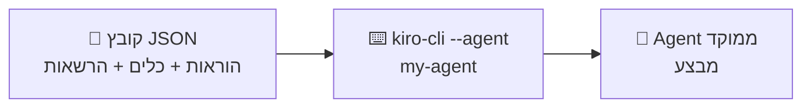

# מודול 9: Custom Agents — אוטומציה של תהליכי עבודה

!!! info "משך"
    25 דקות הרצאה + 60 דקות hands-on + 15 דקות דיון

## מטרות למידה

בסוף המודול הזה, תוכלו:

- להבין מה הם Custom Agents ב-Kiro CLI ואיך הם שונים מקבצי steering
- ליצור agents מותאמים אישית שמאטמטים תהליכי עבודה חוזרים
- להגביל agent לכלים ספציפיים (least privilege) ולתת לו הוראות קבועות
- לשתף agents עם הצוות דרך Git

!!! tip "למה Custom Agents?"
    כולנו עושים פעולות חוזרות: code review לפני PR, בדיקת מוכנות ל-deploy, כתיבת migration. במקום להסביר ל-agent מה לעשות כל פעם מחדש — אפשר לכתוב את ההוראות פעם אחת כ-custom agent ולהפעיל אותו בפקודה אחת.

## מה הם Custom Agents?

Custom Agent הוא **תצורה שמורה של agent**: הוראות קבועות (system prompt), סט כלים מוגדר, והרשאות — הכל בקובץ JSON אחד. כשמפעילים את ה-agent, Kiro CLI טוען את התצורה וה-agent מתנהג בדיוק לפי מה שהגדרתם.

### הרעיון הבסיסי



לדוגמה:

- הקובץ `pr-reviewer.json` → `kiro-cli --agent pr-reviewer`
- הקובץ `deploy-checker.json` → `kiro-cli --agent deploy-checker`
- הקובץ `db-migrator.json` → `kiro-cli --agent db-migrator`

### איפה שמים Custom Agents?

יש שתי רמות:

**ברמת הפרויקט** — agents ספציפיים לפרויקט (נשמרים ב-Git):
```
.kiro/agents/
├── pr-reviewer.json
├── deploy-checker.json
└── db-migrator.json
```

**ברמה גלובלית** — agents שזמינים בכל פרויקט:
```
~/.kiro/agents/
├── commit-helper.json
└── code-explainer.json
```

### מה ההבדל בין Custom Agent ל-Steering?

**Steering (`.kiro/steering/*.md`):**

- **מתי נטען:** תמיד, בכל סשן
- **מטרה:** הנחיות כלליות לפרויקט (stack, conventions, מה לא לעשות)
- **דוגמה:** "השתמש ב-TypeScript, כתוב tests"
- **אנלוגיה:** מדריך עובד חדש

**Custom Agent:**

- **מתי נטען:** רק כשמפעילים את ה-agent הספציפי
- **מטרה:** משימה ספציפית ומוגדרת, עם כלים והרשאות מותאמים
- **דוגמה:** pr-reviewer — עושה review לפי checklist קבוע, עם הרשאות קריאה בלבד
- **אנלוגיה:** מומחה שמזמינים למשימה מסוימת

## אנטומיה של Custom Agent

### מבנה הקובץ

קובץ agent הוא JSON עם השדות המרכזיים הבאים:

```json
{
  "name": "pr-reviewer",
  "description": "Reviews the current branch changes as a thorough code reviewer",
  "prompt": "You are an experienced code reviewer. When asked to review...",
  "tools": ["read", "shell"],
  "allowedTools": ["read"],
  "resources": ["file://README.md", "file://.kiro/steering/*.md"]
}
```

- **`name`** — שם ה-agent (כך מפעילים אותו)
- **`description`** — תיאור קצר; עוזר לכם (ולעמיתים) להבין מה ה-agent עושה
- **`prompt`** — ההוראות הקבועות של ה-agent. זה הלב: כאן כותבים את ה-workflow המלא
- **`tools`** — אילו כלים זמינים ל-agent בכלל
- **`allowedTools`** — אילו כלים מאושרים **אוטומטית** בלי לשאול. כלי שנמצא ב-`tools` אבל לא כאן — ידרוש אישור ידני
- **`resources`** — קבצים שנטענים ל-context של ה-agent מראש

!!! tip "ההבדל בין tools ל-allowedTools"
    זו הפרדה חשובה: `tools` קובע מה ה-agent *יכול* לעשות, `allowedTools` קובע מה הוא יכול לעשות *בלי לבקש אישור*. ל-agent של review תנו `shell` ב-tools (כדי שיוכל להריץ `git diff`) אבל אל תוסיפו אותו ל-allowedTools — כך כל פקודה תוצג לכם לאישור.

### יצירה: שתי דרכים

**דרך 1 — AI-assisted (מומלץ להתחלה):** מתוך סשן של Kiro CLI:

```
> /agent create pr-reviewer -D "Reviews branch changes before PR"
```

Kiro ייצור תצורה מלאה על בסיס התיאור, ותוכלו לערוך אותה אחר כך.

**דרך 2 — ידנית:** צרו את קובץ ה-JSON בעצמכם ב-`.kiro/agents/` (הוסיפו `--manual` לפקודה, או פשוט כתבו את הקובץ ידנית).

### הפעלה

```bash
# פתיחת סשן עם ה-agent
kiro-cli --agent pr-reviewer

# או החלפת agent בתוך סשן פעיל
> /agent swap
```

`/agent swap` פותח תפריט בחירה מכל ה-agents הזמינים — של הפרויקט ושלכם.

### דוגמה מלאה — Agent ראשון

ניצור agent שעושה commits חכמים. צרו את הקובץ `.kiro/agents/commit-helper.json`:

```json
{
  "name": "commit-helper",
  "description": "Creates well-structured git commits for the current changes",
  "prompt": "You are a git commit assistant. When the user asks you to commit:\n1. Run `git diff` and `git diff --cached` to see all changes\n2. Analyze what changed and why\n3. Stage the relevant files (use `git add` with specific files, never `-A` or `.`)\n4. Write a commit message in Conventional Commits format (feat/fix/refactor/docs/test/chore)\n5. The message must have: a subject line (max 72 chars), a blank line, and a body explaining WHAT changed and WHY\n6. Show the commit message and ask for approval BEFORE committing\n7. Never commit .env files or secrets\n8. If there are unrelated changes, suggest splitting into multiple commits",
  "tools": ["read", "shell"],
  "allowedTools": ["read"]
}
```

עכשיו מפעילים:

```bash
kiro-cli --agent commit-helper
> תעשה commit לשינויים הנוכחיים
```

ה-agent יודע בדיוק מה לעשות — וכל פקודת `git` תוצג לכם לאישור, כי `shell` לא נמצא ב-`allowedTools`.

## תרגיל מעשי 1: agent מוכן ראשון (15 דקות)

### שלב 1 — יצירת תיקיית agents

```bash
mkdir -p .kiro/agents
```

### שלב 2 — התקנת agent מוכן

צרו את הקובץ `.kiro/agents/pr-reviewer.json`:

```json
{
  "name": "pr-reviewer",
  "description": "Reviews the current branch's changes as a thorough code reviewer",
  "prompt": "You are an experienced code reviewer. When asked to review:\n\n1. Run `git diff main...HEAD` to see all changes in this branch\n2. Run `git log main..HEAD --oneline` to see the commit history\n3. For each changed file, analyze: code quality and readability, potential bugs or edge cases, performance implications, security concerns, test coverage\n\nProvide your review in this format:\n\n## Summary\nBrief overview of what this PR does.\n\n## Issues Found\nList problems ordered by severity:\n- 🔴 Critical\n- 🟡 Warning\n- 🔵 Suggestion\n\n## Good Things\nWhat's done well.\n\n## Questions\nThings you'd ask the author about.",
  "tools": ["read", "shell"],
  "allowedTools": ["read"]
}
```

### שלב 3 — שימוש

פתחו פרויקט עם branch פעיל ונסו:

```bash
kiro-cli --agent pr-reviewer
> תעשה review לשינויים ב-branch הנוכחי
```

!!! example "מה לצפות"
    ה-agent יריץ `git diff` (ויבקש אישור, כי `shell` לא מאושר אוטומטית), ינתח את השינויים, ויחזיר review מובנה לפי הפורמט שהגדרתם ב-prompt. אם אין שינויים ב-branch — הוא ידווח על זה ויציע איך להמשיך.

## תרגיל מעשי 2: בניית Agent מותאם אישית (30 דקות)

### דוגמה 1: `deploy-checker` — בדיקת מוכנות ל-deploy

צרו `.kiro/agents/deploy-checker.json`:

```json
{
  "name": "deploy-checker",
  "description": "Verifies the project is ready for deployment",
  "prompt": "Perform a comprehensive deployment readiness check. Run these checks and report results:\n\n1. TESTS: Run the test suite (npm test or the project's test command). Report pass/fail count.\n2. CODE QUALITY: Search for TODO, FIXME, HACK, XXX comments in src/. Report count and files.\n3. ENV VARS: Read .env.example if it exists. Verify no secrets are hardcoded in source files (search for API_KEY=, password=, secret= patterns).\n4. DEPENDENCIES: Run npm outdated and npm audit. Summarize findings.\n5. BUILD: Run the build command and verify it succeeds.\n6. GIT: Verify working directory is clean and branch is up to date with remote.\n\nPresent results as a checklist with ✅/❌ per check, details for failures, and an overall verdict: READY TO DEPLOY or NOT READY (with reasons).",
  "tools": ["read", "shell"],
  "allowedTools": ["read"]
}
```

שימוש:

```bash
kiro-cli --agent deploy-checker
> תבדוק אם הפרויקט מוכן ל-deploy
```

### דוגמה 2: `db-migrator` — יצירת migrations

צרו `.kiro/agents/db-migrator.json`:

```json
{
  "name": "db-migrator",
  "description": "Creates database migration files following project conventions",
  "prompt": "You create database migrations. When asked to create a migration:\n\n1. Check the existing migrations directory to understand: naming convention (timestamp/sequential), file format (SQL/TS/JS), and which migration tool is used (knex, prisma, typeorm, drizzle)\n2. Generate the correct filename matching the existing convention\n3. Create the migration with: an `up` function, a `down` function, proper types and imports matching existing migrations, and comments explaining what it does\n4. If using Prisma: update schema.prisma instead, and suggest the prisma migrate command\n5. Show the migration file and ask for confirmation before saving\n\nRules: Always match the existing migration style exactly. For destructive operations (dropping tables/columns), add a warning comment. NEVER auto-run the migration — just create the file.",
  "tools": ["read", "write"],
  "allowedTools": ["read"]
}
```

שימוש:

```bash
kiro-cli --agent db-migrator
> תיצור migration שמוסיף עמודת email_verified לטבלת users
```

שימו לב: ל-agent הזה יש `write` (הוא צריך ליצור קובץ) אבל אין לו `shell` בכלל — הוא פיזית לא יכול להריץ את ה-migration.

### עכשיו אתם — בנו agent משלכם! (15 דקות)

חשבו על תהליך עבודה חוזר שאתם עושים ובנו agent עבורו. כמה רעיונות:

- `api-scaffolder` — יצירת endpoint חדש (route, controller, validation, test) לפי תבנית הפרויקט
- `bug-investigator` — חקירת באג (קריאת logs, חיפוש בקוד, הצעת fix) — read-only!
- `release-noter` — יצירת release notes מ-git log
- `test-writer` — כתיבת tests לקוד לא מכוסה, לפי דפוסי הבדיקות הקיימים
- `onboarding-guide` — agent שעונה על שאלות של מפתחים חדשים על ה-codebase (read-only)

**חובה לכלול:**

1. `prompt` עם workflow מסודר בשלבים
2. `tools` מינימליים — רק מה שה-agent באמת צריך
3. `allowedTools` מצומצם עוד יותר — פעולות מסוכנות דורשות אישור

### תרגיל מעשי 3: debugging של Agent (15 דקות)

מה קורה כש-agent לא עובד כמצופה? נסו את התרחישים הבאים:

1. **Agent עם כלים חסרים:** הסירו את `shell` מ-`tools` של pr-reviewer ובקשו review. מה קורה כשה-agent מנסה להריץ `git diff`?
2. **Agent עם prompt מעורפל:** שנו את ה-prompt ל-"do a good review" בלבד. השוו את איכות התוצאה לגרסה המפורטת
3. **בדיקת precedence:** צרו agent עם אותו שם גם ב-`.kiro/agents/` וגם ב-`~/.kiro/agents/` עם prompts שונים. איזה מהם נטען?

!!! warning "פתרון בעיות נפוצות"
    **ה-agent לא מופיע ב-`/agent swap`:**

    - וודאו שהקובץ נמצא ב-`.kiro/agents/` (או `~/.kiro/agents/`) עם סיומת `.json`
    - וודאו שה-JSON תקין (הריצו `cat file.json | npx json5` או הדביקו ב-validator)
    - וודאו שיש שדה `name` ושהוא תואם למה שאתם מקלידים

    **ה-agent מתעלם מההוראות:**

    - ההוראות ב-`prompt` צריכות להיות ברורות ואימפרטיביות ("Run X", "Never do Y")
    - הימנעו מהוראות שסותרות את קבצי ה-steering של הפרויקט
    - פשטו — agent שעושה דבר אחד טוב עדיף על agent שעושה 10 דברים בינוניים

    **ה-agent מבקש אישור על כל פעולה:**

    - בדקו את `allowedTools` — כלים שלא מופיעים שם דורשים אישור ידני
    - זו התנהגות רצויה לפעולות מסוכנות; הוסיפו ל-allowedTools רק כלים בטוחים (read)

## דפוסים מתקדמים

### Agent עם MCP servers משלו

Custom agent יכול להגדיר אילו שרתי MCP זמינים לו — בנפרד מההגדרות הכלליות:

```json
{
  "name": "github-manager",
  "description": "Manages GitHub issues and PRs",
  "prompt": "You manage GitHub workflows...",
  "tools": ["read"],
  "mcpServers": {
    "github": {
      "command": "npx",
      "args": ["-y", "@modelcontextprotocol/server-github"],
      "env": { "GITHUB_PERSONAL_ACCESS_TOKEN": "${GITHUB_TOKEN}" }
    }
  },
  "includeMcpJson": false
}
```

`includeMcpJson: false` אומר: אל תטען את שרתי ה-MCP הכלליים — רק את מה שמוגדר כאן. זה נותן ל-agent סביבה נקייה וממוקדת.

### Agent שאוכף conventions של הצוות

אחד השימושים החזקים ביותר — agent שבודק שקוד חדש עומד בסטנדרטים:

```json
{
  "name": "convention-checker",
  "description": "Checks that current changes follow team conventions",
  "prompt": "Review the current git diff against our team conventions:\n\nNAMING: Components PascalCase, utility files kebab-case, variables camelCase (no abbreviations), constants UPPER_SNAKE_CASE.\n\nSTRUCTURE: No file longer than 300 lines. No function longer than 50 lines. Max 3 levels of nesting. All exported functions have JSDoc.\n\nGIT: Branch name follows type/TICKET-123-description. Commits use Conventional Commits.\n\nTESTING: Every new function has at least one test. No .skip in committed tests.\n\nRun `git diff`, check every rule, and report violations with file and line references.",
  "tools": ["read", "shell"],
  "allowedTools": ["read"],
  "resources": ["file://.kiro/steering/*.md"]
}
```

שימו לב ל-`resources`: ה-agent טוען את קבצי ה-steering של הפרויקט מראש, כך שהוא מכיר גם את הכללים הכלליים.

!!! warning "Custom agents לא מחליפים CI"
    Agents רצים מקומית ותלויים בשיתוף פעולה של המפתח. הם מצוינים כ-"first line of defense", אבל אל תסמכו עליהם כתחליף לבדיקות אוטומטיות ב-CI/CD.

## שיתוף Agents בצוות

### דרך Git

כי agents שבתיקיית `.kiro/agents/` הם חלק מהפרויקט, הם נשמרים ב-Git אוטומטית:

```bash
git add .kiro/agents/
git commit -m "feat: add team custom agents for Kiro CLI"
git push
```

כל מי שעושה `git pull` מקבל את ה-agents — והם עובדים גם ב-Kiro IDE וגם ב-CLI.

### Best Practices

1. **תיעוד** — כתבו `description` ברור לכל agent
2. **בדיקה** — נסו את ה-agent כמה פעמים לפני שמשתפים
3. **גרסאות** — עדכנו agents כשקונבנציות הצוות משתנות
4. **ספציפיות** — agent טוב עושה דבר אחד ועושה אותו טוב
5. **הגנתיות** — allowedTools מינימלי; פעולות הרסניות (מחיקה, push, deploy) תמיד דורשות אישור

## שאלות לדיון

1. אילו תהליכי עבודה חוזרים בצוות שלכם מתאימים להפוך ל-custom agents?
2. איך custom agents משתלבים עם steering files? מתי תשתמשו בכל אחד?
3. מה הסיכון ב-agent עם `shell` ב-allowedTools? מתי בכל זאת הייתם מאשרים את זה?
4. איך custom agents יכולים לעזור ב-onboarding של מפתחים חדשים לצוות?

## נקודות מפתח

- **Custom Agents** הם תצורות שמורות של agent — הוראות + כלים + הרשאות בקובץ JSON אחד
- הפעלה: `kiro-cli --agent <name>` או `/agent swap` בתוך סשן; יצירה: `/agent create`
- שני מיקומים: `.kiro/agents/` (פרויקט, משותף ב-Git) ו-`~/.kiro/agents/` (גלובלי)
- **`tools` לעומת `allowedTools`** — מה ה-agent יכול לעשות, לעומת מה שמאושר לו אוטומטית. זה הבסיס ל-least privilege
- **Steering = הנחיות קבועות לכל סשן; Custom Agent = מומחה למשימה ספציפית**
- agent טוב עושה **דבר אחד** ועושה אותו טוב — כמו פונקציה
- ההפרדה בין agents עם הרשאות שונות היא בדיוק הרעיון שנרחיב במודול 10 — Sub-Agents
