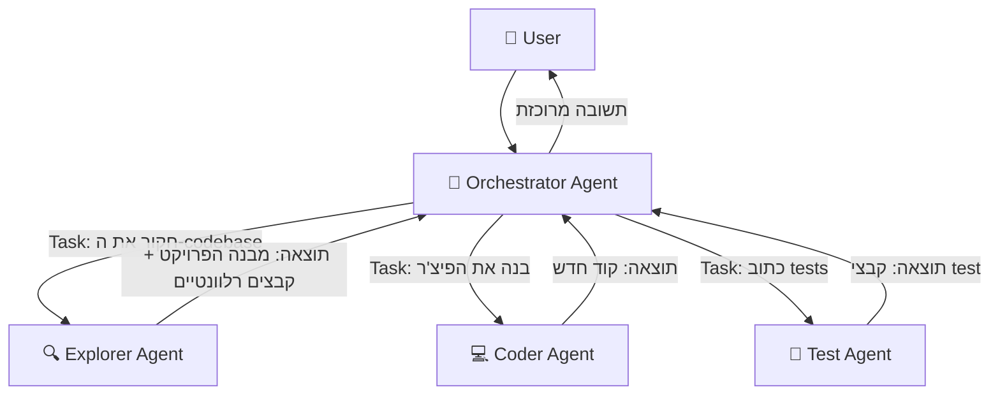
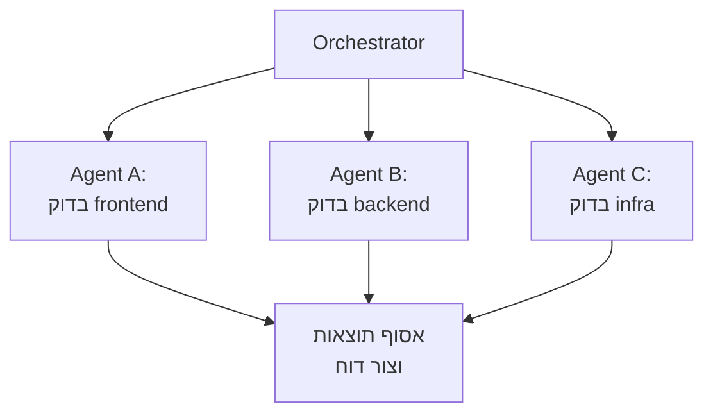
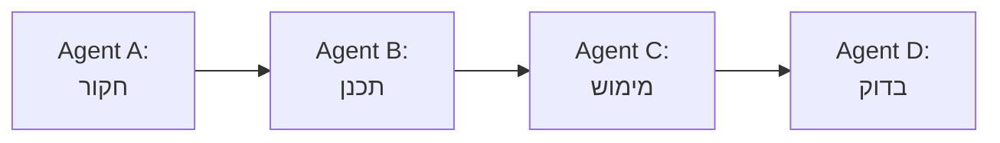
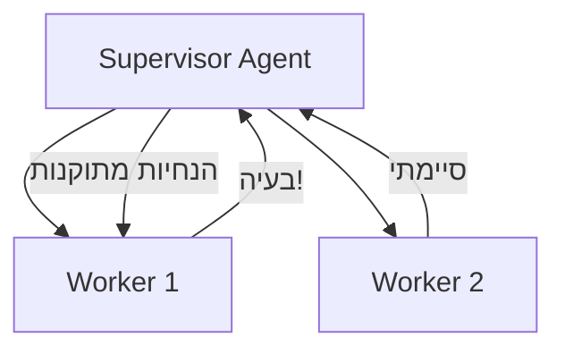

# מודול 9: Sub-Agents — תזמור של agents מרובים

!!! info "משך"
    30 דקות הרצאה + 60 דקות hands-on + 15 דקות דיון

## מטרות למידה

בסוף המודול הזה, תוכלו:

- להבין מה הם sub-agents ולמה צריך אותם
- להגדיר sub-agents עם הרשאות, משאבים ומגבלות
- לתזמר מספר agents שעובדים יחד על משימה מורכבת
- לזהות מתי כדאי לפצל משימה ל-sub-agents ומתי לא

!!! tip "למה sub-agents?"
    במודול 4 בנינו agent בודד עם loop אחד. אבל מה קורה כשהמשימה מורכבת מדי? Agent אחד שמנסה לעשות הכל — חוקר, כותב קוד, בודק, מתקן — מתחיל לאבד פוקוס ולצרוך context מיותר. הפתרון: **לפצל את העבודה ל-agents מתמחים**.

## הרעיון: Agent שמפעיל agents

### Agent בודד לעומת multi-agent

**Agent בודד:**
```
User → Agent → [קריאת קבצים, כתיבה, הרצה, תיקון, ...] → Response
```

הבעיה: ככל שהמשימה מתארכת, ה-context window מתמלא. ה-agent "שוכח" החלטות מוקדמות, מאבד פוקוס, ועושה טעויות.

**Multi-agent עם sub-agents:**
```
User → Main Agent (orchestrator)
         ├→ Sub-Agent A: "חקור את ה-codebase"
         ├→ Sub-Agent B: "כתוב את הפיצ'ר"
         └→ Sub-Agent C: "כתוב tests"
       ← Main Agent: מרכיב תשובה סופית
```

כל sub-agent מקבל **context נקי**, מתמקד במשימה אחת, ומחזיר תוצאה ממוקדת.

### האנלוגיה

חשבו על tech lead שמנהל צוות:

- **Tech lead (orchestrator)** — מבין את התמונה הגדולה, מחלק משימות, מרכיב את התוצאה הסופית
- **מפתח A (sub-agent)** — מתמחה בחקירת קוד קיים
- **מפתח B (sub-agent)** — מתמחה בכתיבת קוד חדש
- **מפתח C (sub-agent)** — מתמחה בכתיבת tests

ה-tech lead לא כותב את כל הקוד בעצמו — הוא **מתזמר** את העבודה.

## Sub-Agents ב-Kiro CLI

### איך Kiro CLI משתמש ב-sub-agents

כש-Kiro CLI מקבל משימה מורכבת, הוא יכול להפעיל sub-agents דרך ה-**Task tool**. כל sub-agent:

- מקבל **prompt ספציפי** — מה בדיוק לעשות
- רץ עם **context נקי** — לא רואה את כל היסטוריית השיחה
- מקבל **סט כלים מוגבל** — לפי סוג ה-agent
- מחזיר **תוצאה אחת** — ל-agent הראשי



### סוגי sub-agents

ב-Kiro CLI יש כמה סוגי agents מובנים, כל אחד עם כלים שונים:

**Explore Agent** — חקירת codebase:

- כלים: קריאת קבצים, חיפוש (Glob, Grep), ניווט
- **אין לו**: כתיבה, הרצת פקודות
- שימוש: "תמצא איפה מוגדר ה-authentication middleware"

**Coder Agent** — כתיבת קוד:

- כלים: קריאה, כתיבה, חיפוש, הרצת פקודות
- שימוש: "תוסיף validation לכל ה-API endpoints"

**Plan Agent** — תכנון:

- כלים: קריאה, חיפוש
- **אין לו**: כתיבה, הרצת פקודות
- שימוש: "תתכנן את הארכיטקטורה למערכת notifications"

> כל סוג agent מקבל רק את הכלים שהוא צריך — **עקרון ה-least privilege**. Explorer לא יכול לשנות קבצים, Planner לא יכול להריץ פקודות.

## הגדרת Sub-Agent

### המבנה הבסיסי

כשהאורקסטרטור מפעיל sub-agent, הוא מגדיר:

```
1. סוג ה-agent (subagent_type) — קובע את הכלים הזמינים
2. ה-prompt — מה לעשות
3. מגבלות (אופציונלי) — max turns, timeout
```

!!! note "מה קורה כש-max turns נגמר?"
    כשה-agent מגיע למגבלת ה-max turns, הוא **עוצר ומחזיר את מה שיש לו עד כה**. הוא לא מקבל סיבוב נוסף לסכם או לסיים — פשוט נעצר. לכן חשוב לבחור ערך שנותן ל-agent מספיק סיבובים לסיים את המשימה. אם התוצאה חלקית, ה-orchestrator יכול להחליט לשלוח agent נוסף להשלים.

### דוגמה: הפעלת Explorer sub-agent

```
Task: "חפש בכל ה-codebase שלנו את כל המקומות שמשתמשים
ב-database connection ישירות (לא דרך ORM).
תחזיר רשימה של קבצים עם שורות ספציפיות."

סוג: Explore
```

ה-Explorer ינווט בקבצים, יחפש patterns, ויחזיר תוצאה ממוקדת — בלי לגעת בשום דבר.

### דוגמה: הפעלת Coder sub-agent

```
Task: "קרא את הקובץ src/auth/middleware.ts
ותוסיף rate limiting של 100 requests per minute per IP.
השתמש ב-express-rate-limit."

סוג: Coder
```

ה-Coder יקרא, ישנה, ויוודא שהקוד עובד.

## הרשאות ומשאבים

### עקרון ה-Least Privilege

!!! warning "כלל זהב"
    כל sub-agent צריך לקבל **רק את ההרשאות שהוא צריך** למשימה. Agent שצריך רק לחפש — לא צריך הרשאת כתיבה. Agent שכותב tests — לא צריך גישה ל-production environment.

### מה אפשר לשלוט בו

**כלים זמינים** — לפי סוג ה-agent:

- **Read-only**: קריאת קבצים, חיפוש — בטוח לחלוטין
- **Read-write**: גם כתיבת קבצים — צריך להיזהר
- **Full access**: גם הרצת פקודות — הכי מסוכן

**Context** — מה ה-agent רואה:

- ה-prompt הספציפי שהוא קיבל
- חלק מהאורקסטרטורים חולקים context מהשיחה הראשית
- ככלל: **פחות context = יותר פוקוס**

**מגבלות** — גבולות על ה-agent:

- **Max turns** — מספר מקסימלי של iteraות (מונע loops אינסופיים)
- **Timeout** — מגבלת זמן
- **Working directory** — באיזו תיקייה הוא עובד

### טבלת הרשאות לפי סוג

**Explore Agent:**

- קריאת קבצים — כן
- חיפוש (Glob/Grep) — כן
- כתיבת קבצים — לא
- הרצת פקודות — לא

**Plan Agent:**

- קריאת קבצים — כן
- חיפוש (Glob/Grep) — כן
- כתיבת קבצים — לא
- הרצת פקודות — לא

**Coder Agent:**

- קריאת קבצים — כן
- חיפוש (Glob/Grep) — כן
- כתיבת קבצים — כן
- הרצת פקודות — כן

**General-purpose Agent:**

- קריאת קבצים — כן
- חיפוש (Glob/Grep) — כן
- כתיבת קבצים — כן
- הרצת פקודות — כן
- הפעלת sub-agents — כן

!!! warning "רקורסיה ב-General-purpose Agent"
    General-purpose Agent יכול להפעיל sub-agents שגם הם מסוג general-purpose — מה שיוצר רקורסיה. ברוב ה-frameworks יש **מגבלת עומק** (depth limit) שמונעת רקורסיה אינסופית. ב-SDK, השליטה היא דרך `maxTurns` — כל agent בשרשרת צורך turns, כך שה-budget הכולל מוגבל. אם אתם בונים orchestrator מותאם, הקפידו להגדיר מגבלת עומק מפורשת (למשל: sub-agent לא יכול להפעיל sub-agent מעומק 3 ומעלה).

## דפוסי תזמור

### דפוס 1: Fan-Out / Fan-In

**הרעיון:** שלח כמה agents במקביל, אסוף את התוצאות, ושלב.



**מתי:** כשצריך לבצע אותה פעולה על חלקים שונים של ה-codebase.

**דוגמה — code review מקבילי:**
```
Orchestrator: "צריך לעשות code review ל-PR הזה"
  → Agent A: "בדוק את שינויי ה-frontend ב-src/components/"
  → Agent B: "בדוק את שינויי ה-backend ב-src/api/"
  → Agent C: "בדוק את שינויי ה-infrastructure ב-deploy/"
← Orchestrator: מרכיב review אחד מ-3 התוצאות
```

**דוגמה מפורטת — Security Audit מקבילי:**

תרחיש מציאותי: רוצים לבצע security audit מקיף על הפרויקט. במקום agent אחד שסורק הכל (ומאבד פוקוס), מפצלים ל-3 agents מתמחים שרצים במקביל:

```
Orchestrator: "בצע security audit מלא לפרויקט"
  → Agent A: "סרוק את כל ה-dependencies לפגיעויות ידועות (CVEs)"
  → Agent B: "חפש סיכוני code injection — SQL injection, XSS, command injection"
  → Agent C: "חפש secrets שנשארו בקוד — API keys, passwords, tokens"
← Orchestrator: מרכיב דוח אבטחה אחד עם כל הממצאים
```

```typescript
// Security audit עם Fan-Out
const [vulnerabilities, injectionRisks, secretLeaks] = await Promise.all([
  runSubAgent(
    `Scan all dependencies in package.json / package-lock.json.
     Check for known CVEs using the lock file versions.
     List every dependency with a known vulnerability,
     its severity (critical/high/medium/low), and recommended fix.`,
    { allowedTools: ["Read", "Glob", "Grep"], maxTurns: 10 }
  ),
  runSubAgent(
    `Search the entire codebase for code injection risks:
     - SQL injection: raw SQL queries with string concatenation
     - XSS: unescaped user input rendered in HTML/templates
     - Command injection: shell commands built from user input
     For each finding, show the file, line, and suggested fix.`,
    { allowedTools: ["Read", "Glob", "Grep"], maxTurns: 12 }
  ),
  runSubAgent(
    `Search for secrets and credentials leaked in the codebase:
     - API keys, tokens, passwords in source files
     - .env files committed to git
     - Hardcoded connection strings
     - Private keys or certificates
     Check .gitignore to see if sensitive files are properly excluded.`,
    { allowedTools: ["Read", "Glob", "Grep"], maxTurns: 10 }
  ),
]);

// ה-orchestrator מרכיב דוח מאוחד
const report = await runSubAgent(
  `Compile a security audit report from these findings:

   ## Dependency Vulnerabilities
   ${vulnerabilities}

   ## Code Injection Risks
   ${injectionRisks}

   ## Secret Leaks
   ${secretLeaks}

   Prioritize by severity. Group related issues together.`,
  { allowedTools: ["Read"], maxTurns: 5 }
);
```

כל agent מתמחה בסוג אחד של בעיית אבטחה, ולכן מדויק יותר מ-agent אחד שמנסה למצוא הכל.

### דפוס 2: Pipeline (שרשרת)

**הרעיון:** כל agent מקבל את התוצאה של הקודם ומוסיף עליה.



**מתי:** כשיש תלות בין השלבים — אי אפשר לכתוב קוד לפני שחקרנו.

**דוגמה — הוספת פיצ'ר:**
```
Agent A (Explore): "תמצא איך authentication עובד ב-codebase"
  → תוצאה: "Auth middleware ב-src/auth/, משתמש ב-JWT..."
Agent B (Plan): "על בסיס מה שמצאנו, תכנן הוספת 2FA"
  → תוצאה: "תוכנית: 1. הוסף TOTP library 2. עדכן user model..."
Agent C (Coder): "תממש את התוכנית הזו"
  → תוצאה: קבצים שנכתבו
Agent D (Coder): "תכתוב tests לקוד החדש"
  → תוצאה: קבצי test
```

**דוגמה מפורטת — מימוש פיצ'ר עם העברת context בין שלבים:**

הנקודה החשובה ב-Pipeline היא **מה בדיוק עובר בין השלבים**. כל agent צריך לקבל סיכום ממוקד, לא dump מלא:

```
Agent A (Explore) — "חקור את מערכת ה-notifications הקיימת"
  → מעביר הלאה:
    - רשימת קבצים רלוונטיים: src/notifications/, src/models/notification.ts
    - הטכנולוגיות: Redis pub/sub, PostgreSQL לשמירה
    - ה-API הקיים: POST /notify, GET /notifications/:userId
    - חסרונות שזוהו: אין תמיכה ב-batching, אין rate limiting

Agent B (Plan) — מקבל את הסיכום + המשימה "הוסף email notifications"
  → מעביר הלאה:
    - תוכנית מפורטת: 4 קבצים לשנות, 2 קבצים חדשים
    - סדר מימוש: model → service → controller → tests
    - interface מוגדר: EmailNotification { to, subject, template, vars }
    - סיכונים: צריך לוודא שה-email service לא חוסם את ה-event loop

Agent C (Coder) — מקבל את התוכנית המפורטת
  → מעביר הלאה:
    - רשימת קבצים שנוצרו/שונו עם תיאור קצר של כל שינוי
    - ה-interface הסופי שמומש
    - הערות על החלטות שנלקחו במימוש

Agent D (Coder) — מקבל רשימת שינויים + interfaces
  → תוצאה סופית: קבצי test שמכסים את כל ה-cases
```

המפתח להצלחה: כל שלב מחזיר **סיכום מובנה** שה-agent הבא יכול לפעול לפיו, לא סתם טקסט חופשי.

### דפוס 3: Supervisor

**הרעיון:** agent אחד מפקח על אחרים ומתערב כשצריך.



**מתי:** כשהמשימה דורשת התאמות תוך כדי עבודה.

**דוגמה — migration:**
```
Supervisor: "העבר את הפרויקט מ-JavaScript ל-TypeScript"
  → Worker 1: "המר את src/utils/ ל-TypeScript"
    ← "נתקלתי בבעיית types ב-3 קבצים"
  → Supervisor: מנתח את הבעיה, שולח הנחיות מתוקנות
  → Worker 1 (שוב): "המר עם ה-type definitions האלה"
  → Worker 2: "המר את src/components/ ל-TypeScript"
```

**מתי ה-Supervisor מתערב? דוגמה מפורטת:**

ה-Supervisor לא סתם "מפקח" — הוא בודק באופן אקטיבי את התוצאות של כל worker ומחליט אם להמשיך, לתקן, או לעצור. הנה מה שמפעיל התערבות:

- **בדיקת איכות:** התוצאה של ה-worker לא עומדת בסטנדרט (קוד לא עובר lint, חסרים error handlers)
- **זיהוי שגיאות:** ה-worker מדווח על בעיה שהוא לא יכול לפתור לבד
- **זיהוי קונפליקטים:** שני workers שינו קבצים בצורה סותרת
- **עדכון הנחיות:** מידע חדש שנחשף בשלב אחד משנה את ההנחיות לשלבים הבאים

```typescript
// Supervisor loop עם validation
async function supervisedMigration(directories: string[]) {
  const sharedTypes: string[] = []; // types שנוצרו ע"י workers קודמים

  for (const dir of directories) {
    let attempt = 0;
    let success = false;

    while (attempt < 3 && !success) {
      const workerResult = await runSubAgent(
        `Convert ${dir} from JavaScript to TypeScript.
         Use these shared type definitions from previous conversions:
         ${sharedTypes.join("\n")}

         Return a JSON summary:
         { "convertedFiles": [...], "newTypes": [...], "errors": [...] }`,
        {
          allowedTools: ["Read", "Write", "Edit", "Glob", "Grep", "Bash"],
          maxTurns: 20,
        }
      );

      // Supervisor בודק את התוצאה
      const validation = await runSubAgent(
        `Validate the TypeScript migration of ${dir}.
         Worker reported: ${workerResult}

         Check:
         1. Do all files compile? (run tsc --noEmit)
         2. Are there any 'any' types that should be specific?
         3. Are all imports updated correctly?

         Return: { "valid": true/false, "issues": [...] }`,
        {
          allowedTools: ["Read", "Glob", "Grep", "Bash"],
          maxTurns: 10,
        }
      );

      if (validation.includes('"valid": true')) {
        success = true;
        // שמור types חדשים לשימוש workers הבאים
        const newTypes = extractTypes(workerResult);
        sharedTypes.push(...newTypes);
      } else {
        attempt++;
        console.log(
          `Supervisor: Worker output for ${dir} failed validation, ` +
          `retrying (attempt ${attempt}/3)`
        );
      }
    }

    if (!success) {
      console.error(
        `Supervisor: Failed to migrate ${dir} after 3 attempts, skipping`
      );
    }
  }
}
```

הלולאה של ה-Supervisor מבטיחה שכל שלב עובר validation לפני שממשיכים הלאה — ואם לא, ה-worker מקבל הזדמנות נוספת עם context מעודכן.

## פתרון קונפליקטים בין agents

כשמספר agents עובדים על אותו codebase, קונפליקטים הם בלתי נמנעים. חשוב להכיר את סוגי הקונפליקטים ולתכנן מראש איך למנוע אותם.

### קונפליקטים בקבצים (File Conflicts)

**הבעיה:** שני agents מנסים לשנות את אותו קובץ בו-זמנית. Agent A מוסיף function בשורה 50, ו-Agent B משנה import בשורה 3 — אבל כל אחד מהם קרא את הקובץ לפני שהשני כתב. התוצאה: השינוי של אחד מהם נדרס.

**פתרונות:**

- **הקצאה בלעדית:** חלקו קבצים בין agents מראש. Agent A אחראי על `src/auth/`, Agent B על `src/api/` — בלי חפיפה
- **השתמשו ב-Pipeline במקום Fan-Out:** אם שני agents צריכים לגעת באותו קובץ, שרשרו אותם — Agent A כותב קודם, Agent B מקבל את הגרסה המעודכנת
- **Orchestrator merge:** ה-orchestrator אוסף את השינויים המבוקשים משני ה-agents ומבצע agent שלישי שמיישם את כולם יחד

### קונפליקטים סמנטיים (Semantic Conflicts)

**הבעיה:** Agent A מוסיף function חדש `validateInput()` ויוצר קריאות אליו. Agent B עושה refactor ומוחק את הקובץ שבו Agent A ציפה שה-function יהיה, או משנה את ה-interface שה-function משתמש בו. כל agent עבד נכון בפני עצמו, אבל ביחד — הקוד שבור.

**פתרון:** הוסיפו **validation agent** שרץ אחרי כל ה-agents האחרים:

```typescript
// Validation agent שבודק עקביות אחרי כל השינויים
const validation = await runSubAgent(
  `All changes have been applied. Verify consistency:
   1. Run the TypeScript compiler (tsc --noEmit) and report errors
   2. Check that all imports resolve to existing files
   3. Check that all function calls match existing function signatures
   4. Run the test suite and report failures

   If there are issues, list each one with the file and line number.`,
  {
    allowedTools: ["Read", "Glob", "Grep", "Bash"],
    maxTurns: 15,
  }
);
```

### קונפליקטים במשאבים (Resource Conflicts)

**הבעיה:** מספר agents מריצים `npm install` במקביל, או מנסים לעשות `git commit` בו-זמנית, או כותבים לאותו lock file. התוצאה: שגיאות file lock, מצב לא עקבי של `node_modules`, או corrupted git state.

**פתרון:** סדרו (serialize) פעולות שמשנות shared resources:

- הריצו `npm install` פעם אחת לפני שה-agents מתחילים
- אם agent צריך להתקין package, תנו לו לעדכן רק את `package.json` — וה-orchestrator יריץ `npm install` אחר כך
- פעולות git (commit, branch) — רק ב-orchestrator, אף פעם לא ב-sub-agents

!!! tip "כלל אצבע"
    אם agents צריכים לגעת באותם קבצים — השתמשו ב-**Pipeline**, לא ב-**Fan-Out**. Fan-Out בטוח רק כשכל agent עובד על קבצים נפרדים לחלוטין.

## השוואת ביצועים: agent בודד מול sub-agents

מתי multi-agent באמת משתלם מבחינת זמן? הנה הערכות גסות של זמני ביצוע:

- **משימה פשוטה** (עריכת קובץ בודד): Agent בודד ~30 שניות, Multi-agent ~90 שניות (ה-overhead של הקמת agents לא משתלם)
- **משימה בינונית** (3-5 קבצים): Agent בודד ~2 דקות, Multi-agent ~2 דקות (דומה — ה-overhead מתקזז עם המקביליות)
- **משימה מורכבת** (10+ קבצים, שינויים cross-cutting): Agent בודד ~5-8 דקות (או נכשל מ-context overflow), Multi-agent ~3-4 דקות (כאן המקביליות מנצחת)
- **משימה מאוד מורכבת** (פיצ'ר שלם, 20+ קבצים): Agent בודד לרוב נכשל (context overflow, אובד פוקוס), Multi-agent ~5-7 דקות (הדרך היחידה שעובדת)

!!! note "הערה חשובה"
    המספרים האלה הם **הערכות גסות** שתלויות בגורמים רבים: גודל ה-codebase, המודל שבשימוש (Sonnet vs Opus), מורכבות הקוד, מהירות ה-API, וכמה context כל agent צריך. השתמשו בהם כ-guideline כללי, לא כמדד מדויק. מומלץ למדוד בפרויקט שלכם.

## בטיחות: מניעת agents חסרי שליטה

כשמפעילים agents אוטונומיים, חשוב לוודא שהם לא גורמים נזק. הנה הסיכונים העיקריים ואיך למנוע אותם:

### מיצוי משאבים (Resource Exhaustion)

Agent שנתקע ב-loop אינסופי יכול לצרוך tokens ללא הגבלה. השתמשו ב-**הגנה כפולה**: `maxTurns` + timeout:

```typescript
// הגנה כפולה: maxTurns ברמת ה-agent + timeout ברמת הקוד
async function runSubAgentSafely(
  prompt: string,
  options: Partial<ClaudeCodeOptions>
) {
  return Promise.race([
    runSubAgent(prompt, {
      ...options,
      maxTurns: options.maxTurns ?? 15, // הגנה ראשונה: מגבלת סיבובים
    }),
    timeout(120_000).then(() => {  // הגנה שנייה: 2 דקות timeout
      throw new Error("Sub-agent timed out after 120 seconds");
    }),
  ]);
}

function timeout(ms: number): Promise<void> {
  return new Promise((resolve) => setTimeout(resolve, ms));
}
```

גם אם `maxTurns` לא מספיק (Agent שכל turn לוקח לו הרבה זמן), ה-timeout יתפוס את זה.

### צריכת שטח דיסק

Agent עם הרשאות כתיבה יכול ליצור מספר גדול של קבצים — למשל, agent שמייצר tests יכול ליצור אלפי קבצים אם ה-prompt לא ברור. הגנות:

- **הגבלת working directory:** תנו ל-agent לעבוד רק בתיקייה ספציפית
- **מעקב אחרי מספר קבצים:** בדקו כמה קבצים נוצרו אחרי שה-agent סיים, ואם המספר חריג — בדקו ידנית
- **הרשאות מינימליות:** אם Agent לא חייב ליצור קבצים חדשים, תנו לו רק `Edit` (עריכת קבצים קיימים) בלי `Write`

### עלויות API שיוצאות משליטה

ב-multi-agent, העלויות יכולות לצמוח מהר. אם orchestrator מפעיל 5 agents שכל אחד מפעיל 3 sub-agents — זה 15 sessions של API calls:

```typescript
// מעקב אחר צריכת tokens כוללת
let totalTokensUsed = 0;
const TOKEN_BUDGET = 500_000; // תקציב מקסימלי

async function runSubAgentWithBudget(
  prompt: string,
  options: Partial<ClaudeCodeOptions>
): Promise<string> {
  if (totalTokensUsed >= TOKEN_BUDGET) {
    throw new Error(
      `Token budget exhausted: ${totalTokensUsed}/${TOKEN_BUDGET}`
    );
  }

  let result = "";
  for await (const message of query({ prompt, ...options })) {
    if (message.type === "result") {
      result = message.result;
    }
    if (message.type === "usage") {
      totalTokensUsed += message.inputTokens + message.outputTokens;
    }
  }

  console.log(
    `Token usage: ${totalTokensUsed}/${TOKEN_BUDGET} ` +
    `(${Math.round((totalTokensUsed / TOKEN_BUDGET) * 100)}%)`
  );

  return result;
}
```

### כשלונות מדורגים (Cascading Failures)

כש-Agent A מייצר output שגוי, ו-Agent B מקבל אותו כ-input — Agent B ייכשל גם כן, או גרוע מזה, יייצר קוד שגוי בלי לדעת. הפתרון: **validate intermediate results** לפני שמעבירים אותם הלאה:

```typescript
// Pipeline עם validation בין שלבים
const exploration = await runSubAgent("Explore the auth system...", {
  allowedTools: ["Read", "Glob", "Grep"],
  maxTurns: 10,
});

// validation לפני שממשיכים לשלב הבא
if (!exploration || exploration.length < 100) {
  throw new Error("Exploration returned insufficient results, aborting pipeline");
}

// בדיקה שה-exploration מכיל מידע שימושי
if (!exploration.includes("src/") && !exploration.includes("file")) {
  throw new Error(
    "Exploration did not find any relevant files, aborting pipeline"
  );
}

// רק אם ה-validation עבר — ממשיכים לשלב הבא
const plan = await runSubAgent(
  `Based on this analysis: ${exploration}\n\nCreate a plan...`,
  { allowedTools: ["Read", "Glob", "Grep"], maxTurns: 10 }
);
```

## טיפול בכשלונות

כשעובדים עם מספר sub-agents, כשלונות הם בלתי נמנעים. חשוב לתכנן מראש איך להתמודד איתם.

### סוגי כשלונות

- **כשל חלקי** — ה-sub-agent החזיר תוצאה, אבל לא השלים את כל המשימה (למשל: תיקן 3 מתוך 5 קבצים)
- **כשל מוחלט** — ה-sub-agent נכשל לחלוטין (timeout, שגיאת API, context מלא)
- **כשל שקט** — ה-sub-agent החזיר תוצאה שנראית תקינה, אבל היא שגויה (למשל: הקוד שכתב לא עובר compilation)

### אסטרטגיות טיפול

**1. Error propagation — העברת שגיאה למעלה:**

הדרך הפשוטה ביותר — אם sub-agent נכשל, ה-orchestrator מקבל את השגיאה ומחליט מה לעשות.

**2. Retry — ניסיון חוזר:**

לפעמים הכשל הוא זמני (rate limit, timeout). ניסיון חוזר עם אותו prompt יכול לעבוד.

**3. Graceful degradation — המשך עם מה שיש:**

ב-fan-out, אם 2 מתוך 3 agents הצליחו — אפשר להמשיך עם התוצאות החלקיות.

### דוגמת קוד: טיפול בכשלונות

```typescript
async function runSubAgentSafe(
  prompt: string,
  options?: Partial<ClaudeCodeOptions>,
  retries = 2
): Promise<{ success: boolean; result: string; error?: string }> {
  for (let attempt = 0; attempt <= retries; attempt++) {
    try {
      const result = await runSubAgent(prompt, options);

      // בדיקה שהתוצאה לא ריקה
      if (!result || result.trim().length === 0) {
        throw new Error("Sub-agent returned empty result");
      }

      return { success: true, result };
    } catch (error) {
      console.warn(
        `Attempt ${attempt + 1} failed: ${error.message}`
      );

      if (attempt === retries) {
        return {
          success: false,
          result: "",
          error: `Failed after ${retries + 1} attempts: ${error.message}`,
        };
      }

      // המתנה לפני retry (exponential backoff)
      await new Promise((r) => setTimeout(r, 1000 * (attempt + 1)));
    }
  }
  return { success: false, result: "", error: "Unexpected error" };
}

// שימוש ב-fan-out עם graceful degradation
async function parallelExploreWithFallback(task: string) {
  const results = await Promise.allSettled([
    runSubAgentSafe("Analyze project structure", {
      allowedTools: ["Read", "Glob", "Grep"],
      maxTurns: 8,
    }),
    runSubAgentSafe("Analyze dependencies", {
      allowedTools: ["Read", "Glob", "Grep"],
      maxTurns: 8,
    }),
    runSubAgentSafe("Find code patterns", {
      allowedTools: ["Read", "Glob", "Grep"],
      maxTurns: 8,
    }),
  ]);

  // אסוף את התוצאות המוצלחות
  const successful = results
    .filter(
      (r) => r.status === "fulfilled" && r.value.success
    )
    .map((r) => (r as PromiseFulfilledResult<any>).value.result);

  const failed = results.filter(
    (r) =>
      r.status === "rejected" ||
      (r.status === "fulfilled" && !r.value.success)
  );

  if (successful.length === 0) {
    throw new Error("All sub-agents failed");
  }

  console.log(
    `${successful.length}/3 explorations succeeded` +
    (failed.length > 0
      ? ` (${failed.length} failed, continuing with partial results)`
      : "")
  );

  return successful;
}
```

## מודעות לעלויות

### למה זה חשוב ב-multi-agent?

כל sub-agent הוא **קריאת API נפרדת** עם ה-context שלו. המשמעות:

- **כל sub-agent מתחיל מאפס** — ה-system prompt, הכללים, וה-prompt הספציפי נשלחים מחדש
- **כל סיבוב (turn) של sub-agent = input + output tokens** — חקירה של 10 סיבובים יכולה לצרוך 50K-100K tokens
- **Fan-out מכפיל עלויות** — 3 agents במקביל = פי 3 עלות API (אבל שליש מהזמן)

### הערכות עלות גסות

- **Agent חקירה בודד** (Explore, 8-10 turns) — ~50K-100K tokens (~$0.15-$0.30 ב-Sonnet)
- **Agent כתיבה** (Coder, 15-20 turns) — ~100K-200K tokens (~$0.30-$1.00 ב-Sonnet)
- **Orchestrator מלא** (explore + plan + implement) — ~200K-500K tokens (~$1-$3 ב-Sonnet)
- **אותו orchestrator ב-Opus** — פי 5 מ-Sonnet (~$5-$15)

### מתי שווה להשתמש ב-sub-agents?

**כן — שווה את העלות כש:**

- המשימה מורכבת ו-agent בודד נכשל או מייצר תוצאה גרועה
- החיסכון בזמן מפתח גדול מעלות ה-API
- צריך הפרדת הרשאות (read-only חקירה לפני כתיבה)
- ה-context window של agent בודד לא מספיק

**לא — חיסכון מיותר כש:**

- המשימה פשוטה (שינוי בקובץ אחד, refactor קטן)
- אתם בתקציב מוגבל ויכולים לעשות את העבודה ב-agent בודד
- ה-overhead של context transfer גדול מהמשימה עצמה

!!! tip "טיפ לחיסכון"
    התחילו תמיד עם agent בודד. רק אם הוא נכשל, מייצר תוצאה חלקית, או שה-context מתמלא — עברו ל-multi-agent. אל תתחילו עם orchestrator מורכב למשימה שאפשר לפתור ב-prompt אחד.

## תרגיל מעשי 1: חקירה מקבילית (30 דקות)

### התרחיש

ניקח פרויקט ונבקש מ-Kiro CLI לבצע **חקירה מקבילית** של חלקים שונים.

### שלב 1 — שכפול פרויקט לדוגמה

```bash
git clone https://github.com/expressjs/express.git ~/missions/subagent-lab
cd ~/missions/subagent-lab
kiro
```

### שלב 2 — בקשה שמעודדת שימוש ב-sub-agents

```
"אני רוצה להבין את הפרויקט הזה לעומק.
בדוק במקביל:
1. מה המבנה הכללי של התיקיות והקבצים החשובים
2. מהם ה-dependencies העיקריים ומה כל אחד עושה
3. איך מערכת ה-routing עובדת — עקוב אחרי הקוד מ-entry point

תן לי סיכום מאורגן של כל הממצאים."
```

### שלב 3 — צפו ב-sub-agents בפעולה

שימו לב:

- האם Kiro CLI הפעיל sub-agents?
- מה סוג ה-agents שהוא בחר?
- האם הם רצו במקביל או בסדרה?
- איך הוא שילב את התוצאות?

!!! tip "מתי Kiro CLI מפעיל sub-agents?"
    Kiro CLI מפעיל sub-agents כשהוא מזהה שהמשימה מורכבת מספיק או כשמבקשים ממנו מפורשות לבצע דברים במקביל. לפעמים הוא יבחר לעבוד לבד — זה חלק מההחלטה של ה-orchestrator.

## תרגיל מעשי 2: בניית Orchestrator (55 דקות)

### המטרה

נבנה orchestrator פשוט שמתזמר שני sub-agents באמצעות ה-Claude Agent SDK.

!!! info "לגבי `@anthropic-ai/claude-code-sdk`"
    ה-SDK זמין באופן פומבי ב-npm ואפשר להתקין אותו עם `npm install @anthropic-ai/claude-code-sdk`. הוא מאפשר להפעיל Claude Code כ-sub-process מתוך קוד TypeScript/JavaScript. נדרש שיהיה Claude Code CLI מותקן על המכונה (`npm install -g @anthropic-ai/claude-code`).

### שלב 1 — שלד הקוד

צרו פרויקט חדש:

```bash
mkdir ~/missions/orchestrator && cd $_
kiro
```

בקשו מ-Kiro CLI:

```
"צור פרויקט TypeScript עם הקובץ orchestrator.ts.
הפרויקט צריך להשתמש ב-@anthropic-ai/claude-code-sdk.
התקן את ה-dependencies."
```

### שלב 2 — מימוש orchestrator

הנה השלד שנעבוד איתו:

```typescript
import { query, type ClaudeCodeOptions } from "@anthropic-ai/claude-code-sdk";

// הגדרת sub-agent
async function runSubAgent(
  prompt: string,
  options?: Partial<ClaudeCodeOptions>
): Promise<string> {
  const defaultOptions: ClaudeCodeOptions = {
    prompt,
    allowedTools: ["Read", "Glob", "Grep"],  // read-only by default
    maxTurns: 10,
  };

  const mergedOptions = { ...defaultOptions, ...options };
  let result = "";

  for await (const message of query(mergedOptions)) {
    if (message.type === "result") {
      result = message.result;
    }
  }

  return result;
}

// ה-orchestrator
async function orchestrate(task: string) {
  console.log(`📋 Task: ${task}\n`);

  // שלב 1: חקירה
  console.log("🔍 Phase 1: Exploring...");
  const exploration = await runSubAgent(
    `Explore this codebase and answer: ${task}
     Focus on understanding the structure, key files, and patterns.
     Return a concise summary.`,
    {
      allowedTools: ["Read", "Glob", "Grep"],  // read-only
      maxTurns: 15,
    }
  );
  console.log("✅ Exploration complete\n");

  // שלב 2: תכנון (על בסיס החקירה)
  console.log("📐 Phase 2: Planning...");
  const plan = await runSubAgent(
    `Based on this analysis of the codebase:
     ${exploration}

     Create a detailed implementation plan for: ${task}

     Include:
     - Which files to modify
     - What changes to make in each file
     - Order of operations
     - Potential risks`,
    {
      allowedTools: ["Read", "Glob", "Grep"],  // still read-only
      maxTurns: 10,
    }
  );
  console.log("✅ Plan ready\n");

  // שלב 3: מימוש (עם הרשאות כתיבה!)
  console.log("💻 Phase 3: Implementing...");
  const implementation = await runSubAgent(
    `Execute this plan:
     ${plan}

     Write the code changes. Follow existing code style.`,
    {
      allowedTools: ["Read", "Write", "Edit", "Glob", "Grep", "Bash"],
      maxTurns: 20,
    }
  );
  console.log("✅ Implementation complete\n");

  console.log("📊 Summary:");
  console.log(implementation);
}

// הרצה
const task = process.argv[2] || "Add input validation to all API endpoints";
orchestrate(task);
```

### שלב 3 — הבנת ההרשאות

שימו לב למבנה ההרשאות:

```typescript
// Phase 1 & 2: read-only — בטוח לחלוטין
allowedTools: ["Read", "Glob", "Grep"]

// Phase 3: full access — רק כאן צריך כתיבה
allowedTools: ["Read", "Write", "Edit", "Glob", "Grep", "Bash"]
```

!!! warning "למה זה חשוב?"
    שלב החקירה והתכנון **לא יכולים** לשנות קבצים — גם אם ה-model ינסה. זה מונע שינויים מקריים לפני שהתוכנית מוכנה.

### שלב 4 — הרחבה: agents מקביליים

שנו את ה-orchestrator כדי שחקירה של חלקים שונים תרוץ **במקביל**:

```typescript
// במקום חקירה אחת — 3 חקירות מקביליות
console.log("🔍 Phase 1: Parallel exploration...");

const [structure, dependencies, patterns] = await Promise.all([
  runSubAgent(
    "Map the directory structure. What are the key directories and entry points?",
    { allowedTools: ["Read", "Glob", "Grep"], maxTurns: 8 }
  ),
  runSubAgent(
    "Analyze package.json / requirements.txt. What are the main dependencies and what does each do?",
    { allowedTools: ["Read", "Glob", "Grep"], maxTurns: 8 }
  ),
  runSubAgent(
    "Find the main code patterns: how is error handling done? Authentication? Database access?",
    { allowedTools: ["Read", "Glob", "Grep"], maxTurns: 8 }
  ),
]);

console.log("✅ All explorations complete\n");

// שלב התכנון מקבל את כל הממצאים
const plan = await runSubAgent(
  `Based on this analysis:

   ## Structure
   ${structure}

   ## Dependencies
   ${dependencies}

   ## Patterns
   ${patterns}

   Create an implementation plan for: ${task}`,
  { allowedTools: ["Read", "Glob", "Grep"], maxTurns: 10 }
);
```

### שלב 5 — הריצו ובדקו

```bash
npx tsx orchestrator.ts "Add error handling middleware"
```

שימו לב ל:

- כמה זמן לוקח כל שלב
- האם ה-agents המקביליים באמת חוסכים זמן
- איכות התוצאה לעומת agent בודד

## הגדרות מתקדמות של sub-agents

### שליטה ב-allowed tools

```typescript
// agent שיכול רק לחפש — אפילו לא לקרוא קבצים שלמים
const searchOnly: ClaudeCodeOptions = {
  allowedTools: ["Glob", "Grep"],
  maxTurns: 5,
};

// agent שיכול לקרוא ולכתוב אבל לא להריץ פקודות
const readWrite: ClaudeCodeOptions = {
  allowedTools: ["Read", "Write", "Edit", "Glob", "Grep"],
  maxTurns: 15,
};

// agent עם גישה מלאה — כולל הרצת shell commands
const fullAccess: ClaudeCodeOptions = {
  allowedTools: ["Read", "Write", "Edit", "Glob", "Grep", "Bash"],
  maxTurns: 25,
};
```

### הגבלת iterations

```typescript
const cautious: ClaudeCodeOptions = {
  prompt: "...",
  maxTurns: 5,   // מקסימום 5 סיבובים — למשימות קצרות
};

const thorough: ClaudeCodeOptions = {
  prompt: "...",
  maxTurns: 30,  // יותר סיבובים — למשימות מורכבות
};
```

### העברת context

Sub-agent מקבל **רק** את ה-prompt שנשלח אליו. הוא **לא רואה** את היסטוריית השיחה של ה-orchestrator, קבצים שנקראו בשלבים קודמים, או תוצאות של sub-agents אחרים — אלא אם כן כוללים את המידע הזה במפורש ב-prompt.

**מה כן מועבר:**

- ה-prompt המלא שהוגדר ב-`options.prompt`
- קבצי rules של הפרויקט (נטענים אוטומטית אם קיימים בתיקיית העבודה)
- הגדרות MCP servers (אם מוגדרים)

**מה לא מועבר:**

- היסטוריית הודעות מהשיחה הראשית
- תוצאות של sub-agents אחרים (אלא אם שולחים אותן ב-prompt)
- state פנימי של ה-orchestrator
- קבצים שנקראו בשלבים קודמים (ה-agent יצטרך לקרוא אותם מחדש אם צריך)

לכן, אם sub-agent צריך תוצאות משלב קודם — חובה לכלול אותן ב-prompt:

```typescript
// sub-agent שמקבל context מהשיחה הראשית
const contextAware = await runSubAgent(
  `You have the following context from the main conversation:
   - Project: ${projectName}
   - Language: TypeScript
   - Framework: Express
   - User request: ${userRequest}

   Previous exploration found:
   ${explorationResult}

   Now do: analyze the authentication system`,
  { allowedTools: ["Read", "Glob", "Grep"] }
);
```

!!! warning "שימו לב לגודל ה-prompt"
    אם כוללים תוצאות של sub-agents קודמים ב-prompt, הוא יכול להיות גדול מאוד. זה צורך tokens ועלויות. העבירו רק את המידע ההכרחי — סיכום ממוקד ולא dump מלא.

## מתי להשתמש ב-sub-agents?

### כן — sub-agents מתאימים כש:

- **המשימה מורכבת** ויש חלקים עצמאיים שאפשר להקביל
- **צריך הפרדת הרשאות** — שלב חקירה read-only לפני שלב כתיבה
- **ה-context window מתמלא** — פיצול מאפשר context נקי לכל חלק
- **רוצים ביצוע מקבילי** — חקירת חלקים שונים בו-זמנית

### לא — אל תשתמשו ב-sub-agents כש:

- **המשימה פשוטה** — "תשנה את שם המשתנה" לא צריך 3 agents
- **יש תלות חזקה בין השלבים** — sub-agents מוסיפים overhead של context transfer
- **הביצועים קריטיים** — כל sub-agent הוא API call נוסף (עלות + latency)
- **ה-agent הראשי מסתדר** — אם הכל עובד טוב עם agent אחד, אל תסבכו

!!! tip "כלל אצבע"
    אם המשימה לוקחת ל-agent בודד יותר מ-15-20 tool calls — שקלו לפצל ל-sub-agents. אם פחות — agent בודד עדיף.

!!! warning "פתרון בעיות נפוצות (Troubleshooting)"
    **Sub-agent לא מתנהג כמצופה:**

    - בדקו שה-prompt מספיק ספציפי — sub-agent לא רואה את ההקשר של השיחה הראשית
    - וודאו שקבצי ה-rules של הפרויקט קיימים ונטענים — הם המקור העיקרי ל-conventions
    - נסו להריץ את ה-prompt של ה-sub-agent ישירות (לא דרך orchestrator) כדי לראות את ההתנהגות

    **Infinite loops — agent שלא מסיים:**

    - הגדירו תמיד `maxTurns` — בלי זה, agent יכול לרוץ ללא הגבלה
    - הוסיפו timeout ברמת הקוד: `Promise.race([runSubAgent(...), timeout(60000)])`
    - אם agent חוזר על אותה פעולה — כנראה ה-prompt לא ברור מספיק לגבי תנאי העצירה
    - שימו לב: `maxTurns: 5` אומר 5 tool calls. אם המשימה דורשת 3 קריאות קבצים + כתיבה + הרצה — זה כבר 5

    **Context לא מועבר בין agents:**

    - זה by design — כל sub-agent מתחיל עם context נקי
    - אם צריך תוצאות משלב קודם, כללו אותן ב-prompt של ה-agent הבא
    - העבירו **סיכום** ולא את כל הטקסט — חוסך tokens ומשפר פוקוס
    - אם ה-context transfer גדול מדי, שקלו לכתוב את התוצאות לקובץ זמני שה-agent הבא יקרא

    **Debugging tips:**

    - הוסיפו logging לכל שלב: `console.log("Agent prompt:", prompt.substring(0, 200))`
    - הריצו כל sub-agent בנפרד לפני שמחברים את ה-orchestrator
    - השתמשו ב-`maxTurns` נמוך בפיתוח (3-5) כדי לחסוך עלויות וזמן
    - בדקו את ה-`message.type` בלופ — יש גם `"tool_use"` ו-`"text"` שיכולים לעזור ב-debug

## שאלות לדיון

1. איך מחליטים כמה sub-agents להפעיל ואיך לחלק את העבודה?
2. מה קורה כש-sub-agent נכשל באמצע? איך ה-orchestrator צריך לטפל בזה?
3. למה חשוב לתת ל-exploration agents רק הרשאות read-only?
4. מה היתרון של `Promise.all` על agents, ומה הסיכון?
5. איך sub-agents משנים את עלות השימוש ב-API? מתי זה שווה את ההשקעה?

## נקודות מפתח

- **Sub-agents** הם agents שרצים בתוך agent אחר — כל אחד עם context נקי, כלים מוגדרים ומשימה ספציפית
- **Orchestrator** הוא ה-agent הראשי שמחלק משימות, אוסף תוצאות ומרכיב תשובה
- **הרשאות** — כל sub-agent צריך לקבל רק את הכלים שהוא צריך (least privilege)
- **דפוסי תזמור**: Fan-out (מקבילי), Pipeline (סדרתי), Supervisor (עם פיקוח)
- **מקביליות** עם `Promise.all` חוסכת זמן כשהמשימות עצמאיות
- **אל תסבכו** — agent בודד שעובד טוב עדיף על מערכת multi-agent מיותרת
- ה-Claude Agent SDK (`@anthropic-ai/claude-code-sdk`) מאפשר לבנות orchestrators מותאמים אישית
